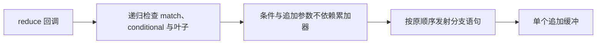
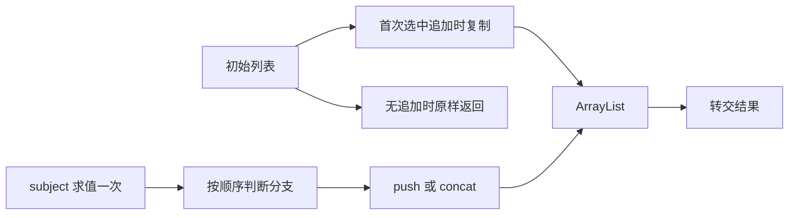

# 嵌套匹配归约缓冲

Intent：恢复 reduce 的嵌套 match 回调使用单一追加缓冲，保留输入不可变、分支求值顺序、长度溢出及既有线性容量约束。

Data：测试会话在 23def89a 上运行 test-reduce-runtime，60/62 步骤、110/112 用例通过，仅既有 nested 的两个容量用例失败；本会话直接重跑其实际二进制再次退出 1。count=256 时常规 arena 容量 331410、禁止 resize 时 286312，既有上限 70656。实际生成代码在每个 concat/push 分支分配完整增长列表。源码 append_reduce.matches 与 statements 只有 reference、conditional、tuple_field，缺少 match_expr；已有 dependencies 已遍历全部 match 边。

Edges：只扩展 append_reduce 的匹配与发射。subject、每个条件及追加参数必须保持与 accumulator 无依赖；所有结果与 fallback 递归匹配。保留首次真正追加时复制 initial 的行为，无追加仍返回 initial。subject 仅求值一次，零分支也不得删除其求值；嵌套 subject cache 必须恢复。不修改测试或容量阈值，不扩展无关 buffer_call/object_reduce 优化。

Answer：一处 owner 的通用 match 递归支持，现有 test-reduce-runtime 的全部模式通过，并检查实际生成物使用 ArrayList 追加。没有新增测试，不运行全量测试。

## 验证与自我复核

最终 ReleaseSafe 专项退出 0，62/62 构建步骤、112/112 用例通过，包含 8 种 reduce 模式、结果与输入不变性、分配失败释放、禁止原地扩容，以及 256/1024/4096 三档既有容量检查。测试与容量阈值均未修改，没有运行全量测试。

实际生成物已归档到 `生成/nested.zig.txt`：外层和内层分支共用一个 ArrayList，追加参数先求值、检查总长度后再追加；首次选中追加时才复制 initial，无追加时仍返回原值。原始生成字节另存于 `生成/nested.zig.gz`，文本视图仅规范末尾换行。生成代码不再在每个 concat/push 分支分配完整增长列表。修复前实际二进制再次复现相同两个容量错误；修复后的日志与源码哈希记录随文档保存。

自我复核：问题来自优化器未覆盖正式 match_expr，而不是容量阈值或种子列表唯一性。此次按语义递归补齐分支，不按夹具、层数或节点位置特判。带 subject 的发射复用了成熟 match 的单次求值与 cache 恢复方式，但现有 nested 夹具属于无 subject 的守卫匹配，不能把这份容量证据扩展为所有 match 组合的形式化证明。其他 object_reduce 与调用投影优化不在本次修改范围。
