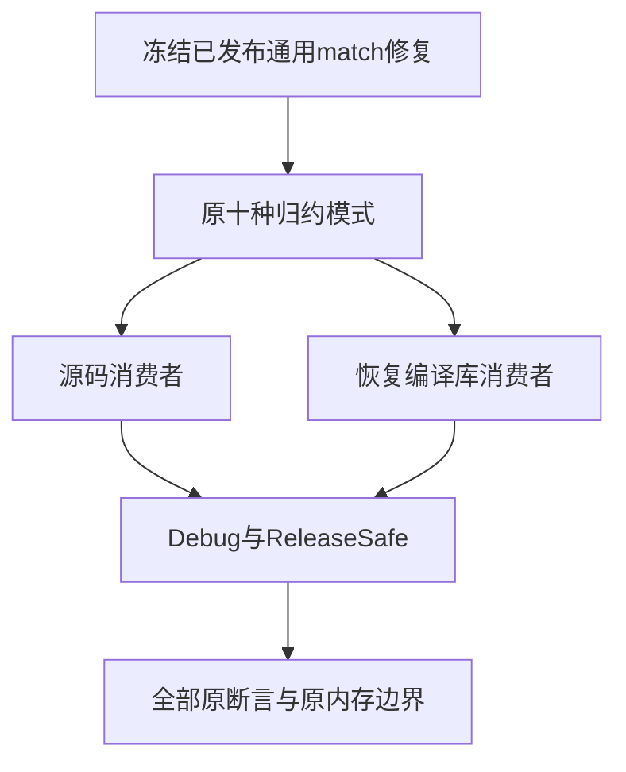
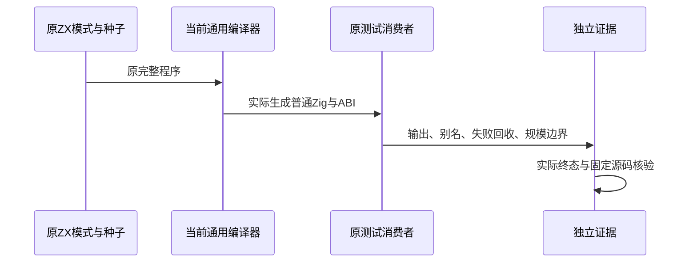

# 嵌套归约有界修复独立复验计划

## Intent：最终目标

独立复验已报告的 nested match 对象归约容量缺陷是否经通用生产修复闭环，执行原完整 test-object-reduce，保持全部原用例与 4096 字节/四次分配边界。

## Data：可用证据

c5085a97 原 Debug/ReleaseSafe 聚合均 188/192，两条 nested 消费者各两项 capacity 失败；四个原生独立复现均 count=128 失败，真实统计在对象归约与StoreIO完整复验。

生产提交 9e7a2b0b 增加 match 分支的对象归约分析与发射，并更新发射指纹。当前合并版本包含该实现与已验证的数值 loop 测试；生产会话自述通过不能代替本次独立执行。

## Edges：边界与限制

不修改任何源码、用例、期望、原128/2048/16384规模或禁止resize要求；主检出全包字节在两实际门禁期间冻结。所有十种程序模式、两条源码/编译库路由都保留，不只执行 nested。

实际缓存如实记录；若完整构建仍缓存部分运行，追加对应原生二进制实际执行补齐，不将 cached 统计算为新测试。成功范围是原对象归约门禁，不外推全部完整根或全部语言功能。

## Answer：交付格式与成功标准

Debug、ReleaseSafe 原完整门禁实际退出0；所有二十个原消费者、原分配失败、旧值和指针身份、规模与resize边界完整通过；全包字节不变，保存真实命令、终态、二进制与生成程序指纹、原始日志及IDEA记录，英文 Conventional Commits 提交 push。没有生产问题时不向实现会话发送无问题消息。

## 架构图

## 数据流图

## 自我批判

本部分必须区分原生成源码中的逐步分配与修复后的真实行为，不能只看到生产提交已发布就改写旧失败。只有完整原执行补齐当前证据，才在其范围内闭环。
