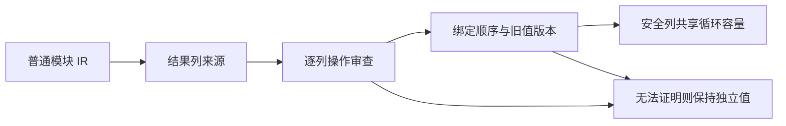

# 嵌套计算中的独立状态列缓冲

## Intent：最终目标

补齐通用跨模块缓冲分析，使不受嵌套计算影响的列表列能够复用容量，同时保留旧值、闭包捕获和错误语义。通过实际 resolver 生成物检查收益，不设置文件名、函数号或业务类型特例。

## Data：可用证据

纯值类型解析器已经接入并通过现有专项，但生成 run/step 仍无完整 buffered 版本。audit 无条件拒绝 scope、iteration、transform；版本分析另一次拒绝 nested iteration/transform。may 只描述结果是否携带别名，不能证明执行没有读取旧列表。

## Edges：边界与限制

scope 需保持绑定求值顺序与版本检查。嵌套循环只在初始值和每轮结果不携带当前列、循环不推进该列版本、捕获读取满足版本契约时才能通过。未知 callback 来源、原生逃逸、并行和任务继续保守处理。不能为命中优化改写解析器业务，不新增专用运行时或测试用例，不运行全量测试。

## Answer：交付与成功标准

先用通用 IR 观测工具记录每个函数和每条候选列的拒绝原因，再按实际原因修复。交付源码、生成物与前后判定证据，以及既有所有权、缓冲与解析专项结果。未解决的复制成本继续明确记录。

## 实际观测与本次范围

通用工具读取真实 `library.zxcir`，执行与后端相同的 prepare、值表示分析和逐列摘要，不按模块名设置分析规则。基线表明不少拒绝先于 nested_transform：输入只要含任意 optional 子项，may 对所有结果列回溯整个 argument，导致不相关 frames 被计为重复引用。

本次先移除这条整体 optional 回退。optional 仍作为不透明输入来源，字段投影可穿过 optional；some、optional_value、coalesce 双支、index 与 pop 的保守来源判断保持。原生、Store 和未知调用继续追踪整个实参；正向来源摘要仍只证明存在，不能据此证明没有其他引用。

真实 resolver 的 node、finish、wrap 帧列由拒绝改为通过；name 由 duplicate 改为后续 unsupported_call，enumeration、object、tuple 和 step 尚未完全通过。根循环没有因此被宣称完成容量复用。scope 和 nested loop 的新准入规则本次尚未修改，需要继续取得下一层来源和版本证据。

自我复核：只读结构审查核对了可选输入叶子、coalesce、pop 的 owner 路径以及非 local 任务的准入限制，未发现本次移除 guard 新增可达漏判；这不等于一般性形式化证明。缓存指纹更新为 v18，保持编译产物失效正确。

新 CLI 编译同一解析器源闭包，实际生成 node、finish、wrap 的 buffered 版本，与来源表的新增可用列一致；step/run 仍未获得完整 buffered 路径。现阶段发行构建通过 35/35 步骤，值返回及聚合循环专项通过 178/178 步骤、218/218 检查。缓冲、模块化循环与解析专项通过 258/258 步骤、499/499 检查，另有 1 项库重发布检查通过。未新增用例、调整期待或运行全量测试。

## 更新后读取的版本判定

实际 IR 中 object 的 current 调用分别位于 replace 前后（表达式 2、71，replace 为 66），tuple 同样为 2、52（replace 为 47）；对应 ZX 源码读取的是更新后的 state.frames。audit 的全函数 transferred 标记只记录“曾发生转移”，无法表示被读取值是否最新，也无法区分互斥分支。

本步去除此标记造成的 reader 一律拒绝，继续要求 pure detached reader，并交给已有 versions 顺序分析：其 call 分支 observe 实参，只允许当前版本；旧快照仍返回 stale_version。直接索引、原生逃逸、列表操作准入与嵌套循环规则均保持。同一 IR 的逐列观测已确认 object、tuple 的 frames 通过，并由新 CLI 生成对应 buffered 函数。

发行构建通过 35/35 步骤；已有 detached reader、模块化循环、迭代缓冲、跨函数迭代和类型解析专项通过 258/258 步骤、499/499 检查，库重发布检查通过。缓存指纹更新为 v19；未新增测试或运行全量测试。

自我复核：删除的是无法表达新旧值关系的全函数标记，安全准入仍要求 pure、detached 和 versions.check。顺序版本分析检查参数求值后的版本，也保留分支中的单调版本编号和旧值失效证据。结构复核及既有旧快照回归未发现新增可达问题，但不据此声称一般性形式化证明。enumeration 仍为 duplicate，name/step 仍为 unsupported_call，最外层循环容量复用尚未完成。下一步须证明枚举内层循环整体状态不携带当前列，不能把 callback 参数永久绑定初值来绕过跨轮来源变化。
