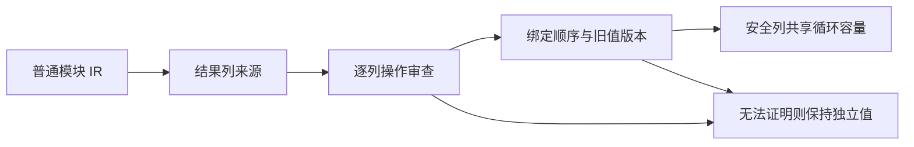
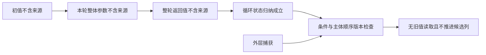
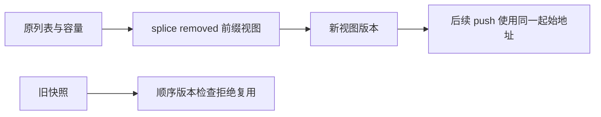
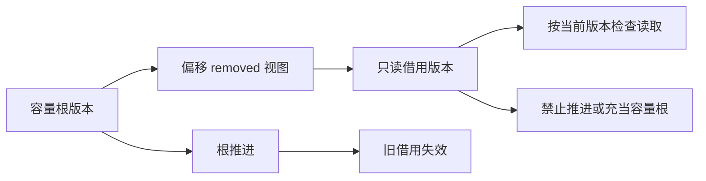
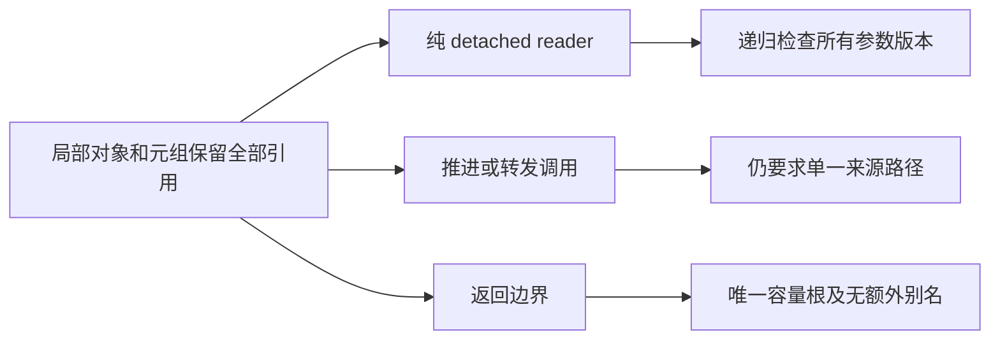
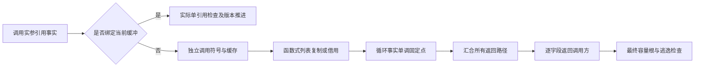

# 嵌套计算中的独立状态列缓冲

## Intent：最终目标

补齐通用跨模块缓冲分析，使不受嵌套计算影响的列表列能够复用容量，同时保留旧值、闭包捕获和错误语义。通过实际 resolver 生成物检查收益，不设置文件名、函数号或业务类型特例。

## Data：可用证据

纯值类型解析器已经接入并通过现有专项，但生成 run/step 仍无完整 buffered 版本。audit 无条件拒绝 scope、iteration、transform；版本分析另一次拒绝 nested iteration/transform。may 只描述结果是否携带别名，不能证明执行没有读取旧列表。

## Edges：边界与限制

scope 需保持绑定求值顺序与版本检查。嵌套循环只在初始值和每轮结果不携带当前列、循环不推进该列版本、捕获读取满足版本契约时才能通过。未知 callback 来源、原生逃逸、并行和任务继续保守处理。不能为命中优化改写解析器业务，不新增专用运行时或测试用例，不运行全量测试。

## Answer：交付与成功标准

先用通用 IR 观测工具记录每个函数和每条候选列的拒绝原因，再按实际原因修复。交付源码、生成物与前后判定证据，以及既有所有权、缓冲与解析专项结果。未解决的复制成本继续明确记录。

## 实际观测与本次范围

通用工具读取真实 `library.zxcir`，执行与后端相同的 prepare、值表示分析和逐列摘要，不按模块名设置分析规则。基线表明不少拒绝先于 nested_transform：输入只要含任意 optional 子项，may 对所有结果列回溯整个 argument，导致不相关 frames 被计为重复引用。

本次先移除这条整体 optional 回退。optional 仍作为不透明输入来源，字段投影可穿过 optional；some、optional_value、coalesce 双支、index 与 pop 的保守来源判断保持。原生、Store 和未知调用继续追踪整个实参；正向来源摘要仍只证明存在，不能据此证明没有其他引用。

真实 resolver 的 node、finish、wrap 帧列由拒绝改为通过；name 由 duplicate 改为后续 unsupported_call，enumeration、object、tuple 和 step 尚未完全通过。根循环没有因此被宣称完成容量复用。scope 和 nested loop 的新准入规则本次尚未修改，需要继续取得下一层来源和版本证据。

自我复核：只读结构审查核对了可选输入叶子、coalesce、pop 的 owner 路径以及非 local 任务的准入限制，未发现本次移除 guard 新增可达漏判；这不等于一般性形式化证明。缓存指纹更新为 v18，保持编译产物失效正确。

新 CLI 编译同一解析器源闭包，实际生成 node、finish、wrap 的 buffered 版本，与来源表的新增可用列一致；step/run 仍未获得完整 buffered 路径。现阶段发行构建通过 35/35 步骤，值返回及聚合循环专项通过 178/178 步骤、218/218 检查。缓冲、模块化循环与解析专项通过 258/258 步骤、499/499 检查，另有 1 项库重发布检查通过。未新增用例、调整期待或运行全量测试。

## 更新后读取的版本判定

实际 IR 中 object 的 current 调用分别位于 replace 前后（表达式 2、71，replace 为 66），tuple 同样为 2、52（replace 为 47）；对应 ZX 源码读取的是更新后的 state.frames。audit 的全函数 transferred 标记只记录“曾发生转移”，无法表示被读取值是否最新，也无法区分互斥分支。

本步去除此标记造成的 reader 一律拒绝，继续要求 pure detached reader，并交给已有 versions 顺序分析：其 call 分支 observe 实参，只允许当前版本；旧快照仍返回 stale_version。直接索引、原生逃逸、列表操作准入与嵌套循环规则均保持。同一 IR 的逐列观测已确认 object、tuple 的 frames 通过，并由新 CLI 生成对应 buffered 函数。

发行构建通过 35/35 步骤；已有 detached reader、模块化循环、迭代缓冲、跨函数迭代和类型解析专项通过 258/258 步骤、499/499 检查，库重发布检查通过。缓存指纹更新为 v19；未新增测试或运行全量测试。

自我复核：删除的是无法表达新旧值关系的全函数标记，安全准入仍要求 pure、detached 和 versions.check。顺序版本分析检查参数求值后的版本，也保留分支中的单调版本编号和旧值失效证据。结构复核及既有旧快照回归未发现新增可达问题，但不据此声称一般性形式化证明。enumeration 仍为 duplicate，name/step 仍为 unsupported_call，最外层循环容量复用尚未完成。下一步须证明枚举内层循环整体状态不携带当前列，不能把 callback 参数永久绑定初值来绕过跨轮来源变化。

## 独立循环状态的归纳证明

Intent：让循环状态与候选缓冲列无关的计算通过来源和版本审查，使枚举处理继续走普通 RX/ZX 值状态。

Data：固定 IR 中枚举循环参数未绑定，Source 的十个引用叶都保守地指向 frames，最先触发 duplicate。初值来自 context.source、空 names 和 detached diagnostic；整轮只推进独立 names/index/diagnostic。

Edges：仅证明整个循环状态不含候选来源，不进行字段固定点的近似替代。假设按循环和输入来源隔离；嵌套证明中产生的结论不得逃出外层假设作用域。条件与主体仍需顺序版本检查，禁止循环内推进候选缓冲列；外层捕获继续接受旧值检查。transform 等其他门槛保持。

Answer：增加通用循环来源归纳及对应版本检查，以固定 IR 对比真实准入变化，并执行既有缓冲与所有权专项。实现结果与剩余拒绝原因在验证后补齐。

第一次固定 IR 观测消除了枚举的 duplicate，但随后在 scope 表达式 80、115、118 停止。补齐 scope 结果来源穿透，并移除 audit 的 scope 整体拒绝；已有版本分析继续顺序执行全部 binding（包括无符号 binding），只恢复局部符号而不回退执行版本。全表达式 audit 保留 detached append/pop/call 拒绝。归纳分析单次观测耗时约 0.67 秒、最大驻留约 211 MiB，仅作本次观测，不视为稳定性能基准。

scope 修复后，同一 IR 的枚举、名称解析、step 帧列均通过。新发行构建通过 35/35 步骤；CLI 无缓存编译同一解析器闭包，实际生成 enumeration/name/step buffered 函数，run 在 while 外创建 ArrayList(Frame*)，循环内把同一个 lane 缓冲传给 step，退出后取出拥有的切片并写回 frames。这证明帧列表容量跨轮复用已打通；run 自身没有返回来源摘要不影响其内部循环使用缓冲。

自我复核：来源归纳只回答状态是否携带目标引用，条件和主体执行安全仍由版本分析承担。假设按 iteration 与完整来源路径隔离；依赖外层假设的嵌套结果不进入全局成功缓存。serial 保持单调，因此任一循环分支的目标版本推进都被拒绝；symbols/cached 的恢复保留外层捕获及旧值证据。结构审查未发现新增可达反例，但这不等于一般性形式化证明。Frame 元素仍装箱，State 的同型聚合和其他可变列还有成本；未宣称整个解析器零复制。

既有迭代、detached reader、跨模块循环、迭代缓冲、跨函数迭代和类型解析专项通过 279/279 步骤、525/525 检查，另有 6 项 CLI 与库重发布检查通过。包含前后置条件顺序、旧快照和分配失败路径；未新增测试、调整期待或运行全量测试。源码与草稿镜像、固定 IR、观测与格式化生成物均记录哈希，缓存指纹为 v20。

## 前缀视图与缓冲容量

Intent：让列表的零复制前缀视图继续关联原容量，为 scratch 列的后续 push 复用补齐通用来源规则。

Data：splice 的 removed 投影已有直接切片生成，finish 返回的 scratch 前缀并非新数组；当前 Trace 只识别 pop/push/concat，前缀来源被丢弃。另一方面，Frame 列表与同型聚合的 boxed 限制还保护 ABI 身份，不能直接删除。

Edges：仅接受起点为常量零的 removed 投影；非零起点不能用只按长度调整的容量模型。参数求值、边界与长度溢出仍走原生成器。版本分析把截短后的视图视为新版本，旧快照仍保守拒绝；一般 splice 更新与多视图逃逸不放开。

Answer：交付前缀来源识别、版本传播与既有相关专项结果；观察真实 scratch 拒绝链，不能把前缀能力等同于完整 scratch 缓冲。跨调用复制式读取需另有证据。

固定 IR 观测确认 finish 的两个前缀操作（表达式 80、90）已关联到 scratch 的原输入列；此前未产生这两条 lane，现在 step 也能保留其来源摘要。finish 仍在更早的非零起点尾片操作（16、32）被拒绝，step 仍为 unsupported_call，完整 scratch 容量复用尚未成立。后续需要把只读偏移视图与可调整容量长度的前缀区分，并证明跨调用复制后不再借用原切片。

自我复核：原生成器仍让 splice[0] 分配独立数组，只有 removed[1] 共享原切片；版本事实与该语义保持一致。起点为零保证基址不变，参数推进同一目标会使保存的 target 版本过期而拒绝。旧视图、其他输出路径与容器逃逸仍受版本和来源审查；may 对两个 splice 结果仍保守视为可能携源，本次未放宽。结构复核未发现新增可达反例，不作为一般性形式化证明。

发行构建通过 35/35 步骤；新 CLI 无缓存编译同一解析器闭包成功。生成源码的原始 SHA-256 与上一独立循环阶段完全相同，因此复用已有生成物归档；这印证当前只补齐 scratch 前缀来源，尚未越过尾片借用门槛，没有新增运行成本收益的声称。

已有列表范围、detached reader、模块化循环、迭代缓冲、跨函数迭代和类型解析专项通过 283/283 步骤、2536/2536 检查，另有 1 项库重发布检查通过。未新增测试、改变期待或运行全量测试。缓存指纹更新为 v21，七份源码镜像与固定 IR / 观测哈希一致。

## 偏移视图的只读版本事实

Intent：区分可作为容量基址的列表状态和只能读取的偏移视图，继续推进 scratch 尾片的安全读取。

Data：finish 的尾片操作 16、32 仍为 unsupported_operation；其 removed 结果是原列表子切片，updated 结果仍独立分配。现有版本事实只有 none/stale/version/aggregate，不能表达“与当前版本相关，但禁止推进”的借用。

Edges：新增 borrowed 事实只允许读取，不允许 advance 或作为最终容量根保留。分支合流只要含 borrowed 就不能恢复为可写根。前缀作用于偏移视图时仍然是偏移视图，不能因局部 start=0 丢失偏移信息。参数求值后的旧版本检查、容器逃逸、未知调用限制保持。

Answer：交付只读视图事实与 splice 传播、固定 IR 下一层拒绝证据、既有相关专项结果；跨调用多别名和复制型读取另需证明，不宣称本步完成 scratch 容量复用。

实现增加 borrowed 版本事实，并让 contains/observe/merge 保留该来源；advance/retains 仍只接受容量根 version。splice 的 updated 结果仍独立分配，removed 的偏移视图携带 borrowed。由于 splice 读取安全已交给版本事实，删除不再参与判定的前缀表达式清单，前缀的来源追踪仍保留。

固定 IR 中 finish 两条 scratch lane 从 unsupported_operation 推进到 duplicate，step 仍为 unsupported_call。类型列的首个重复在 Candidate 对象表达式 61：children 与 fields.types 分别由同一布尔条件的互斥分支引用尾片，现有逐字段 may 保守地计为两个。名称列在调用参数对象 62 出现重复：state.scratch 与 candidate.fields.names 同时借用同一来源。即使精化条件计数，调用处的所有者与借用仍同时存在，需要单独的跨调用只读证明。

自我复核：偏移视图上的局部零起点不会恢复容量基址资格；合流只要涉及 borrowed 就保持只读，过期或无法合并的来源保持 stale。参数求值后才检查保存的 target，参数内推进不能隐藏旧版本。结构复核未发现新增可达反例，但不等同于一般性形式化证明；本步仍不放宽调用多别名、容器逃逸或公开 ABI 身份限制。

发行构建通过 35/35 步骤，观测工具通过 23/23 步骤；新 CLI 无缓存编译解析器成功，生成源码与前缀阶段的原始 SHA-256 相同。继续复用既有完整生成物，不以来源精度变化宣称新增运行成本收益。

已有列表范围、detached reader、模块化循环、迭代缓冲、跨函数迭代、类型解析和聚合循环专项通过 341/341 步骤、2638/2638 检查，另有 1 项库重发布检查通过。未新增测试、修改期待或运行全量测试；缓存指纹为 v22，六份正式源码与草稿镜像哈希一致。

## 局部聚合与只读多别名

Intent：允许局部对象或元组同时保存一个来源的多个引用，并在实际读取、更新和返回边界检查它们。

Data：版本分析逐字段保存 aggregate 事实，纯 detached reader 已递归 observe 全部参数，最终 retains 检查唯一容量输出及其他字段。现有构造时 count 大于一即拒绝，早于这些完整检查。条件分支中一个字段可能没有该来源，现有 none 与当前引用合流为 stale，也会拒绝本来安全的只读使用。

Edges：仅纯且结果 detached 的 reader 允许多别名；其他调用仍要求一个来源路径。可选存在的当前引用只合流为 borrowed，不能恢复成可推进的 version。过期版本、形状不匹配、容器逃逸、cached append 和返回多路径约束保持。

Answer：交付边界审计调整、只读合流事实、真实 IR 拒绝位置变化及既有专项结果。构造成功不等于允许多别名修改，construct 的复杂跨调用证明仍需单独完成。

固定 IR 的 finish 仍报告 duplicate，但 audit 中该拒绝已仅位于非 reader 调用边界，局部 Candidate 和参数对象不再提前拒绝。结合该函数的调用实参，剩余拒绝位于 construct 调用表达式 63；返回 State 的 construct 不属于 detached reader。step 仍为 unsupported_call，完整 scratch 缓冲尚未启用。

发行构建通过 35/35 步骤，观测工具通过 23/23 步骤；新 CLI 无缓存编译解析器成功，原始生成源码哈希与上一阶段相同，继续复用已归档生成物。不能从局部别名准入推断跨调用复制已被证明。

自我复核：object/tuple、scope、解构、缓存和分支仍逐字段传播引用事实，reader 在参数求值后递归观察全部字段，最终 retains 拒绝额外输出别名。缺失来源与当前引用只能合流为 borrowed，形状不匹配、过期引用和 stale 不被升级。selected buffered call 仍要求单引用，因为该路径只推进选中的输入，不能据此放宽一般多参数别名。静态复核未发现新增可达反例，但不作为一般性形式化证明。

已有列表范围、detached reader、模块化循环、迭代缓冲、跨函数迭代、类型解析和聚合循环专项通过 341/341 步骤、2638/2638 检查，另有 1 项库重发布检查通过。未新增测试、调整期待或运行全量测试。缓存指纹为 v23，三份正式源码与草稿镜像哈希一致。

## 普通调用的引用传递证明

Intent：让编译器证明普通 ZX 调用的只读输入、列表复制及逐字段返回关系，覆盖 construct/update/fields.sort/delta 的真实调用链。

Data：scratch 在 construct 输出中原样转发；候选尾片经过条件排序，最后 concat 复制进 delta。仅用 detached 返回值或单轮循环分析都不足以描述这条链。未绑定当前 lane 的调用不直接获得其 buffer；其他列首次写入复制各自外层列表。

Edges：普通借用调用按函数式列表语义分析，不推进调用方版本；push/list_update 的插入值、未知原生调用、Store、任务与引用逃逸继续拒绝。仅在元素引用规则可证明时清除列表外层复制来源。callee 使用独立 symbols/cache，函数索引严格下降；循环以固定版本和有限字段事实求单调固定点，不设置猜测次数上限。已绑定缓冲的调用增加实际事实单引用及全参数有效性检查。

Answer：交付复用的语句分析、普通调用与循环借用分析、实际 IR 准入和生成代码证据，以及已有相关专项。任何链路仍无法证明时保持拒绝，不宣称完整 scratch 缓冲。

实施进度：语句遍历已从单一 lane 检查中抽出，保存每个返回值与该路径的版本，再逐条验证唯一容量输出。共享事实增加递归相等、来源计数和聚合与无来源分支的逐字段只读合流；过期字段仍产生 stale，合流不会把条件存在的引用升级为可写容量根。普通调用、复制型列表与循环固定点尚未接入，本阶段不扩大调用审计准入。

自我复核：返回路径的版本必须随返回值保存，不能使用另一分支结束后的 current。原 branch/switch 对继续执行路径的合流和全局 valid 保持；新增 results 由同一分析 arena 持有。当前改动仅完成通用事实与语句基础，不能据此宣称 construct 调用链已被证明。

共享事实与语句抽取后的 ReleaseSafe 发行构建成功（日志：验证/普通调用基础构建.log）。本阶段未新增用例、未运行全量测试；普通调用接线完成后再运行已有相关专项。

普通调用、列表复制与循环固定点已接入。固定 IR 中 finish 和 step 的 scratch 路径 [7,0]、[7,1] 均由拒绝变为 rejection=null；普通调用仍检查原生、Store、契约、已接受缓冲列的潜在同源写入，selected call 仍要求实际单引用。真实生成代码与既有专项正在核验，暂不把 lane 准入等同于最终容量发射成功。

只读审查未发现当前实现中可确认的错误放行。自我复核保留一项明确限制：普通调用可能被其他 caller lane 注册为 buffered，故不能仅根据当前 lane 未选择该调用就删除可写 callee lane 守卫。现有守卫会保守拒绝部分实际上没有 sibling 注册的复制 helper；后续精确化须携带潜在 sibling 调用注册集合，避免依赖 lane 审查顺序。当前真实 scratch 调用链已通过该守卫。

新 CLI 无缓存编译同一解析器成功。实际 function_55_value 在循环外声明 scratch.names 的 ArrayList([]const u8) 与 scratch.types 的 ArrayList(u32)，通过 lane_34/lane_35 传给 function_54_buffered，并在退出后按最终长度 toOwnedSlice 写回。此次与之前仅完善来源事实的阶段不同，真实生成物已出现两列跨轮容量复用；生成源码与接口归档于生成/普通调用借用。

ReleaseSafe 发行构建通过 35/35 步骤，观测工具构建通过 23/23 步骤；既有七组专项通过 341/341 步骤、2638/2638 检查。未新增测试、调整期待或运行全量测试。缓存指纹为 v24，九份正式源码与草稿镜像一致。此结论覆盖 scratch 容量链，不代表同型聚合表示、原生专用状态迁移或整个自举目标已经完成。
