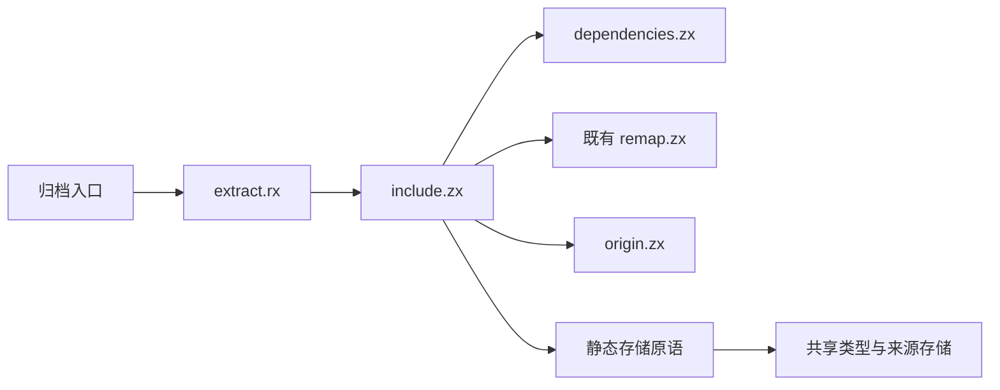
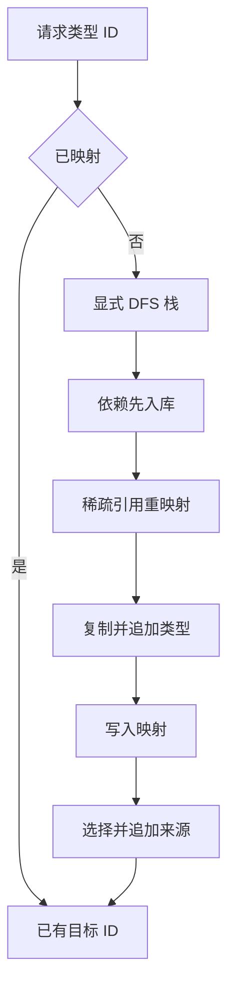

# 归档类型提取自举

## IDEA

- Intent：将归档类型依赖调度、引用重映射编排与名义来源选择迁入 RX/ZX。
- Data：artifact/types.zig 当前以 pending 栈执行 DFS，引用严格向前，已有 remap.zx 可复用；归档专项覆盖引用重映射、来源缺失与分配失败。
- Edges：保持 task 的 errors 优先处理、tuple/object 的正序处理；保留映射写入后再检查来源的失败顺序；不增加 visited 表、运行库、全量测试或新测试。
- Answer：正式 RX/ZX 流程、仅包含存储操作的原生桥、种子分支、源码草稿与相关专项验证记录，完成后提交推送。

## 执行步骤

1. 抽取 TypeValue 借用组装器供原有重映射和归档存储共用。
2. 建立独立提取工作区，原生操作只读写数组、压栈出栈、分配与复制类型数据。
3. RX 入口连接 ZX 提取、依赖展开与来源选择；直接调用现有 remap.zx。
4. 正式归档入口调用生成实现，种子保留旧算法；验证发行及已有归档/库专项。

## 架构

## 数据流

## 契约复核

- 越界先失败；已有映射不分配 pending。栈容量仍只属于本次 include，退出时释放。
- task 先压 result 再压 errors，因此 errors 先提取；tuple/object 倒序压入，正序提取。
- 先追加类型，再写 mapping，最后扫描来源。被引用来源缺失、重复或名字不符时，保留旧实现相同的已写前缀。
- 未引用来源不参与绑定校验；不新增 native 来源类别限制，不按来源身份去重。
- 返回码 0 表示 InvalidModule，1 表示 MissingNominalOrigin，其他值为映射 ID 加 2；内部 origin 选择器 0 为缺失、1 为冲突、其他值为来源下标加 2，include 明确转换。
- 原生 copy 只承担输出脱离源生命周期所必需的字符串复制；引用值通过共享 borrow 组装器读取已重映射的 buffer，没有复制整个类型表。
- workspace 与 buffer 由适配器显式传入，buffer 指向同一工作区内的稳定 references 字段。ZX 不发生 opaque 类型转换。

## 构建过程中发现的问题

1. 首次生成被导入排序规则拒绝，使用已有 zxc fmt 修正 ZX 源码。
2. 原生声明当前不支持跨声明文件导入 opaque 类型；改为显式传入两个既有名义类型的句柄，各原生声明保持独立。
3. 相同 references.zig 绑定两份 ABI 会违反 Zig 文件只能属于一个模块的规则。references 原语改为接收只用于原生边界的 opaque 指针，不依赖某个生成 ABI；两个生成模块共享同一原语实例。ZX 层仍保留原始名义类型身份校验。

## 自我复核

生成器源码编译通过不等于零容量 arena 可执行；必须等待实际归档与缓存专项的结果。不能把复制字符串消除作为本次目标：归档必须脱离源生命周期，必要的持久存储复制需要保留。类型初始化与整批链接驻留等剩余自举工作不在本阶段完成声明内。

## 最终验证

- `zig build dist` 退出 0。
- 在 packages/test 运行 module-artifacts、typed-try-library、library-codec、semantic-cache、native-references-library 五个现有专项，退出 0。
- 最终发行 CLI 编译本目录草稿 extract.rx，生成 extract.zig 与 ABI，退出 0。
- 生成调用的执行 arena 容量固定为零，专项实际执行已通过；显式存储原语仍按应用需要分配栈、引用列和持久数据，不把这说成整个编译器不分配。
- 最终只读复核未发现实际问题；无新增测试、全量测试或浏览器操作。

草稿 pkg.yaml 只用于源码生成所需的接口声明。正式实现通过 compiler/build 静态连接原生存储、共享 reference_view 与 nominal_data，无动态加载或独立运行库。
