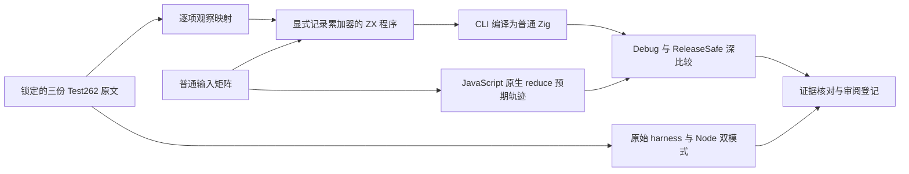
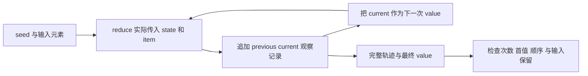

# 归约调用轨迹与上游审阅执行计划

## Intent：最终目标

为三份尚未审阅的 Test262 reduce 用例保存完整断言证据，补充 zxc 归约调用次数、首个累加值及后续传递顺序的执行测试。全量 Test262 和全部 zxc 特性的目标继续保留。

## Data：可用证据

锁定上游 revision 为 `7ab7fafa0003f73fc85c1b95d88094d33f7eb8bd`。候选为 `15.4.4.21-9-c-ii-9.js`、`15.4.4.21-9-c-ii-10.js`、`15.4.4.21-9-c-ii-17.js`。查询确认三者均未审阅；原文分别断言调用两次、首次累加参数为 1、每次累加值来自上次返回且确实调用回调。已有 `generate_array_callbacks.ts` 与 collections support 是同职责参考，后者会复制可写输入并验证调用后原值不变。

## Edges：边界与限制

zxc 回调不捕获外部变量；reduce 固定为两个形式参数且必须显式初值。原文的外部观察变量改为显式累加记录，记录每次实际收到的 previous/current。回调返回 current，用它验证原文第三份的真实传递语义；前两份原文的 undefined 返回不影响其被断言的次数与首次参数，但不得宣称验证了一等函数、零/一形式参数声明或 undefined 累加行为。分类为 adapted，逐项解释观察对应关系，不增加 excluded。

普通输入通过同一个通用 ZX 程序执行，不能根据用例名称分支或生成预设轨迹。预期轨迹由 JavaScript 原生 reduce 独立收集，避免让生成器复制被测循环算法。只修改测试包；生成物为普通静态 Zig，不新增运行库。文档与草稿集中在本目录，正式测试源码由现有无人值守测试目标授权。

## Answer：交付格式与成功标准

三份原文 SHA 与普通/严格模式真实执行结果、明确的断言映射、具名 JSON 测试及生成器可重现检查、Debug/ReleaseSafe 真实执行证据、输入保留检查、目录矩阵审计与自我复核。每模式运行同一套具名用例，不把两个模式计为两倍独立覆盖。完成后使用英文 Conventional Commit 并实际 push。

