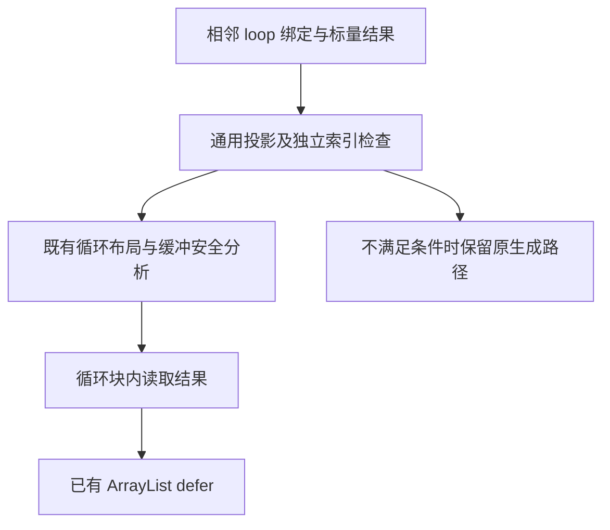
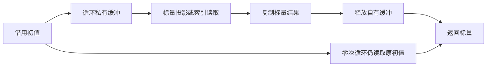

# 循环临时列表标量读取

## IDEA

- **Intent**：对局部 loop 结果只用于紧接的标量投影时，在循环缓冲有效期内完成读取，避免无用的 toOwnedSlice 与缓冲所有权转移。
- **Data**：基线 7f03946b；iteration 已支持 reference/value/discard，iteration_buffer.Capacity 已生成 ArrayList defer，finish/take 负责转移。类型查询的普通 ZX 状态提供真实使用场景。
- **Edges**：只优化相邻局部循环绑定与末尾返回/IR scope 结果；只允许非引用标量、枚举和错误值，排除 string、opaque、optional 与聚合输出；投影链为字段、元组、索引和 length，索引表达式不得引用该局部。保持循环内部既有安全分析，不按文件名或字段名识别；不新增测试用例，不跑全量。
- **Answer**：交付通用投影分析与循环内部读取生成，覆盖语句和 scope 两个入口；检查实际查询产物，并运行相关已有循环/类型专项后提交。

## 架构图

## 数据流图

## 安全边界与自我复核

不能只删 toOwnedSlice 后把列表切片返回到块外，那会在 defer 后悬空。消费者必须与循环位于同一块，并在 deinit 前完成。零次循环不释放借用输入，仅释放生成器创建的 ArrayList。索引读取保留求值次数、顺序及 IndexOutOfBounds，失败路径也执行清理。

首阶段限定有明确布局且不通过 buffer_call 转交循环状态的情形；Store 事务沿原路径生成。不存在新运行库，也不为 flags 或 query 特设规则。Arena 下释放是否立即归还底层内存仍取决于分配顺序；不夸大为每次归还系统内存。

## 实现复核

新增 iteration_consumer 负责统一候选判断与投影生成，语句末尾的相邻 constant/result 和 IR scope 的最后 binding/result 共用该实现。consumer 的结果必须是不携带引用的标量，字段链最终根必须是对应符号；索引表达式独立检查，遇到无法证明的形状保留旧路径。

iteration 的 consume 模式要求已有布局成立且没有转交 buffer_call。它在循环结束后、同一生成块内部读取结果，跳过 buffers.finish 的所有权转移；已有 Capacity.create 的 defer 保持不变。候选不成立时在安装缓冲和修改符号映射前返回，原 reference/value/discard 路径不受影响。

实际类型查询生成产物中 toOwnedSlice 从 1 次降至 0 次，ArrayList deinit 保留 1 次，索引读取位于该 defer 生效的块内；边界错误检查仍在。查询没有重新引入 type_flags。优化不识别名称、源码路径或查询业务含义。

本轮精确缩短的是已由 Capacity 管理的 ArrayList 生命周期；循环内部其他分配仍沿既有生命周期处理。几何扩容策略未改变，不能宣称消除全部临时复制或达到一次精确分配。Arena 是否立即回收到底层分配器仍取决于分配顺序。

## 验证边界

相关既有循环专项用于确认输入不可变、零步循环、借用及聚合返回回退、旧版本快照和分配失败行为。实际类型查询产物及编译器类型/任务专项验证此次标量读取路径。未新增专用用例，因此不将所有消费者形状或错误组合宣称为穷举验证。

最终发行构建成功。已有 test-iterate-buffer、test-iterate-calls、test-value-return、test-loop-policy 共314项Zig检查及3项Node检查通过；test-type-merge、test-native-references-analysis、test-zx-tasks-analysis共189项通过。没有新增测试用例、没有执行全量。正式CLI生成的查询源码与seed生成宿主逐字节一致，不代表整个编译器stage2/3已完成。
