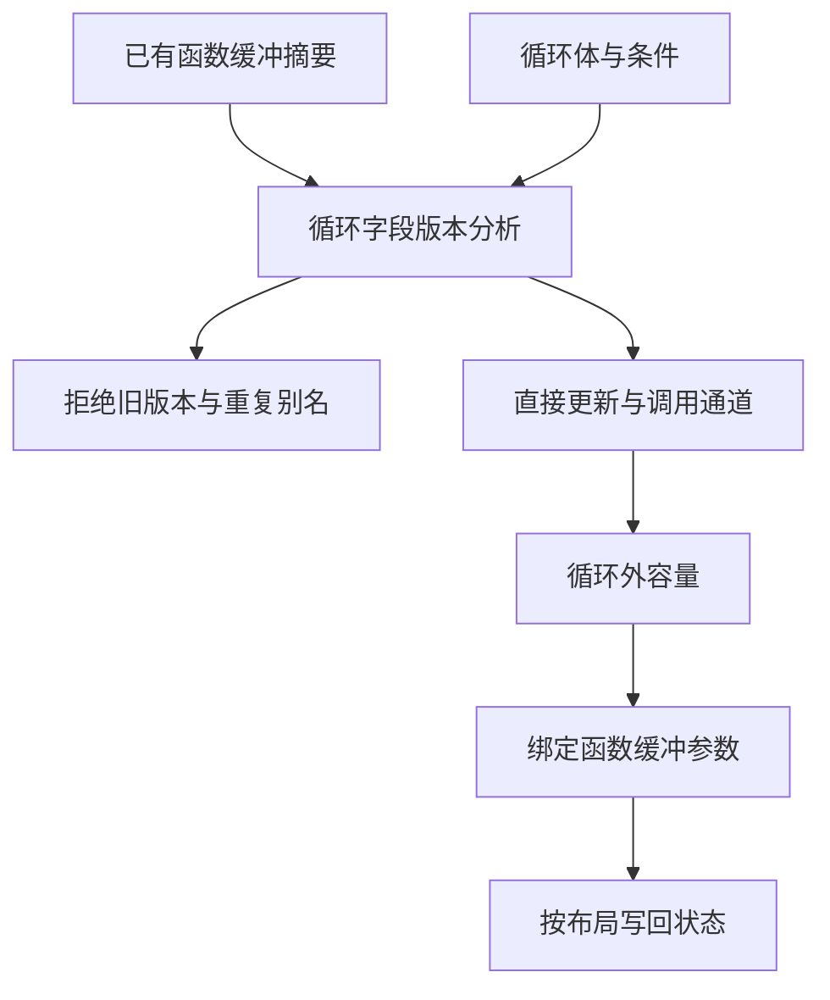
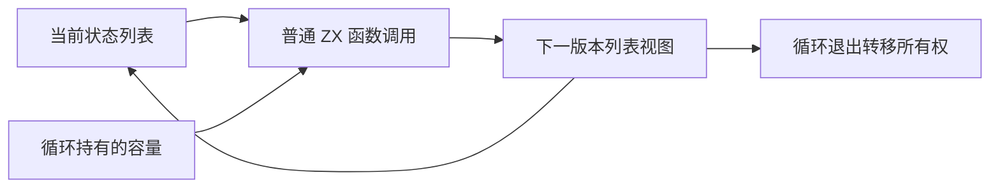

# 循环内调用缓冲

## Intent：最终目标

普通 ZX 循环体内的多个列表更新函数调用，应在版本与别名安全前提下共享循环持有的容量，不要求用户将整个循环改写为单一状态函数调用。此项是 genz 通用能力，不依赖所有权检查器的名称、字段或固定调用编号。

## Data：可用证据

所有权主执行器的工作栈由四个列表构成。push/pop 函数已有合格缓冲摘要，但原生成主入口的 117 个 push 和 1 个 pop 均调用普通 value 版本。源码确认 `buffer_call/iteration.candidate` 只接受循环体整体转发调用；直接循环分析没有接入函数摘要，遇到返回列表的调用会拒绝。

修复后，同一输入的 117 个 push 与 1 个 pop 均调用 buffered 版本，循环外 ArrayList 从 1 份增至 8 份。另有 16 处快照保存与 11 处快照截断调用走缓冲版本，但不代表快照所有列都已复用容量。调用次数是静态调用点统计，不是执行次数或运行分配测量。具体对照见 `循环内调用缓冲/调用变化.json`。

## Edges：边界与限制

- 复用已有有效函数摘要，只在参数中恰有一个被跟踪来源、该来源为当前完整版本时选择通道。
- 返回值必须仅在对应状态字段保留当前版本；旧版本继续被读取、重复别名或借用视图用于可变通道仍不通过。
- 普通只读调用沿用已有递归借用分析，不给它们假造可变通道。
- 多个字段可绑定同一调用的不同槽；首次保存原槽映射，退出时恢复。外层已绑定的通道不被覆盖。
- 原始指针对象与递归值结构采用不同写回路径。前者按路径重建根值，后者保持直接字段写回，不能写入 const 指针对象，也不能把普通布局赋给递归值结构。
- 所有权草稿仍存在状态更新、memo 及辅助调用复制；本项不宣称完整检查器已零复制或自举完成。

## Answer：实现与成功标准

`iteration_buffer/analysis` 新增带函数摘要的分析入口，旧入口仍保留原契约。循环求值时发现合格调用，沿用 observe/advance/retains 完成版本检查，输出直接列表操作和调用通道两组记录。调用也推进版本，但不冒充直接列表更新表达式。

`iteration_buffer/root` 为通过分析的字段建立容量，把相关普通调用绑定到已有 buffered 函数版本，并在作用域退出时恢复绑定。含调用的字段根据循环布局选择结构化写回或直接字段写回。编译缓存指纹更新为 v25。

验收包括根构建、已有循环缓冲与别名专项，以及完整所有权草稿的代码生成和 ReleaseSafe 实例化。未新增测试，不执行全量测试。最终源码根构建 35/35 步骤成功；五项已有专项 305/305 步骤成功、538/538 测试通过，另有 1 个库重发布测试通过。完整所有权草稿 ReleaseSafe build-obj 成功；最终 CLI 重生成的入口及 ABI 与该实例化产物哈希一致。

## 自我复核

首次构建因嵌套 const 对象的直接字段写回失败，暴露出原直接循环缓冲路径未覆盖的表示边界，已复用既有结构化写回实现。独立只读审查又指出 deep 循环使用递归值布局，已显式传递 deep 标记区分写回路径。源身份在重建路径上清空，未修改字段保留。源码审查不替代专项行为与生成代码编译证据。

合入远端四个测试提交后，单独补验更新后的 test-detached-reader：92/92 步骤成功、156/156 测试通过，包含新增前缀与偏移视图场景。未改动其测试代码或期望。
