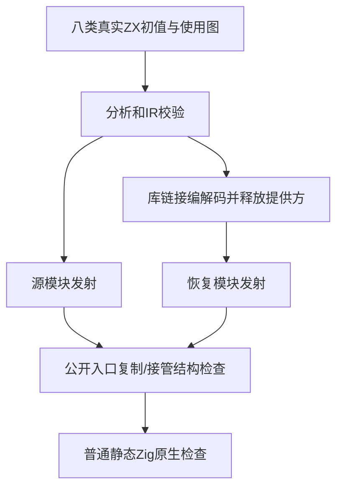
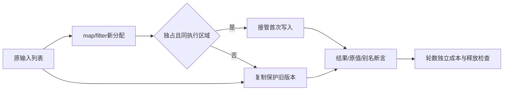

# 循环初值所有权独立覆盖计划

## Intent：最终目标

独立验证新发布的循环初值独占接管：新分配map/filter初值避免首次整列复制；共享、借用及跨重复执行区域保留复制和旧值语义。

## Data：可用证据

生产提交dcd796ea增加值使用边、声明与执行区域证明，明确只接管map/filter新分配外层切片，沿object/tuple/scope/单引用传播。现有iterate_buffer主要输入借用列表，缺少正向初值接管和跨重复执行区域负向夹具。按现有loop_columns编译驱动、iterate_buffer oracle和分配失败组织写完整草稿。

## Edges：边界与限制

不修改生产实现，不测试元素对象原地改写授权。库路线释放提供方并破坏编码缓冲后发射恢复module，尚非新增consumer分析。仅单执行区域要求分配成本不随轮数增长；跨重复区域必须复制，不把必须复制的路径当资源退化。三完整根检出继续冻结。

## Answer：交付格式与成功标准

八模式各source和恢复库路线，Debug与ReleaseSafe均执行；正向生成入口无dupe并有constCast，负向有dupe，真实值、别名与输入保持。空输入与filter空结果保留边界错误，大规模65537元素、重复更新64次、禁止resize、分配失败释放。执行新门禁与四个现有循环门禁，归档真实证据，英文Conventional Commit提交push。现行生产缺陷才通知实现会话。

## 步骤与自我审查

草稿先保存本目录，经已有测试授权同步正式文件；先格式检查，再冻结包输入。门禁终态前不修改源码。若失败，区分fixture规则、结构证明假设和真实运行缺陷，避免用放宽断言制造通过。通过后精确核验提交范围与外部工作文件。
