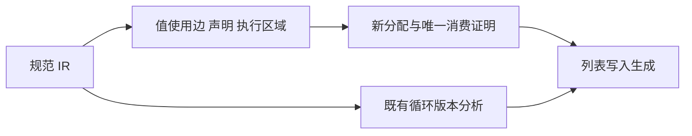
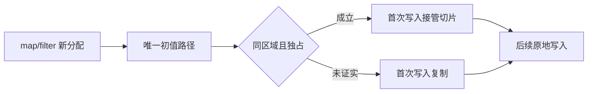

# 循环初值所有权转移

## Intent：最终目标

让固定长度循环列表更新接管可证明独占的新分配初值，消除第一次写入的整列复制；保留共享、静态和跨重复执行区域初值的原有语义。

## Data：可用证据

基线 5896cdab。任务消费计数生成器由 map 创建计数数组，唯一传入 loop 初值；iteration_buffer/root.zig 当前无论来源如何均设 started=false，list_update.zig 第一次写入必定 dupe。已有 iteration_buffer/analysis 证明循环内版本、别名和保留路径，但没有初值来源与唯一性证明。

只读审计确认 map 的普通和 SIMD 路径均新分配外层列表；filter 同样创建独立外层列表。静态列表可能生成 comptime 常量，不能直接接管。单一 reference 节点可能有多个使用父节点，或跨越重复执行边界。

## Edges：边界与限制

只接管固定长度更新的外层切片，不据此允许原地改写元素对象。不改动态容量的释放责任。仅支持明确 map/filter 新分配来源，沿 object/tuple/scope/单一引用声明传播；不推断 pure 调用返回新内存。不识别源码路径、字段名或回调内容。无证明时保留原复制语义。

## Answer：交付与成功标准

正式编译器增加通用唯一使用与执行区域证明；通过后仅将首次建缓冲动作替换为 constCast，保留边界检查、value 求值和 started 协议。任务检查生成物中计数数组不再 dupe；相关既有循环、所有权和原生引用专项保持通过。不得新增测试或运行全量测试。提交并推送阶段成果，不据此宣称完整自举。





## 实现与自我复核

`ownership/graph.zig` 分别计数值使用边和符号引用，登记控制常量及 scope 声明，标记表达式执行区域。object 的字段计入使用边，evaluation 只参与执行区域传播；task captures 计入额外符号使用。transform body、iteration condition/body 及 task body 建立独立区域；多父节点或区域冲突只会撤销独占标记，不能在后续遍历中恢复。

`ownership/root.zig` 沿初值字段路径检查每个节点独占性、区域与声明唯一性，最终要求 map/filter 新分配。已有循环版本分析先通过，且只在固定长度更新分支设置 transfer。动态容量、原生返回和静态列表没有被扩大授权。

```zig
const initial = if (storage != null and storage.?.transfer)
    try self.builtin(.constCast, &.{source})
else
    try self.call(try self.field(try self.builder.identifier("allocator"), "dupe"), &.{ try @import("iteration_value/types.zig").element(self, element), source }, true);
```

指纹 v34 升至 v35，避免复用旧生成结果。只读独立审查未发现当前固定长度路径的可行动正确性缺陷；审查不替代运行验证。每个候选字段重建图会增加编译期开销，当前未引入缓存及其失效生命周期，后续仅在实际性能证据需要时优化。

## 生成证据

新生成任务检查器已实际出现：第 174 行保留计数数组 alloc；第 304、444、637、731 行原 dupe(u64, ...) 均变为受同一 started 标志保护的 constCast。该生成文件不再含 dupe(u64, ...)。因此上一阶段发现的计数工作区首次整列复制已消除；不将此局部证据外推为所有生成代码都没有复制。

循环与别名专项 `test-iterate-buffer test-iterate-calls test-aggregate-loop test-loop-columns` 已通过 245/245 步骤、411/411 用例；编译器包回归已通过 28/28 步骤、372/372 用例。生成器局部变量从 copy 改名为 initial 后，最终重新生成的任务检查器与前一版本逐字 SHA256 相同（a6127a47b01dcb8a7436daf5c28dac155e76542505b63b048392fdf6368759d1）。其余最终结果以验证记录为准。

最终根构建通过35/35步骤；任务、显式取消和原生引用边界专项通过48/48步骤、93/93用例。所有本次验证进程均退出0。命令、目录、日志及源码指纹归档于`验证结果.json`，没有新增测试或运行仓库全量测试。
