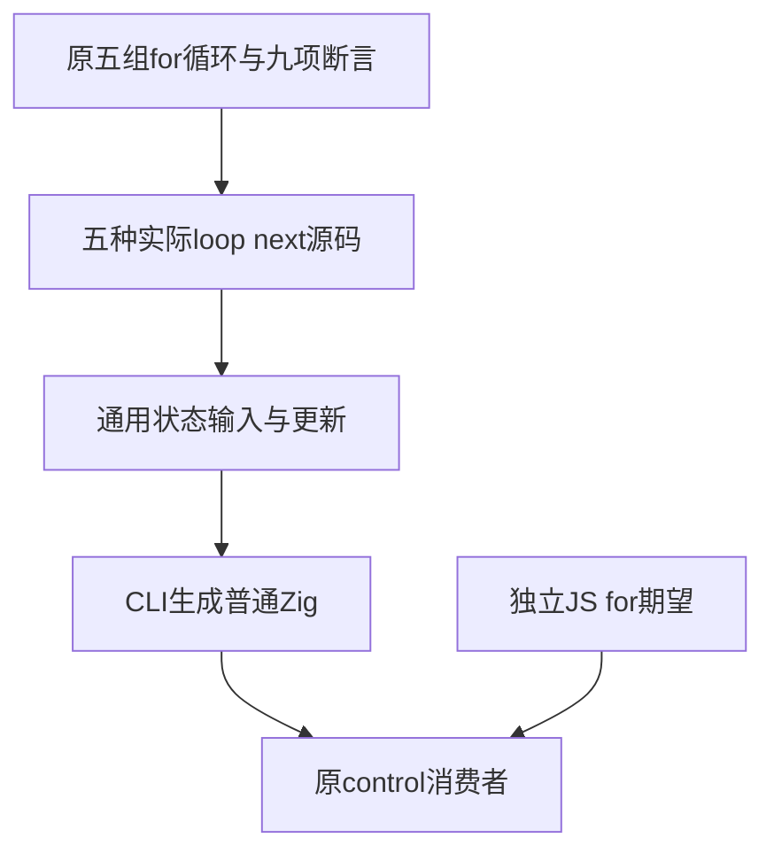
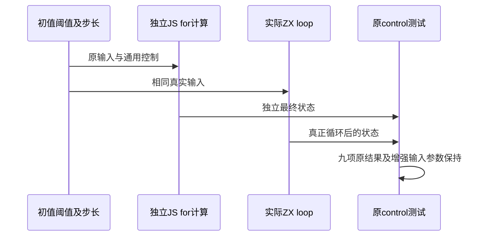

# 循环更新表达式原断言执行计划

## Intent：最终目标

对齐 Test262 for/S12.6.3_A14.js 的五组真实循环与全部九项结果断言：增量、乘法、除法、减量及自乘更新。使用实际 loop next 状态推进，不将原文循环计算替换为直接返回常量。

## Data：可用证据

锁定 revision 为 7ab7fafa0003f73fc85c1b95d88094d33f7eb8bd，SHA 为 20af24357eea8455e30ecd0399d8236d0cbe50bee374049411d6b305ee0389e1。五组原初值/条件/更新完整阅读，原结果为 i=10；i=16/j=4；i=1/j=4；i=1/j=9；i=16/j=2。

现有 snapshot.zx 成熟实现支持对象状态 next、有顺序的字段写回和旧 snapshot；现有状态更新测试支持 f64 与 +=/-=/*=。普通 runtime control 目录支持结构化输入输出和 actual CLI 生成 Zig 后执行。

## Edges：边界与限制

保留 Number 对应的 f64，不改为整数简化除法。原 for 语法和 var 环境映射为显式 loop 与状态；原 ++/-- 值被丢弃，可对应 step=1 的 +=/-=，不声称支持更新表达式返回值或 var hoisting。

五种源码从可变输入接受初值、阈值、step 与 j，不嵌入期望结果。自乘使用实际 state.i *= state.i。控制案例仅选择可终止的数值条件，避免未终止案例阻塞门禁；不能为保证终止在生成程序中加入额外上限。新增控制不伪装为更多 Test262 原文。

当前其他原聚合门禁使用主检出冻结字节。草稿先只写本目录，待两原门禁真实终态后才落正式包，不混入正在运行版本。

## Answer：交付格式与成功标准

五个分层目录、独立 JS 期望生成、一个完整原文审阅关联，新增原 runtime 细分门禁并由原完整根覆盖。普通/严格原文执行无错误，五组全部原断言由真实结果验证；Debug 与 ReleaseSafe 均实际运行，类型检查、生成器 --check 与矩阵审计通过后，以英文 Conventional Commits 提交 push。

## 架构图

## 数据流图

## 自我批判

for A2 类异常原文需要任意抛出值或未声明名运行时解析，原生有限错误不能完整替代；本次只选择没有省略此类断言的 A14。对齐必须读取全部原文，不能只因为最终数字可计算就登记适配。
