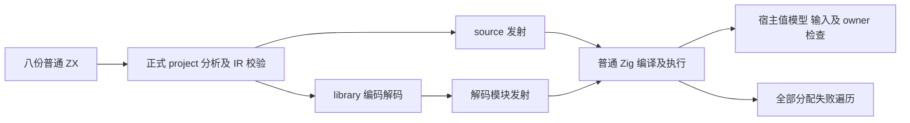
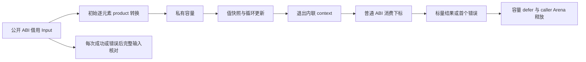

# 循环聚合列表独立回归实施记录

## IDEA

- Intent：为聚合列表局部值布局补上真实执行的独立语义、ABI、错误、所有权及资源回归。
- Data：固定生产源码 `2320d2e9ad8233b92ad4cc9144001727822e9123`，20 个新增/注册输入，普通 project 源码分析、IR 校验和 library 编码解码，实际生成程序，独立宿主模型，Debug/ReleaseSafe 冷门禁与相邻 CLI 门禁。
- Edges：不修改生产源码，不添加运行库，不伪造 IR，不把 eligibility 或对象包装地址作为 oracle。源级 test 声明、夹具实例和重复路线执行分开。没有新增 Test262 review 或 JSON 用例，不将本轮 zxc 独有语义回归登记成整份 Test262 适配。
- Answer：正式 aggregate_loop 测试目录、独立 test-aggregate-loop 步骤和总 test 一行接入；64 份生成产物及对应 ABI 原始字节、三个最终原始门禁日志、哈希、草稿、证据脚本和自我批判。英文 Conventional Commit 提交并 push。

## 第一性边界与观察

原有 iterate_buffer 的嵌套模式是状态路径嵌套，列表元素仍为 scalar；本轮列表元素为 object/tuple/optional product，公开 ABI 中是对象指针，局部缓冲则是普通值 struct。最关键的差异是：保存旧元素可以按值保存，而保存整条旧列表并在更新后读取，必须保留旧版本并回退。

非空初始列表在 while 前逐元素转换进私有容量，即使 count=0 也可能 OOM。零步验证返回初始语义、输入不变和转换释放，不承诺零复制。共有两条 lane 时每条必须独立转换及释放；共享输入并不授权共享可变缓冲。最终消费 native 下标时已经退出生成内联 context，普通 aggregate 参数仍使用公开 ABI。

| 夹具      | 每路线测试实例 | 独立观察                                                                                                                                                           |
| --------- | -------------: | ------------------------------------------------------------------------------------------------------------------------------------------------------------------ |
| stack     |              7 | 原样采用成熟局部栈 ZX；push、旧元素、字段更新、pop optional 与 remaining。宿主递推 `t'=4t+2`，覆盖 0/1/2/3/8/16 步及空/非空种子                                    |
| nested    |              5 | 元素包含 object、tuple 和 optional object；旧 nested 值和 tuple bool 在更新后保持。按每轮 `base+4i+39+(i 为奇数 ? i+2 : 0)` 求值，实际读取初始种子和有/无 optional |
| two_lanes |              7 | 同一只读 Frame[] 同时初始化 left/right，每轮分别 +1/+2，再累加，发现串改；全体输入与 slot 指针保持                                                                 |
| bounds    |              7 | 动态 selected 字段更新；合法首/末项、length、length+1、u64 最大值以及空输入；精确 IndexOutOfBounds                                                                 |
| old_list  |              7 | 保存旧列表，更新后读取旧项与当前项，按两个独立标量版本求和；必须回退                                                                                               |
| call      |              7 | 真实普通项目 helper 接收 aggregate 元素并读取 count，随后旧值观察；必须回退                                                                                        |
| escaping  |              5 | 返回公开 Frame[]；全体字段及输入保持，同一 Arena 再调用后先前输出仍有效；完整聚合列表不能被错误当作可转移 primitive 列表                                           |
| consumer  |              6 | native 真正读取普通 Selection 参数，记录 slot/fail/调用次数；成功下标、下标越界、SelectionFailed、循环先失败则不调用，及 OOM 截止                                  |

四份 runtime root 共 23 条源级 test 声明；按八夹具实例化为每路线 51 项。source 和 library 两条路线各执行 51，共 102。多输入循环、多个 OOM 点、两优化模式及生成阶段的形态检查不另算独立用例数量。回退资源分支在复核后增加真实 257 元素/9 步执行，避免空分支计作新增覆盖。

## 生成链与资源

compile.zig 使用成熟 value_return 的 project.analyze → validateIr → emitBundle 链；另一条 route 经 library.link → codec.encode/decode → module(0) → emitBundle。两 route 的产物都导入正式 Zig 测试并实际执行。本轮新增八夹具的主门禁不是 CLI；相邻 11 个既有 scalar 夹具通过实际 zxc CLI 生成，再实际执行，两项证据不混淆。

caller 种子在故障 allocator 外准备。每次先保存 execute 的 error union，检查完整宿主数据及输入字段，再展开成功或错误；Arena 使用 caller backing allocator，正常与语义错误路径核对 allocated/freed 字节，OOM sweep 使用既有 allocation_testing 的 noResize/noRemap。当前 std.testing.checkAllAllocationFailures 对每个故障点的 allocated/freed 再核对，不能吞掉 OOM。native OOM 时调用次数为零，因为本夹具全部分配发生在普通消费调用前，且该消费直接借用现有 Selection，不在 host 分配。

固定峰值的 stack、nested、two_lanes、bounds 和 consumer 比较短/长执行的实际分配字节，不随步数增加。stack 避免递推溢出，仅比 3/16；其他按适用范围比 3/64。old_list/call/escaping 保留原回退，不要求恒定成本。

shape.zig 在每次正式发射后、写入文件前检查受控 execute 范围：private ArrayList 个数分别为 1/1/2/1/0/0/0/1，清理数对应；初始 ensureTotalCapacity/for 位于 while 前；选定循环体无 allocator.create/dupe；消费块无 toOwnedSlice；consumer 的普通参数调用位于循环后。不要求编号或 wrapper pointer 身份，不全文件禁止合法初始对象分配。这些文本检查仅适用于本组没有字符串花括号的受控夹具，并不是通用 Zig parser。

## 最终执行

冻结工作区：`/Users/xiewendao/.codex/worktrees/json-output-conformance/zxc`。测试输入 SHA 在输入清单，提交输入 SHA 在提交输入清单，生成和原始日志 SHA 在两模式执行结果。官方 archive SHA 为 `4f9a1c5269aa17ebda5e6d3c2b89d6cbf36f7d2b22a0306e9ab98f25f95529c6`，宿主 Zig 0.17.0、x86_64 Darwin、macOS 26.1。

```sh
zig build test-aggregate-loop --cache-dir /tmp/zxc-aggregate-loop-verified-debug-2320d2e9 --summary all

zig build test-aggregate-loop -Doptimize=ReleaseSafe --cache-dir /tmp/zxc-aggregate-loop-verified-safe-2320d2e9 --summary all

zig build test-iterate-buffer -Dzig-archive=/tmp/zig-x86_64-macos-0.17.0.tar.xz --cache-dir /tmp/zxc-aggregate-loop-adjacent-debug-2320d2e9 --summary all
```

| 门禁                      |  步骤 | 实际测试 | 实际叶节点 | 缓存测试叶节点 |
| ------------------------- | ----: | -------: | ---------: | -------------: |
| 最终 Debug                | 78/78 |  102/102 |         16 |              0 |
| 最终 ReleaseSafe          | 78/78 |  102/102 |         16 |              0 |
| 相邻 iterate-buffer Debug | 74/74 |    66/66 |         11 |              0 |

首次准备和首次完整行为日志仍保留，不能替代最终输入门禁。收集器以最终实际 emitter 重发射保存文本，并用哈希逐字节匹配相应实际 build cache：每优化模式八夹具×两 route×program/ABI=32，合计 64。所有对应文件跨优化模式一致。source/library ABI 相同，而 program 文本不同：link 后模块增加导出函数生成，两者各自实际执行通过，不强加全文相等。

生成 imports 仅 std/zxc_abi，以及 consumer 的显式静态 choose 模块。zxc_abi 是公开结构定义，不是专用运行库；本轮没有引入 interpreter、动态加载或应用持久化。源码形态检查针对 execute，不能把库发射额外静态函数的同名局部变量计入该函数的 lane 数。

## 并行修改与保留

开始时生产 HEAD 为 e221f3cc；检测远端 2320d2e9 新增 selected column 转移后，核对原有十一份 tracked 修改哈希并 fast-forward，再冻结当前实现。旧字符串回归工作区的十四输入经哈希核对、保存 owned diff 后，仅恢复两份 own tracked 文件并删除十二份 own untracked 文件，再更新；没有 blanket reset/clean。历史日志保持不变，历史 live verifier 需恢复当时 HEAD/输入才能重放。

提交 hook 的标准格式化只改变七份 Zig 文件的空白行；测试冻结输入不改，逐文件证明全部非空行原始字节序列相同，提交输入另存 SHA。没有用格式化后的哈希冒充历史运行输入，不因此重复已通过的语义测试。

准备问题和证据收集假设全部在准备修正记录中登记。普通生成及 runtime 没有确认实现缺陷，因此没有通知实现会话。其他 tracked/untracked 文件未纳入本次提交。

## 自我批判与剩余工作

- 这组覆盖 selected scalar consumer 与邻接回退，不证明所有 product、opaque native reference、可选列表状态、分支版本、capture、持续增长或 selected primitive column 转移已完整覆盖。新 production column 转移的独立专项仍需继续。
- 只验证当前 x86_64 macOS 两优化模式；没有以此推断其他目标、ReleaseFast、所有 CLI/package 布局或 stage 1/2/3 自举完成。
- 固定峰值预算有实际对应语义，回退不套用预算；普通产品地址身份和容量地址稳定不属于测试承诺。
- textual shape 检查有受控源码前提，语义、公开 ABI 的实际编译、完整输入保留与故障资源检查才是独立行为证据。收集脚本的两次假设错误未修改原始生成/测试结果。
- 本轮没有新增 JSON catalog 用例或 Test262 审阅：已有 80,872 JSON、2,754 份已审阅、50,843 份未审阅口径不变。整体 Test262 对齐和所有 zxc 特性覆盖尚未完成，目标保持 active。




