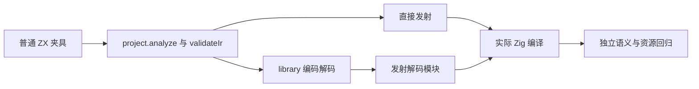
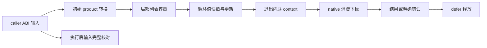

# 循环聚合列表独立回归执行计划

## Intent：最终目标

用普通 ZX 源码实际生成并执行 Zig，验证聚合元素的值快照、嵌套 product 转换、共享初始输入的两个独立列表、零步、动态消费下标、错误和 OOM；同时验证旧列表观察、聚合函数调用、完整列表返回保留正确回退。测试属于 zxc 所有特性覆盖，不能冒充新增 Test262 整份适配。

## Data：可用证据

已读取 list_plan、iteration_buffer 的版本分析、initial/conversion、consumer 和 local 生命周期。已有 iterate_buffer 仅覆盖标量元素；value_return 提供真实 project analyze、validateIr、library encode/decode 和 emitBundle 两条生成路线。新增远端 2320d2e9 允许选定 primitive 列表转移，完整 Frame[] 仍不能满足该 primitive 子元素条件。本轮在同步后的源码验证。

## Edges：边界与限制

不修改编译器，不增加运行库，不用手写 IR 或复制 eligibility predicate 作为 oracle。独立 host 值模型计算结果；对象包装地址不是值语义契约。零步非空聚合列表允许分配；只有固定最大容量的内联模式检查资源不随步数增长。完整列表输出和旧列表版本的回退不施加此预算。输入检查先于展开 execute 的 error union，全分配失败检查使用既有 noResize/noRemap helper。native 消费下标通过真实参数记录确认，不使用预设答案。

## Answer：交付格式与成功标准

正式测试位于 packages/test/tests/collections/aggregate_loop，多层目录按夹具、普通回归和 native 消费职责划分。新增独立构建步骤接入总 test。每个 source/library 产物实际编译执行；Debug 和 ReleaseSafe 门禁分别保存原始日志、生成程序和 ABI，以及哈希。测试声明数与路线重复执行数分开统计。文档和代码草稿保存于本目录，完成一部分后英文 Conventional Commit 提交并 push。

## 步骤

1. 采用成熟 stack 原文，新增 nested、two_lanes、bounds、old_list、call、escaping 与 consumer 普通夹具。
2. 复用 value_return 的真实编译与库往返，不把内存发射字串当执行通过；按生成公开类型创建输入。
3. 分职责建立独立数学模型、完整输入不变、结果寿命、首错和全分配失败观察。
4. 在隔离冻结工作区冷缓存执行两模式；检查实际局部值缓冲与回退形态，保存产物。
5. 运行相邻已有 iterate_buffer 回归，复核 diff 与保留其他修改，提交并 push。

## 自我批判约定

夹具解析失败、宿主断言错误或收集脚本假设属于测试准备问题，先查明再判断生产缺陷。只有能由实际生成程序重复证明的实现错误才通知指定实现会话。源文本形态和数值通过均不能单独证明完整优化正确；资源保证只适用于实际生成内联路径。总体目标仍包括尚未审阅 Test262 与全部特性，不以此小节完成替代全局完成。
