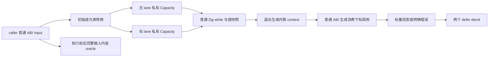

# 循环聚合列表独立回归：边界与风险分析

## Intent：最终目标

为局部聚合列表值布局优化建立少量独立回归。分别证明普通 ZX 语言行为、公开 ABI 保留、选定列表的值布局生成形态及容量生命周期。测试不得调用或复制生产 eligibility predicate 作为 oracle，不伪造 IR，也不把普通对象包装或临时列表的 pointer 身份当语言契约。

本次只检索、阅读、分析，交付此文档；没有修改正式源码或测试、执行门禁、提交或向其他会话发送消息。

## Data：固定源码与既有覆盖

固定阅读 SHA：`e221f3cc4e67dbd2d80119f087ebfb18048211ad`。所有行号基于该提交；下列链接指向共享工作区，主线继续推进后当前文件行号可能变化。

主要实现入口：

| 文件                                                                                                                                                                                                                                           | 固定入口与职责                                                                           |
| ---------------------------------------------------------------------------------------------------------------------------------------------------------------------------------------------------------------------------------------------- | ---------------------------------------------------------------------------------------- |
| [iteration.zig:29](/Users/xiewendao/Documents/MatrixAges/zxc/packages/genz/src/zx/iteration.zig:29)                                                                                                                                            | consume/discard 模式先尝试 local；reference/value 不使用这条新路径；失败回退既有生成方式 |
| [iteration_value/local.zig:9](/Users/xiewendao/Documents/MatrixAges/zxc/packages/genz/src/zx/iteration_value/local.zig:9)                                                                                                                      | 初始求值、局部 context、容量、条件/步骤、退出 context、最终消费                          |
| [list_plan.zig:9](/Users/xiewendao/Documents/MatrixAges/zxc/packages/genz/src/zx/iteration_value/list_plan.zig:9)                                                                                                                              | 状态形状、所有聚合列表路径、冲突缓冲、局部表达式完整门禁                                 |
| [iteration_buffer/analysis.zig:22](/Users/xiewendao/Documents/MatrixAges/zxc/packages/genz/src/zx/iteration_buffer/analysis.zig:22)                                                                                                            | 每条列表路径的版本与别名安全证明                                                         |
| [iteration_consumer.zig:8](/Users/xiewendao/Documents/MatrixAges/zxc/packages/genz/src/zx/iteration_consumer.zig:8)                                                                                                                            | 标量 projection、独立下标、最终消费生成                                                  |
| [iteration_value/initial.zig:9](/Users/xiewendao/Documents/MatrixAges/zxc/packages/genz/src/zx/iteration_value/initial.zig:9)                                                                                                                  | 初始 ABI 列表逐元素直接填入私有容量                                                      |
| [iteration_value/types.zig:6](/Users/xiewendao/Documents/MatrixAges/zxc/packages/genz/src/zx/iteration_value/types.zig:6)、[conversion.zig:7](/Users/xiewendao/Documents/MatrixAges/zxc/packages/genz/src/zx/iteration_value/conversion.zig:7) | 局部 struct/tuple/optional/list 类型与递归转换                                           |
| [iteration_buffer/root.zig:13](/Users/xiewendao/Documents/MatrixAges/zxc/packages/genz/src/zx/iteration_buffer/root.zig:13)、[capacity.zig:8](/Users/xiewendao/Documents/MatrixAges/zxc/packages/genz/src/zx/iteration_buffer/capacity.zig:8)  | 每个 lane 的容量创建、override 安装、恢复、defer 释放                                    |

实施记录 [内联实施记录.md:7](/Users/xiewendao/Documents/MatrixAges/zxc/docs/2026-10-07/解析状态自举前置/内联实施记录.md:7) 与实现基本一致，但必须按其明确限制理解：20 行记录零轮仍有 O(N) 初始复制；28–49 行是人工展示与执行，不是正式断言注册；57 行报告既有专项成功。这些记录可作为历史证据，本文没有重新执行验证，也不能据此宣称下面的边界已覆盖。

### 成熟测试组织

- [build/iterate_buffer.zig:4](/Users/xiewendao/Documents/MatrixAges/zxc/packages/test/build/iterate_buffer.zig:4) 的 `test-iterate-buffer` 已有 11 种 mode，经 CLI 生成普通 Zig 并执行。[iterate_buffer/root.zig:89](/Users/xiewendao/Documents/MatrixAges/zxc/packages/test/tests/collections/iterate_buffer/root.zig:89) 有零步、1/2 步、长执行、延迟更新、全部实际分配失败、资源规模检查。这组元素是 i64，主要返回对象并保留列表；不会触发新局部聚合列表路径。
- [iterate_buffer/fixtures/two_fields.zx:8](/Users/xiewendao/Documents/MatrixAges/zxc/packages/test/tests/collections/iterate_buffer/fixtures/two_fields.zx:8) 已让两份 i64 列表借用同一个输入；不能把它当两个聚合元素 Capacity 的生命周期覆盖。
- [iterate_buffer/fixtures/stale_local.zx:13](/Users/xiewendao/Documents/MatrixAges/zxc/packages/test/tests/collections/iterate_buffer/fixtures/stale_local.zx:13) 与 stale_branch/stale_switch/stale_state 覆盖旧列表快照；元素是 scalar，且公开输出持有列表。新路径应补聚合元素快照与旧列表 alias 的对照，不另造相同 i64 单例。
- [build/iterate_calls.zig:23](/Users/xiewendao/Documents/MatrixAges/zxc/packages/test/build/iterate_calls.zig:23) 已有 source/library 两条普通 Zig 编译执行路径；[iterate_calls/compile.zig:11](/Users/xiewendao/Documents/MatrixAges/zxc/packages/test/tests/collections/iterate_calls/compile.zig:11) 在生成 library 产物前真实释放原始 analysis、library、编码 bytes，适合复用这一成熟 owner 边界。
- [value_return/borrowed_objects/root.zig:165](/Users/xiewendao/Documents/MatrixAges/zxc/packages/test/tests/collections/value_return/borrowed_objects/root.zig:165) 已覆盖多份逃逸结果、只读对象列表、输入/owner 保留和 OOM。它的 loop 只读列表并返回 State，缺少本轮必须具有的聚合列表更新和 scalar consumer。
- [value_return/native_scalar/root.zig:129](/Users/xiewendao/Documents/MatrixAges/zxc/packages/test/tests/collections/value_return/native_scalar/root.zig:129) 已覆盖 native 调用日志、首错停止、OOM 调用截止、输入和多份返回结果。可复用 host 日志与失败模式，但不能将这组旧返回对象测试当消费下标退出 context 的覆盖。

## Edges：完整适用边界与生命周期

### 1. 启用的上层约束

新 local 仅从 consume/discard 尝试，见 iteration.zig 30–32 行；local.zig 10 行同时拒绝 state_active、已有 iteration_value context 和事务。正常返回 aggregate/list 的 `.reference/.value` 不走此新路径，ABI 不随此优化改变。

consumer 的上层约束见 iteration_consumer.zig 9–20 行：事务或已缓存 iteration 不消费；输入表达式必须是 iteration；最终类型仅非 string/void 的 scalar、enumeration、error_set。native_reference、optional scalar、string、object、tuple、list 的最终结果不进入 scalar consumer。独立语句的 discard 不要求这种最终类型。

最终表达式只能是绑定结果的 reference 加 field/tuple_field/index/length 投影链。每个 index 的下标必须独立于该 loop 结果 symbol（23–37 行）；`independent` 允许无关 reference、常量、组合运算、对象/tuple/list 构造、call 等，但调用 argument 不能依赖该 loop symbol（39–63 行）。这是依赖限制，不是要求下标无副作用或纯函数。

普通末尾 `const state = loop(...); return state.rows[index].value` 可触发：statement lowering 在 [statements.zig:66](/Users/xiewendao/Documents/MatrixAges/zxc/packages/genz/src/zx/statements.zig:66) 仅尝试 return 前紧邻 const；scope lowering 在 [scope.zig:41](/Users/xiewendao/Documents/MatrixAges/zxc/packages/genz/src/zx/scope.zig:41) 尝试最后一个 binding。夹具必须保留这种邻接，不能无意在两者之间插入日志或另一条 const，然后声称走过 local consume。

### 2. 状态、product 与全部列表路径

`product`（list_plan.zig 32–48 行）允许 scalar、enum、error_set、native_reference；optional/object/tuple 可递归组合。product 内没有 list/task。

`supported`（50–65 行）对 object/tuple 递归检查状态；list 的 child 必须 product，optional 的 child 也必须 product。因此：

- `Row[]`，Row 为 object/tuple 或 optional object/tuple，允许候选。
- Row 内含 string 允许，因为 string 是 scalar；string 仍是普通只读 slice。
- Row 内含 opaque Node/Node? 允许 product；保持 host reference 本身，不能复制/制造 host 所有者。
- Row 内含 `u64[]` 或 task 不允许新路径；嵌套 list 不进入 product。
- 状态中的 `Row[]?`、`{ rows: Row[] }?` 不允许：optional child 含 list，不是 product。不能误解释为所有 optional 都拒绝。
- 状态中 scalar list 可以邻接，但只有 element 满足 iteration_layout.represented（object/tuple，包含外层 optional）的列表才计入被选聚合 lane。至少需要一个这样的 lane（list_plan.zig 17 行）。仅 Node[] 或 i64[] 不会单独启用新路径。

每条 object/tuple 路径上的聚合 lane 都必须经过 analysis，且任何 update 已存在 list_update_buffers/collection_buffers 就整体拒绝新路径，见 list_plan.zig 67–92 行。一个聚合 lane 安全、另一个聚合 lane 不安全时，不能只内联安全的那条。因此测试应独立观察两条 lane 与“一条不安全导致整体回退”。

### 3. 表达式约束

list_plan.zig 94–165 行完整检查 condition 与 body，而不只检查最终 state：

| 语义类别                       | 新路径边界                                                                                                                                                 |
| ------------------------------ | ---------------------------------------------------------------------------------------------------------------------------------------------------------- |
| 类型与普通缓存                 | 每个被访问 expression 类型 supported；Lower.cache 已缓存非 primitive 值拒绝                                                                                |
| reference                      | loop 参数与 scope 已顺序绑定的局部 symbol 可用；外层只允许 primitive reference，外层 aggregate/list 捕获拒绝                                               |
| 常量、projection、index、unary | 常量允许；child 全部递归检查；index 保留普通 bounds 检查                                                                                                   |
| optional                       | some、optional_value 递归检查；含被追踪列表别名的 optional 包装/解包另被版本分析拒绝                                                                       |
| binary                         | null equality/inequality、coalesce 或两侧 primitive 可用；普通 aggregate/list 身份比较拒绝；native_reference 属 primitive，不能笼统说全部 pointer 比较拒绝 |
| object/tuple/list/template     | 所有 evaluation/field/child 检查，确保源求值与重复使用仍有完整路径                                                                                         |
| scope                          | binding 顺序检查后标记该 symbol 为局部；result 再检查                                                                                                      |
| list 操作                      | list_update 可用；push/pop/concat 可用；reverse/sort/splice 走回退                                                                                         |
| call                           | pure_functions 为真，且 function input/output 都是 primitive，再递归 argument；aggregate/list 入出拒绝                                                     |
| match/conditional              | 完整分支检查；match subject 还要求 primitive；版本分析再做 branch join                                                                                     |
| 其他                           | capture/task/await/cancel/parallel、transform、嵌套 iteration、Store 等不进入                                                                              |

pure_functions 来自 [value_call/analysis.zig:46](/Users/xiewendao/Documents/MatrixAges/zxc/packages/genz/src/zx/value_call/analysis.zig:46)，native 的 pure 判定是 [native_value.zig:3](/Users/xiewendao/Documents/MatrixAges/zxc/packages/genz/src/zx/native_value.zig:3) 的 valueBoundary，而不是“没有可见业务副作用”的保证。native 单个 primitive 入出可以允许，包含 host reference 的叶子也并非全部拒绝。多个参数形成 tuple input，虽 external.expand_tuple 可能满足 valueBoundary，仍不满足 list_plan 的 primitive(input)，会回退。native 返回 list 也不满足这里的 primitive(output)。

### 4. 列表别名版本

[iteration_buffer/analysis.zig:36](/Users/xiewendao/Documents/MatrixAges/zxc/packages/genz/src/zx/iteration_buffer/analysis.zig:36) 每次只追踪一个指定路径，初始 current=0；condition 不得推进版本。body 至少有一条 update，最终 state 对该路径保留当前 version，其他 sibling 不得持有该 lane alias；再用最终 version 验证下一次 condition 不推进版本（44–60 行）。

- update target 必须是当前 version；advance 记录真实 update expression，并产生新 serial，见 306–319 行。
- stale alias 可存在，只要不在更新后观察其元素。index 会 observe target 与下标（108–114 行）；旧列表 length 只观察元数据，不检查该 version 是否当前（103–107 行），不能强加“所有旧 length 都禁止”的错误契约。
- `const before = current.rows[0]` 是普通元素值快照：index 观察当时有效列表，但结果事实是 none。后续更新列表后读取 before 的值合法；与保存整条旧列表再读 old[0] 不同。
- `.some/.optional_value` 的子事实 contains lane alias 即拒绝（234–243 行）。pop 返回第二槽的 optional product 不带列表版本，允许解包；不要因为看到 optional_value 就复制旧拒绝规则。
- push/concat 参数、list/template child、list_update replacement 都不能携带当前 lane alias；把它塞入别处可能逃逸（119–120、244–265 行）。
- conditional/match 以 snapshot/restore/join 合并版本（161–195、336–359 行）。[fact.zig:30](/Users/xiewendao/Documents/MatrixAges/zxc/packages/genz/src/zx/iteration_buffer/fact.zig:30) 仅合并两侧对应当前版本；不一致路径成为 stale；分支不同 update 数量不能以复制函数实现作为测试 oracle。
- 条件中的 logical_and/logical_or/coalesce 若右侧推进版本即拒绝（277–295 行），避免短路执行的版本不确定性。
- 未选跨函数 lane 时，传递含 alias 的 argument 到 external 或含 list output 的函数拒绝（197–232 行）；list_plan 更进一步拒绝所有 aggregate/list 的 call input/output。

### 5. 表示与退出生命周期

正常 ABI 的 object/tuple/native_reference 是 const pointer；list 是元素 ABI 的 const slice，见 [types.zig:16](/Users/xiewendao/Documents/MatrixAges/zxc/packages/genz/src/zx/types.zig:16)、25–32、65–71 行。内联私有 context 则递归创建普通 struct/tuple，optional 保留 null/present 分支，list 变为 slice of local element，native_reference 仍采用正常 opaque pointer；types.get 6–44 行与 conversion 11–51 行实现这一传播。

local.zig 15 行先在正常 context 求值并绑定 initial，20 行才进入局部 context。initial.convert 对 object/tuple 沿静态路径递归；选定聚合 list 不先做另一份中间数组，而是 ensureTotalCapacity → 设置 items.len → for ABI source 逐元素 convert → 设置 started → 以 items 作为 state 字段，见 initial.zig 40–68 行。

**零步仍发生初始转换。** 非空输入至少需要私有容量并复制每个元素。空列表可以不产生运行时容量分配，但不能从此推广为任何零步都零分配。before.value 等普通对象快照应检查完整值，不检查 before wrapper 地址。

Capacity.create 生成 std.ArrayList(local element)，empty、started=false 和 defer deinit（capacity.zig 8–18 行）。每条 path 创建一份 Capacity，root.installCapacity 111–123 行安装自身 update override；两条 lane 即两份独立的容量容器。容量增长可搬迁；不应检查初始/中间 items.ptr 固定。

selected list 的 update 在 started 后复用 items；push/concat 保留 std.math.add(usize) 的长度溢出检查，再 prepare 并 append/appendSlice，见 [collections.zig:60](/Users/xiewendao/Documents/MatrixAges/zxc/packages/genz/src/zx/collections.zig:60)、120 行。pop 空列表返回 null，非空返回末元素并缩短 source slice（31–35 行）；下一次 prepare 会调整实际容量 items.len。list_update 求值 source/index/value 后才检测 bounds（list_update.zig 11–15 行），这一求值顺序不能被优化改变。

local.zig 62 行**先退出 iteration_value context**，64 行再 consumer.read。consumer.read 的 index 在 [iteration_consumer.zig:78](/Users/xiewendao/Documents/MatrixAges/zxc/packages/genz/src/zx/iteration_consumer.zig:78) 通过正常 self.expr 生成独立下标。它可以调用接收普通 ABI aggregate 的函数，或构造参数；不能被错误当作私有 state_type。生成声明时的顺序决定最终生成的 ordinary Zig 是否类型正确，必须实际编译执行才能证明。

local 返回 scalar/unit，不调用 buffers.finish，也不做 toOwnedSlice；aggregate.finish 将最终消费放进同一个带 defer 容量容器的 block，先计算 scalar 再退出释放，见 [aggregate.zig:99](/Users/xiewendao/Documents/MatrixAges/zxc/packages/genz/src/zx/aggregate.zig:99)。越界/OOM/native error 也应经 Zig defer 释放。index 检查 `offset >= len` 返回 IndexOutOfBounds，见 [intrinsics.zig:6](/Users/xiewendao/Documents/MatrixAges/zxc/packages/genz/src/zx/intrinsics.zig:6)；capture 边界有专门 break 行为，不能伪造无效 IR 强迫 local 与 capture 重叠。

生成期的 context、names、override 都有 defer restore（local.zig 21、25、39–40 行；root.restore 160–167 行），并且 init 部分安装失败会 errdefer restore（root.zig 16 行）。生成器自己的临时资源由 render 的 Arena 收口，见 [render.zig:15](/Users/xiewendao/Documents/MatrixAges/zxc/packages/genz/src/zx/render.zig:15)。应用运行时的私有 Capacity defer 与生成器 Arena 是两种不同生命周期。

## Answer：最小独立回归建议

建议在 `packages/test/tests/collections/iterate_buffer/` 新建一个职责清晰的 `products/` 子目录，复用现有生成/执行组织，补少量受控 mode。需要 source/library 双路径、host 调用或解码后释放原输入时，复用 iterate_calls 的 compile.zig 所有权流程或 value_return 的 host 接线；不要新增通用 Node/运行器。正式实现和门禁由主代理决定。

### A. 两条 product lane：行为、零步和资源

基础普通 ZX 草稿形状如下。元素名使用应用普通概念，不识别编译器 Frame 或路径。

```zx
export type Item = { value: i64, enabled: bool, meta: [u64, string] }

export type Input = { left: Item[], right: Item[], steps: u64 }

export type State = {
    left: Item[], right: Item[], remaining: u64, total: i64
}

export type Output = i64

export default function (in: Input): Output {
    const initial: State = {
        left: in.left, right: in.right, remaining: in.steps, total: 0
    }

    const state = loop(initial, {
        while: current => current.remaining > 0,
        next: current => {
            const before = current.left[0]

            current.left[0].value += 1
            current.right[0].value += 2

            current.total += before.value * 10
                + current.left[0].value + current.right[0].value

            current.remaining -= 1
        }
    })

    return state.total
}
```

独立 oracle：初值 left[0].value=l、right[0].value=r，n 步输出 `n*(11*l+r+3) + 13*n*(n-1)/2`。测试输入值取不同正负数，避开 i64 溢出。测试 n=0/1/2/长执行、空列表零步、空列表正步越界。用两个 lane 借用同一份 Item 列表，l=r，仍按两条更新各自推进的公式观察，发现共享 buffer 导致串改。

行为检查在 execute 返回成功或错误之后、Arena 释放之前进行：Input 每个字段、列表长度和 slot 内容、所有 Item 字段、tuple/string 原始内容均保持不变；不只检查第 0 个 value。不要断言生成私有列表或 before 对象的地址。测试可检查 caller 自己的原始 pointer/slot 没被写改，但这不同于对生成中间值施加地址身份契约。

在邻接 mode 中把 Item 扩展为嵌套 object、tuple、optional object 和 Node/Node?，输出 score 要实际读取各层内容，并分别覆盖 none/present；optional product 列表可用 push/pop 的第二返回槽解包，覆盖空 pop 和非空 pop。每轮读取元素快照后更新相同槽位，独立 Zig 值数组模型确认旧快照仍是旧值。

资源 oracle 与行为 oracle 分开：固定初始长度和最大容量，改变步数，实际跟踪分配字节应有相同或明确常数范围，不能随每轮 product 构造增长。使用 noResize/noRemap 或 resize_fail_index=0，避免 allocator resize 掩盖分配。对有持续 push 增长的列表按最大容量给规模预算，不能要求分配次数恒定。只允许安全尺寸构造，不伪造巨大 slice 去碰 usize overflow。

### B. 退出 context 后的消费下标与首错

把最后 return 改为 `state.left[choose(in.selection)].value`，其中 choose 是真实 native 声明，单参数 Selection 为普通 object 或 tuple，返回 u64；保持 while/body 不调用 choose。消费下标独立于 state，所以允许局部 consume，而 choose 参数必须走公开 aggregate ABI。

host 记录调用次数、参数完整内容、事件顺序，并可注入 NativeFailure。三个独立观察：

1. 有效 index：loop 完成后 choose 恰调用一次，返回正确最终元素值；至少一次零步非空输入也读到初始值。
2. 返回越界 index：choose 已调用一次，随后 IndexOutOfBounds；输入保持，两个容量 defer 可在生成形态与实际 allocator 生命周期中观察。
3. choose 自身失败：恰一次调用后 NativeFailure，不发生后续读/调用。另有循环内越界时 choose 完全未调用，证明 runtime 的 loop 错误先于消费下标执行。

这里 choose 可有业务副作用；不要要求其 pure。生产 consumer.independent 只约束它的 argument 不读取 loop symbol。使用含 aggregate 参数的 host 有助于发现退出 context 过晚导致的私有布局/ABI 类型混用。

全部实际分配失败 sweep 中 host 日志应是独立完整事件列表的前缀，并有错误后截止记录；OOM 可在初始第一/第二 lane 容量建立、后续增长或参数构造时出现，所以不能要求每次 OOM 都已经调用 choose。应用执行后必须检查输入完整性，再传播错误给 allocation_testing。OOM 单个结果分类不能代替调用日志与 owner 检查。

### C. 少量语义必要的回退邻接

优先选择两种，可共用基础 type/host：

- 保存整条 `old = current.left`，更新 left 后读取 old[0]。普通不可变语义必须读旧元素，输出按旧值 oracle；源码应使用原有表示，不出现这个新 private product lane。对照 A 的 before 元素快照，区分“元素可按值保存”和“列表 alias 必须保留旧版本”。分支更新数不同再读旧列表是第二个可选 mode，已有 scalar stale_branch 不需完整复制。
- 把当前 Item 或列表送给真实 aggregate helper/native accessor，再更新 lane；独立检查完整返回值与调用日志，确保回退仍正确。helper/native 的 aggregate 入出不能被局部表示漏传。另选一个无 aggregate 参数的 primitive native call 作允许对照，不要把所有 native call 都写成必须回退。

optional 包裹列表、list 元素含 list、reverse/sort/splice、外层 aggregate 捕获、依赖 loop symbol 的 consumer index、公开返回聚合结果属于其他明确回退边界；本轮无需每种都新增大套测试。可挑一个在既有 fixture 中成熟且类型/语法普通的形状，并以真实行为和局部生成形态观察，不直接调用 eligible 断言 false。

### 行为与源码形态分离

行为断言必须来自显式数学公式或小型普通 Zig 值模型、host 参数事件和输入保留，不能调用 list_plan/analysis/fact 来生成预期。正式 analyzeProject → validateIr → emitBundle → 实际 Zig 编译执行，source/library 两路线使用相同独立 oracle。

源码形态可以在发射阶段附加范围明确的检查：

- 只在目标 execute 的局部循环 block 中定位两份 ArrayList，每个 element 为普通 struct/tuple 或 optional product；公开 ABI 仍是 pointer object 元素。
- 两份 defer deinit、初始 ensureTotalCapacity 与逐元素填充出现在 while 前；consumer block 不出现将 lane toOwnedSlice 后逃逸。
- product 构造不逐轮 allocator.create，不逐轮 dupe 整条选定列表；consumer choose 在 while 之后且使用正常 ABI 参数。不能全文件搜索 create/dupe 后断言完全没有，因为 ABI、helper 与非 lane 临时对象可以合法分配。
- 用发射的语法树节点/范围结构或受控 fixture 中有限的源码片段检查；不要精确匹配 state_type_N/local_state_N 的编号，fresh 编号不属于契约。

source/library 生成相等不是唯一成功标准：应各自可编译执行并满足 oracle。普通 scalar 值正确但 product 仍被逐轮装箱，说明行为通过而优化形态/资源目标未覆盖；局部类型文本存在但首次填充、可选解包或末尾下标错误，说明形态观察不能替代行为。



### 成功标准与自我复核

本轮最小高价值组合为：双 product lane + 元素快照/零步/资源；退出 context 的动态 native 下标 + 越界/首错/OOM；旧列表 alias 与 aggregate call 的回退对照。既有简单 scalar buffer、只读逃逸对象列表、普通 native scalar 调用继续保留。

本文没有执行源码草稿或新增断言，调用形状仍需主代理实现时经正式解析/分析确认。本文没有把历史 380 检查推广为新聚合 lane 完整覆盖，也没有把 ArrayList 的地址稳定、零步零分配、整个 Arena 每次调用立即归还容量、所有非 lane 临时分配均释放等未承诺行为当语言契约。native opaque 身份可通过 host 能力行为验证，普通 product 包装身份不作 oracle。具体资源预算必须基于 fixture 的最大容量与元素布局制定，而不是复制生产判定或硬编码仅能命中特定业务样例的分支。
