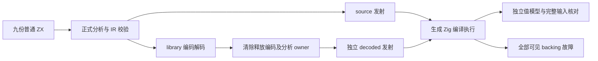
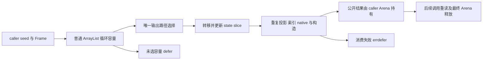

# 循环选定列转移独立回归实施记录

## IDEA

- Intent：独立验证选定 primitive 列转移的值、公开 ABI、重复投影、嵌套路径、错误及调用方生命周期。
- Data：冻结生产 `e42d096c40c3ebed30c1d348d424520d4a4392ad`，21 个输入；普通源码分析与 IR 校验；source/library 实际发射编译；独立数值模型、native 参数事件和输入保留；两模式与相邻回归的原始门禁日志。
- Edges：仅新增已授权测试与注册，不修改生成器，不引入专用运行库、解释器或动态加载。对象/列表包装地址不作为语言 oracle。Arena backing 故障不等于每个内部逻辑分配故障；完整帧返回和未选容量边界保持区别。未新增 Test262 review 或 JSON catalog 用例。
- Answer：loop_columns 正式多层测试目录、test-loop-columns 与总 test 一行接入；72 份 program/ABI 原始文本、输入与输出哈希、原始日志、草稿、IDEA/Mermaid 与自我复核。按要求英文 Conventional Commit 提交并 push。

## 第一性问题

局部 Frame 值容量在循环结束时释放，输出列却需继续由调用方 Arena 持有。正确流程是按唯一状态路径转移选定列、更新状态切片，然后读取所有投影和构造公开结果。同一个状态列写入多个输出位置，不应重复 take；未选 Frame/scratch 保留 defer，转移后的错误保留 errdefer。

不仅要测试新对象返回，还要测试直接返回 primitive slice 与公开 tuple。Frame[] 则不能以私有值布局逃逸。零步 primitive 列没有 started，保留原有初始值；非空 Frame 的初始转换仍可能分配。输入只读和输出 owner 有效期是两项观察，不能以生成列表元素数正确替代。

## 夹具与独立模型

| mode     | 每路线实例 | 观察                                                                                                                                       |
| -------- | ---------: | ------------------------------------------------------------------------------------------------------------------------------------------ |
| mixed    |          7 | 原样保留成熟混合 stack，push、旧值、字段更新、pop optional、columns/scratch；total 按 `t'=4t+2`，columns 为各步 total，mirror 内容完整一致 |
| direct   |          7 | 相同循环直接返回 u64[]；验证公开 slice ABI、零步非空 seed、完整 prefix 和后续调用寿命，与 Frame[] 回退对照                                 |
| borrowed |          7 | columns 从可写 caller seed 借用初始化；0/1/17/257 长度，零步与增长后前缀均保持，宿主所有 slot 不变                                         |
| shrink   |          7 | 每步追加 total、追加额外 index 再 pop，最终列仍为正确递推序列；逻辑长度低于最近一次容量 items 长度，验证 finish 缩短及转移后读             |
| nested   |          7 | 状态 object.box 内有 Frame/columns/scratch；返回 tuple、新 object、长度与重复列，检测状态路径与结果包装混用                                |
| dual     |          7 | 同一初始 seed 作为 left/right，分别追加 11+i 与 101+i；重复 left、两个索引与长度；双转移后精确越界、OOM、保留结果与线性资源规模            |
| leaves   |          6 | optional u64、string、bool 三列移交；none/present、空串/ASCII/UTF-8/嵌入 NUL，普通标签动态输入，三列完成后的 optional 下标                 |
| consumer |          7 | native 真正读取公开 Selection，记录 slot/fail 与调用次数；消费在转移后，SelectionFailed 优先于索引越界，第二次失败后首次结果保持           |
| fallback |          7 | 输出包含公开 Frame[]，内联 selected result 回退；公开 Frame 每个字段、全部列和首次结果寿命保持                                             |

四份 runtime root 共 27 条源级 test 声明，在九夹具中实例化为每路线 62 项，source/library 实际共 124 项。多输入、多个 backing 故障点、重复优化模式及生成形态检查不另计独立用例。已有 JSON 80,872 的统计不因本轮 Zig 检查而增加。

宿主模型只按普通递推/算术与显式 prefix 求值，不调用生产 eligibility、buffers 或 fact。dual 的两列追加值不同，能发现共享可变容量或错路径；nested 通过 tuple 槽及字段名逐项检查。Input 的 Frame/columns 或 optional/texts/flags 由 caller 在故障 allocator 外准备，execute 的 error union 保存后先核对输入，再展开结果。两次调用复查首次返回内容；consumer 以第二次的 native 或 bounds 失败验证 retained result，没有在 Arena 释放后访问任何数据。

## 编译、codec 与公开 owner

compile.zig 采用成熟 iterate_calls 的嵌套 owner 块：source 分析和发射后 link/encode/decode，将编码 bytes 置零，在退出块时释放 bytes、library 和 analysis，然后才用独立 decoded owner 发射 library 模块。这样 encoded owner 的释放不是单纯写在函数末尾。两 route 用相同独立 runtime 模型实际编译执行，不用手写 IR。

库 link 生成额外静态函数，因此 source/library program 文本不同；对应 ABI 相同。两个 program 各自通过，不用字节相等代替行为。测试名字中的 source/library 是该实际链，不声称 CLI publish、消费再发布或完整 package 部署覆盖。

实际应用产物只导入 std、结构定义 zxc_abi，以及 consumer 的显式静态 choose。没有新增 zxc 专用 runtime。选择性转移使用普通 std.ArrayList，result 对象/tuple 仍保持现有公开 ABI；借用 string 字节在 caller 中继续存活，测试不手工 free 重复输出字段。

## 形态、错误与成本

shape.zig 限定受控 execute，拒绝 Frame[] 的内联逃逸；其他 modes 有一条 Frame 值 lane。mixed/direct/borrowed/shrink/nested/consumer 有三容量、一次列转移和对应 errdefer；dual 有四容量、两次转移；leaves 有四容量、三次转移。deinit 均保留；未选 Frame/scratch 没有转移。每份源码都确认转移在 while 后，受控循环内没有 Frame allocator.create。检查 fresh 符号只使用前缀，不绑定数字后缀。

重复输出的完整内容与有效期是 runtime oracle；一次 toOwnedSlice 是受控生成形态观察。本轮没有采用代理建议中的 columns.ptr==mirror.ptr、输出区间地址或普通产品 pointer 身份作为语言要求。输入外层 slice/slot 指针则核对 caller 的结构没有被写改。

无故障非法索引必须为 IndexOutOfBounds；native fail 必须先 SelectionFailed，并恰调用一次。消费出错发生在选定列转移之后，和仅零步未开始容量的错误分开。OOM 时 native 事件必须是预期完整事件的前缀，不强加“尚未调用 native”：对象最终构造仍可分配，第二次调用也可能失败。实际 native 调用后需要停止，首次输出仍应可读。

所有故障检查使用既有 allocation_testing 的 noResize/noRemap，Arena 结束后核对 backing allocated/freed。std helper 检查每个实际 backing 失败点的字节平衡并禁止吞掉 OOM。Arena 可能保留非末尾空间，因此这些结果不能单独证明每条逻辑 free 当场返回内存；生成 defer/errdefer 和结果寿命是补充证据。

dual 以 256/1024 步比较分配规模，小于八倍增长，允许随真实输出增大，不把所有列输出误写为恒定成本。两个独立列与 scratch 有普通几何增长；没有把此预算强加给 Frame[] 回退。

## 最终门禁与重放

工作区 `/Users/xiewendao/.codex/worktrees/json-output-conformance/zxc` 冻结 e42d096c 与输入清单中的 21 文件。宿主 Zig 0.17.0、macOS 26.1、x86_64。命令在 packages/test 执行：

```sh
zig build test-loop-columns --cache-dir /tmp/zxc-loop-columns-complete-debug-e42d096c --summary all

zig build test-loop-columns -Doptimize=ReleaseSafe --cache-dir /tmp/zxc-loop-columns-complete-safe-e42d096c --summary all

zig build test-aggregate-loop --cache-dir /tmp/zxc-loop-columns-adjacent-debug-e42d096c --summary all
```

| 门禁                      |  步骤 | 实际检查 | 实际叶节点 | 缓存测试叶节点 |
| ------------------------- | ----: | -------: | ---------: | -------------: |
| 最终 Debug                | 85/85 |  124/124 |         18 |              0 |
| 最终 ReleaseSafe          | 85/85 |  124/124 |         18 |              0 |
| 相邻 aggregate-loop Debug | 78/78 |  102/102 |         16 |              0 |

收集器用实际 emitter 再发射保存 program/ABI 文本，并以哈希锁定实际 build cache 的对应输出目录。九夹具×两 route×program/ABI×两优化模式=72 份原始字节；36 组对应文件跨优化模式一致，原始文本不因仓库格式化而改写。最终输入和 leaf 实际执行逐项由核验门禁证据.py 复核。首次准备失败、七夹具 96 检查和八夹具 110 检查日志保留，但不替代终态输入门禁。

## 并行修改与自我批判

原有十一份 tracked 修改核对哈希并保留，未纳入本轮提交。只清理本会话冻结工作区的前一轮二十输入，先核对全部 SHA、保存 own diff，仅恢复 own build.zig 并删除 own 新文件，再更新 e42d096c；历史日志不改，旧 live verifier 需恢复当时输入。生产没有确认实现缺陷，未通知实现会话。

- 代理文档是分析和建议，不是已执行证据。覆盖代理建议的部分地址与 capture 观察未采用；公开值模型及作用域证据优先。指针身份相关建议不能自动成为语言契约。
- 后续仍需 primitive 列仅 pop/静态字段更新、未更新列、跨 helper value layout、native opaque leaf、captured loop/捕获 helper，以及独立 CLI package 生命周期。当前 helper/native 候选不代表这些路径已经覆盖；没有伪造 IR 命中 capture 门禁。
- 本轮全分配失败是 Arena backing 观测，不宣称强制 OOM 命中每个内部转移、最终对象构造或即时 free。若要验证某个具体逻辑点，需要额外普通程序及可定位的故障证据。
- 受控 shape 的花括号扫描不是通用 Zig parser；夹具不含干扰花括号的字符串。它与实际编译、错误和值检查组合使用，不作为唯一正确性证明。
- 只验证 x86_64 macOS 的 Debug/ReleaseSafe，没有推断其他目标或 stage 1/2/3 自举完成。此处“终态”仅指本轮九夹具，不缩减全局目标。
- Test262 已审阅 2,754、未审阅 50,843 的口径未变。本轮推进 zxc 特性覆盖；全部 Test262 对齐和所有特性目标仍 active。




