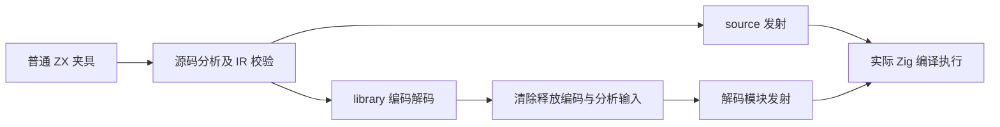
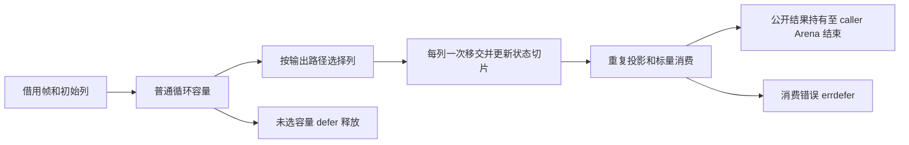

# 循环选定列转移独立回归执行计划

## Intent：最终目标

补齐新 selected column 转移能力的独立普通 ZX 回归：重复引用、多列、嵌套 state/output 路径、optional/string/bool 元素、零步借用、消费下标和错误，以及公开输出在下一调用之后的寿命。继续 zxc 全特性覆盖，不能把这组新语义冒充 Test262 整份等价适配。

## Data：可用证据

当前生产 e42d096c 包含 2320d2e9 的 result 证明与 Capacity.take/finish。已经完整读取 result、consumer、capacity、buffers、scope 和 aggregate 构造顺序；成熟 aggregate_loop 支持真实源码与 library codec 两路线执行，iterate_calls 支持在解码后释放并清除编码输入。本轮复用这些职责，不伪造 IR。

## Edges：边界与限制

正式修改仅为已授权测试与注册，不修改生成器。宿主模型独立计算值；不把资格判定或普通对象地址作为 oracle。动态列输出允许随输出规模增长，不强加恒定分配预算。非空帧零步转换仍可能分配。借用 primitive 初始列是否转移要依据实际更新，不能把生成的 toOwnedSlice 声明次数当运行次数。完整 Frame[] 与 catch/capture 等回退分别验证，不将标量列资格扩展到所有状态。普通 Arena 的全释放不能单独证明每次所有权移交正确，需结合生成顺序、结果寿命、错误与实际故障观察。

## Answer：交付格式与成功标准

测试放在 packages/test/tests/collections/loop_columns，新增独立构建步骤并接入总 test。至少包含单独返回整条 primitive 列、增长后 pop 缩短再转移、混合返回、借用种子、嵌套路径、两列、optional/string/bool、native 消费与必要回退；source/library 各实际执行 Debug/ReleaseSafe，保存原始日志、生成程序/ABI、冻结 SHA 和输入清单。按 fixture 实例计数，重复 route 和故障点不计为额外独立用例。完成后英文 Conventional Commit 提交并 push。

## 实施步骤

1. 读取成熟 mixed-return 普通 stack 源码，保留其 push/pop 和快照观察；增加 caller 数据合同。
2. 建立按职责拆分的宿主值模型、全输入不变、同 Arena 多次成功/失败调用及 OOM sweep。
3. 发射阶段只检查受控 execute 内所需私有 Frame lane、各列容量与一次转移，不全文件禁止 create/dupe。普通 native 参数与首错由真实调用日志确认。
4. 隔离冻结当前生产并执行两模式；解码路线先清除并释放编码输入，再发射执行。
5. 相邻上一部分 aggregate_loop 验证；复核新增 diff、保留其他修改，提交 push。

## 自我批判

源码阅读只支持候选，不代替执行。草稿或收集脚本错误必须先区分，只有实际生成程序证实的生产缺陷才通知实现会话。必须检查当前远端新改动，并在冻结输入上建立证据；总体 Test262 与全部特性目标尚未完成。
