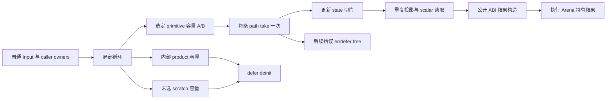

# 循环选定列转移独立回归：转移边界分析

## Intent：最终目标

为局部聚合列表循环结束后的选定 primitive 列转移补充独立回归，验证返回结果在内部容量释放后仍有效、重复投影只接管一次、接管后标量读取正确，以及公开 ABI、嵌套路径与捕获回退。

独立预期来自普通 ZX 的不可变值语义、明确数值公式、调用日志和输入/结果生命周期，不复制生产资格函数作为测试 oracle。只交付这一份分析文件；没有改正式源码或测试、执行、提交。

## Data：固定阅读证据

源码固定在 `e42d096c40c3ebed30c1d348d424520d4a4392ad`。此提交包含已正式注册的 aggregate_loop 回归，但本文没有重新执行它们。远端或当前工作区后续推进不改变本次读取证据。以下行号均以该 SHA 为准，文件链接指向共享工作区。

| 入口                        | 源码证据                                                                                                                                                                                           |
| --------------------------- | -------------------------------------------------------------------------------------------------------------------------------------------------------------------------------------------------- |
| 返回形状与选定路径          | [iteration_value/result.zig:14](/Users/xiewendao/Documents/MatrixAges/zxc/packages/genz/src/zx/iteration_value/result.zig:14)、30–81 行                                                            |
| 接管与返回生成              | [result.zig:83](/Users/xiewendao/Documents/MatrixAges/zxc/packages/genz/src/zx/iteration_value/result.zig:83)、91–122 行                                                                           |
| 消费入口                    | [iteration_consumer.zig:8](/Users/xiewendao/Documents/MatrixAges/zxc/packages/genz/src/zx/iteration_consumer.zig:8)、31–89 行                                                                      |
| 局部 context 退出           | [local.zig:62](/Users/xiewendao/Documents/MatrixAges/zxc/packages/genz/src/zx/iteration_value/local.zig:62)                                                                                        |
| Capacity 接管               | [capacity.zig:40](/Users/xiewendao/Documents/MatrixAges/zxc/packages/genz/src/zx/iteration_buffer/capacity.zig:40)、50–72 行                                                                       |
| 容量安装差别                | [iteration_buffer/root.zig:55](/Users/xiewendao/Documents/MatrixAges/zxc/packages/genz/src/zx/iteration_buffer/root.zig:55)、71–108、111–123 行                                                    |
| 新对象/tuple 构造与求值顺序 | [aggregate.zig:14](/Users/xiewendao/Documents/MatrixAges/zxc/packages/genz/src/zx/aggregate.zig:14)、64–88、99–105 行                                                                              |
| 语句与 scope 的返回布局参数 | [statements.zig:66](/Users/xiewendao/Documents/MatrixAges/zxc/packages/genz/src/zx/statements.zig:66)、[scope.zig:41](/Users/xiewendao/Documents/MatrixAges/zxc/packages/genz/src/zx/scope.zig:41) |
| 捕获的控制流                | [capture.zig:21](/Users/xiewendao/Documents/MatrixAges/zxc/packages/genz/src/zx/capture.zig:21)、[lower.zig:393](/Users/xiewendao/Documents/MatrixAges/zxc/packages/genz/src/zx/lower.zig:393)     |

[混合返回实施记录.md:16](/Users/xiewendao/Documents/MatrixAges/zxc/docs/2026-10-07/解析状态自举前置/混合返回实施记录.md:16) 明确保留公开表示，只移交被选列，读取前更新切片，重复列只移交一次，并拒绝捕获上下文。48–56 行是一次展示源码的生成与人工运行观察；64 行报告旧专项成功。它没有新增独立断言，不应替代本轮回归。

### 已有正式检查及真实缺口

- `test-aggregate-loop` 在 [build/aggregate_loop.zig:13](/Users/xiewendao/Documents/MatrixAges/zxc/packages/test/build/aggregate_loop.zig:13) 注册 stack、nested、two_lanes、bounds、old_list、call、escaping、consumer 八种 mode，每种 source/library 两路线。它们覆盖上一阶段值快照、只消费标量、原生下标与必要回退。
- [aggregate_loop/shape.zig:18](/Users/xiewendao/Documents/MatrixAges/zxc/packages/test/tests/collections/aggregate_loop/shape.zig:18) 对 inline modes 明确禁止 toOwnedSlice；这是原来的 scalar/discard 生命周期形态。不能修改此断言来让旧 mode 同时充当选定列输出用例。
- [fixtures/escaping.zx:7](/Users/xiewendao/Documents/MatrixAges/zxc/packages/test/tests/collections/aggregate_loop/fixtures/escaping.zx:7) 返回 Frame[]，属于聚合元素逃逸的正式回退；[escaping_test.zig:54](/Users/xiewendao/Documents/MatrixAges/zxc/packages/test/tests/collections/aggregate_loop/escaping_test.zig:54) 已独立检查零步、二次调用、越界和全部分配失败。这不是 primitive 列的选择性接管。
- 实施记录的展示源码同时有 Frame、columns、scratch 三份容量，返回 columns/mirror；记录中有一次 columns toOwnedSlice，但没有正式断言验证收缩后重读、返回构造 OOM 或重复投影接管次数。
- 可直接复用现有 aggregate_loop compile/build、flat_input、host 和 allocation_testing 组织，不需新的通用运行器。当前 compile.zig 32–44 行完成 library encode/decode 后，原 analysis/library/bytes 仍存活；如果本轮要求解码 owner 独立，应另按成熟 [iterate_calls/compile.zig:11](/Users/xiewendao/Documents/MatrixAges/zxc/packages/test/tests/collections/iterate_calls/compile.zig:11) 的嵌套 owner 块释放它们，再发射 library 产物。source/library 自身运行相同 oracle，不等于编码输入释放已覆盖。

## Edges：完整返回与所有权边界

### 1. 资格不是允许任意 State 返回

consumer 首先要求紧邻绑定值为 iteration，事务或已缓存 iteration 不尝试（iteration_consumer.zig 9–10 行）。非 string/void 的 scalar、enum、error_set 沿原 scalar projection 分支；其他结果先经过 result.eligible，再直接尝试 local。local 仍保留原来的 state_active、已有 iteration context、事务与 list_plan 全套约束；至少一条聚合列表 lane 必须安全，见 [list_plan.zig:17](/Users/xiewendao/Documents/MatrixAges/zxc/packages/genz/src/zx/iteration_value/list_plan.zig:17)。仅有 u64[] 状态的循环不是这条新混合返回路径。

result.primitive 是 scalar、enum、error_set、native_reference，以及递归 optional。它不包含 object/tuple/list。result.eligible 在 15 行拒绝整个输出属于 primitive，也拒绝 active capture。因此：

- `return { columns: state.columns, total: state.total }` 可是候选。
- `return state.columns` 在元素 primitive 时可是候选。
- `return { optional: state.optional, text: state.text, node: state.node }` 的叶子投影可允许。
- 单独返回 string、native_reference 或 optional primitive 不进入混合返回。普通数值/enum/error_set 返回沿已有 scalar consumer；其余 primitive 返回回退。不要要求这些单值返回一定有 toOwnedSlice。

visit（result.zig 30–68 行）先拒绝 Lower.cache 中已有的节点，再按 ExprId seen 去重。允许的返回树只有：

1. primitive 类型、来自 loop symbol 的合法投影；投影链允许 field/tuple_field/index/length，下标必须独立于 loop symbol。
2. 新 object 或 tuple 构造，完整递归其 evaluation 和字段/元素。
3. loop symbol 本身或 field/tuple_field 链，最终类型是 list of primitive。collectPath 仅接受 reference/field/tuple_field，不接受 index 或 optional unwrap。
4. 常量字面量。

任意 binary/conditional/call/list literal、some/optional_value、capture 等返回表达式不因结果类型是 primitive 就自动允许。例如 `{ total: state.total + 1 }` 会回退；`{ maybe: state.maybe }` 可以是投影，而 `{ maybe: state.maybe ?? 0 }` 不是纯投影。这里是局部优化边界，不是普通语言不支持这些写法。

嵌套新对象/tuple 能包装已选列；直接返回 state 中的旧 object/tuple 聚合字段不符合 list primitive 分支。整个局部 State、Frame、Frame[]、Frame? 和 `[Frame,...]` 不通过。optional 包裹列表还不满足 list_plan 的状态形状。不能为测试临时造非法 TypeId 或伪造结果 IR 绕过普通分析。

### 2. 选定列路径与重复投影

collectPath 在 result.zig 70–81 行按根到叶顺序收集 object 字段/tuple 槽索引，不硬编码列名。finish 遍历的是 buffers.fields，每个 field 与收集路径比较；命中时只调用一次 field.storage.finish（91–114 行）。

因此同一列在 return 中出现两次，哪怕是不同 ExprId、位于不同新对象/tuple 包装中，仍按同一容量 path 接管一次。ExprId seen 的目的还包括 object.evaluation 与 fields 共享子图时避免重复递归；它不能代替 path 接管去重。

同一路径重复输出的**内容与生命周期**是契约；不把输出 mirror.ptr 必须等于 columns.ptr 写成普通语言要求。接管一次可以通过发射范围中的单个 toOwnedSlice、相应资源规模和错误清理观察。输出 alias 地址相等可以作为生成实现事实记录，但不宜成为语言行为 oracle。

嵌套 object/tuple 路径需要独立输入辨别两个列：相同 element 类型、不同内容、不同静态位置，避免字段排序或 tuple slot 混用造成“表面值相同仍通过”。普通源码可用 `state.table.columns` 与 `state.pair[1]`；在合法 tuple 类型中常量下标产生 tuple_field，不要把动态 list index 当成 collectPath。

### 3. 不是所有返回列都接管

buffers.fields 只记录 Capacity，不记录所有返回列。

- 聚合元素 lane 在 inline context 中必须建立 Capacity（root.zig 65–68 行），但不能被 result 输出，因为其元素不是 primitive；它在作用域退出时释放。
- primitive 列含 push/concat 等动态写入、mutable_state=true 时建立 Capacity（71–86 行）；被选中后可以接管。
- 只有静态 list_update 的 primitive 列使用旧 Storage slice（89–108 行），不在 fields 中；返回它时不执行这里的 take。
- 仅 pop 的 primitive 列 dynamic=true、writes=false，不建立 Capacity；其缩短 slice 保持既有生命周期。
- 未更新的 primitive 列无法通过 analysis 的 updates 非空要求，没有 Capacity；它是借用初值列。

result 支持这些列的合法投影，但“合法返回”不等于“新 buffer 转移”。测试应以完整值和输入不变观察它们，同时只对真正动态写入的选定列检查接管形态。

primitive 初始列不会预填 Capacity，因为 [initial.zig:40](/Users/xiewendao/Documents/MatrixAges/zxc/packages/genz/src/zx/iteration_value/initial.zig:40) 在 child 不 represented 时直接返回原值。非零步骤第一次动态写入由 Capacity.prepare appendSlice 初始列并置 started；零步骤时 started=false，take 留空占位，finish 不覆盖 state 原列。隐藏的聚合 lane 即使零步也会初始复制；不能把零步列表借用推广成整个执行零分配。

### 4. take/finish 的错误和成功生命周期

Capacity.create 保留 defer deinit（8–18 行）。take 的结构为：

1. 定义普通 const slice owned，初值为空。
2. 注册 errdefer allocator.free(owned)。
3. 若 started，将 ArrayList.items.len 改为 source.len，再 toOwnedSlice。
4. finish 若 started，将 state 当前目标切片改为 owned。

接管发生在 result 投影生成之前（result.zig 91–120 行）。这保证 toOwnedSlice 收缩或重新分配后，index、length、重复输出都读取**更新后的 state slice**，不继续读旧 items 地址。不要依赖 allocator 在某次运行一定重新分配；禁止 resize 的 allocator 与普通增长/缩短后读应共同观察。

成功后 ArrayList 为空，defer deinit 不释放交给结果的 slice；未选中的 scratch/Frame 容量仍由各自 defer 释放。若随后某个标量读取越界或最终对象/tuple ABI 构造 OOM，接管 slice 由同一 local block 的 errdefer 回收；已经接管的两个选定列都必须回收。

正常返回的所有权终点是调用方执行 Arena，不是无限期独立 heap 对象。结果必须在 execute 内部 block 退出后、同一 Arena 二次调用后仍可读取；Arena.deinit 后不得读 owned 列。借用列、string 字节和 native Node 的 owner 则是原调用方/host，必须继续存活。

使用 Arena backing 的实际分配失败 sweep 能证明 owner 总体释放，但 Arena 的 free 可能保留非末尾块，因此它不能单独证明每条内部 Capacity 当场释放。需要将生成形态（defer/errdefer、一次 take）与生命周期行为分开报告，不要求 queryCapacity 在 execute 返回后立即下降。

### 5. 返回求值、临时缓存与 ABI

local.zig 62 行先恢复 iteration_value，64 行调用 result.lower。result.lower 先完成选定容量 finish，再为所有 projections 设置临时 Lower.cache，最终按 selected.layout 调用 value_call.expression 或普通 lowering.expr（116–122 行）。缓存键在 defer 中全部移除；visit 已拒绝这些节点原本有 cache，所以不会覆盖旧 entry 后丢失它。

缓存中的投影值是生成出来的 node expression，不保证所有不同投影都在 runtime 只求值一次。object 构造器会按 evaluation 顺序绑定临时值并复用同 ID（aggregate.zig 29–45 行）；tuple 按元素顺序绑定（64–70 行）。源文本写两次带副作用的下标调用，应该记录两次调用，不能误以为路径相同就折叠成一次。已生成共享子图的 evaluation/field 使用，则不能重复求值。

result.layout 在 statements 中来自 self.value_output，在 scope 中来自 layout（statements 72 行、scope 45 行）。普通公开 ABI object/tuple 构造走 construct；value/layout 返回沿既有 value_call 和 aggregate.objectValue/tupleValue。原生引用 leaf 始终是普通 opaque pointer，不转成 product wrapper。

一个低成本的成熟布局邻接是纯 collect(job) 返回 Result，并由入口 `jobs.map(job => collect(job))` 返回多份 Result。Result 作为列表元素会保持公开包装需求；同职责的 [borrowed_objects/collect.zx](/Users/xiewendao/Documents/MatrixAges/zxc/packages/test/tests/collections/value_return/fixtures/borrowed_objects/collect.zx) 已使用此组织。是否实际进入 layout=true 还受 state_plan 与函数分析影响，应读发射的 callValue/return 形态确认，不能把“存在 helper”直接算这条分支通过。

### 6. optional/string/native 叶子与捕获

selected `u64?[]`、`string[]`、`Node[]`、`Node?[]` 满足 list-of-primitive；元素本身保持普通 ABI，take 只接管外层列表，不能释放 string 字节或 host Node。返回对象内的 optional/string/native 直接投影也允许，但从 optional Node 包装下再 unwrap 的返回表达式不是 projection 链，可能回退；可以直接输出 optional 值，由 Zig 宿主检查 none/present。

捕获回退的理由是 Lower.call 在 active capture 中将 fallible call 生成 catch+带值 break（lower.zig 393–398 行），它是普通控制流退出，不能依赖错误返回触发 take 注册的 errdefer。result.eligible 15 行因此明确拒绝 active capture。

普通 `const [err, result] = try helper(in)` 不足以独立观察 active capture 门禁：helper 被独立生成，内部 context 可以仍是 capture=null，helper 真正错误返回会执行自身 errdefer；调用方再捕获错误是合法且应保持的行为。

`const state = loop(...); const [err, value] = try state.columns[index]` 是合法公开邻接，但失去了紧邻 loop binding 的混合 return；它会回退，不能宣称已触达 result.eligible 的 active capture 分支。当前已读普通 ZX 入口未发现可以无额外状态边界、自然产生该具体内部状态的成熟夹具。不要写非法箭头语句块、临时伪造 scope/capture IR 或增加生产测试出口来“覆盖”它。可先做真实捕获调用的行为回归，将这个门禁仍标为源码证据，直到主代理找到合法 public fixture。

## Answer：最小可落地独立观察

### 第一组：两份选定列、重复投影、接管后读取

复用 aggregate_loop 项目生成器与 host，新增受控 `selected` mode。普通草稿形状：

```zx
export type Item = { value: u64 }

export type Input = {
    work: Item[], seed: u64[], other: u64[], steps: u64, slot: u64
}

export type State = {
    work: Item[], values: u64[], other: u64[], scratch: u64[],
    index: u64, count: u64
}

export type Output = {
    columns: u64[], mirror: u64[], other: u64[],
    size: u64, first: u64
}

export default function (in: Input): Output {
    const initial: State = {
        work: in.work, values: in.seed, other: in.other, scratch: [],
        index: 0, count: in.steps
    }

    const state = loop(initial, {
        while: current => current.index < current.count,
        next: current => {
            current.work[0].value += 1

            current.values = current.values.push(current.work[0].value)[0]
            current.other = current.other.push(current.index + 100)[0]
            current.scratch = current.scratch.push(current.index)[0]

            current.index += 1
        }
    })

    return {
        columns: state.values, mirror: state.values, other: state.other,
        size: state.values.length, first: state.values[in.slot]
    }
}
```

独立 oracle：values 为 seed 原内容后接初始 work[0].value+1 到 +steps；other 为原内容后接 100..100+steps-1；size、first 来自这个完整预期数组。work、seed、other、Input 所有字段在成功/OOM/越界后保持完整不变。

同 Arena 内以不同 seed、不同 steps 第二次调用，再完整读取第一次结果，包括 mirror 与 other，防止已移交列仍被内部 deinit 或后来循环复用。还需零步非空 seed、零步空 seed（若 first 越界应独立期望错误）、空 work 正步越界、1/2 步、跨容量增长的长执行。

源码形态：目标 local block 有 work、values、other、scratch 四份容量；仅 values 与 other 各一条 toOwnedSlice，mirror 不增次数；接管后 state 的两个切片更新出现在 size/first 和结果构造之前。work/scratch 仍保留 deinit，无接管。不要用 columns.ptr==mirror.ptr 或精确 fresh 编号充当语言 oracle。

所有实际分配失败采用现有 allocation_testing；成功路径经过初始复制、增长、两个 toOwnedSlice 与最终返回对象构造。Arena 会合并实际 backing 分配，不能仅凭 sweep 成功宣称每个逻辑分配点都已诱发 OOM；应记录实际失败阶段。另对无 OOM 时确定 first 越界的路径 sweep，先做 input 完整检查，再将 OutOfMemory 原样传给 sweep；这个路径专门验证两个已接管列之后的错误清理。选择增长后缩短再接管的尺寸，有助于观察 toOwnedSlice 收缩；资源记录仍需承认 allocator 可以直接缩短而不重新分配。

一个小型 host 邻接可将 first 与第二个读取分别写为 `state.values[native.index(in.firstSelection)]`、`state.other[native.index(in.secondSelection)]`，复用现有 choose 接线，增加完整事件数组。无错误时应按源码求值顺序调用两次；第一次下标越界只出现第一事件；第二次 native 失败出现两事件并停止。两次源文本调用不能被重复路径去重吞掉。这个邻接发生在两列接管之后，比旧 scalar consumer 更直接观察 errdefer 与结果求值顺序。

### 第二组：嵌套路径与叶子类型

少量 shared types + `nested_selected` mode：状态同时包含 object.table.columns 和 tuple pair[1]，两条列同元素类型而内容不同；输出嵌套的新 object/tuple，再重复其中一条列。依输出名字与 tuple 槽完整比较，避免只比总和。

将一条列换为 `u64?[]`，至少 none、0、非零值交错，另包含 `string[]` 的空串与相同文本但独立 caller 字节。宿主检查完整字符串与 optionals，并在结果存活期保持原 bytes owner；不要求复制字符串字节，也不释放 owner 后读取借用字符串。

native 仅需要一个成熟 `Node[]` 或 `Node?[]` 邻接：合法 native module 提供 opaque Node，输入由宿主 owner 提供。循环只传递叶子到列，不调用 aggregate 原生函数；在输出中检查 host 标识/能力行为以及 none/present。node owner 属 host，列表接管不能改变节点内容或自行释放 Node。不再为普通 aggregate wrapper 设地址身份断言。

### 第三组：正常捕获与明确回退

保留已正式测试的 Frame[] escaping 回退，并新增一个真实 try helper 调用邻接：helper 采用第一组普通混合返回，调用方用成熟 typed_try 组织捕获其 IndexOutOfBounds/OutOfMemory，捕获成功时完整读取两份列，捕获错误后保留输入且不执行后续成功分支。这个测试证明跨函数捕获行为，报告时明确不等于 active capture 门禁覆盖。

另一个最小返回树回退可把返回 scalar 字段改成 `state.index + 1` 或把整份 state 聚合直接输出。普通语言值仍正确，但不应接入 result 的选择性局部输出。生成形态按这个 mode 的已知职责判断，不把 predicate 复制成 expected bool。

如果预算允许，一个 primitive 列静态更新或仅 pop 的邻接可验证“没有 Capacity 也能合法返回”；它不要求 toOwnedSlice。不要为补足列表元素组合而拆出大量重复声明。

### 复用组织和证据分层

最小组织放在 `packages/test/tests/collections/aggregate_loop/selected/`，共享 fixture/oracle/资源检查；对现有 compile/build 只扩受控 modes 与普通 native 接线。新形态检查独立于旧 shape 的禁止接管规则；source/library 使用同一个手写 oracle，实际编译执行生成的普通 Zig。需要 owner 隔离时真正释放原 analysis/library/bytes 后再生成解码路线。



### 成功标准与自我复核

成功标准分三层报告：普通值与 owner 生命周期 oracle；选定容量的一次接管与结果读取顺序；真实 OOM/越界/捕获错误边界。没有运行本轮建议，草稿仍需主代理经正式解析和编译确认。

不要求返回列永远拥有新地址、全部输出列都执行 take、Arena 释放后结果仍有效、重复源码调用只执行一次、所有 native/string 叶子都深复制。active capture 的具体内部门禁目前只能作为源码证据，不能用 try helper 的成功替代。本文没有把已有 aggregate_loop 的 102 实际测试或历史 380 检查推导为本轮选定列转移已经通过。
