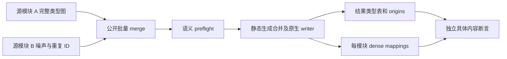
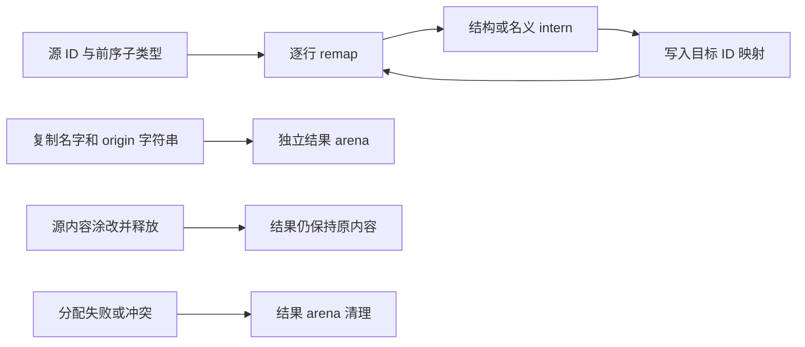

# 批量类型合并独立回归执行计划

## IDEA

- Intent：验证自举批量合并的完整九 tag 图在不同本地 ID、重复结构及名义身份下正确重映射；返回结果独立拥有所有字符串和列，失败正确清理且不修改输入。
- Data：冻结提交 `4ef67c03394174bc045d053d21255f9efb09fcb9`；公开 artifact.type_link.merge 与 TypeStorage/Origins；既有 prefix 和少数类型合并测试不能替代完整批量图。模块提取边界另做文件分析，后续独立实施。
- Edges：完整合并 API 的失败不返回结果；不假定底层 Table.appendFrom 整体事务回滚。Fixture 采用实际类型表和完整原生 owner，所有模块元信息明确填写。静态 Zig 测试与 JSON catalog ID 分开统计。
- Answer：文档草稿、规范分类测试、双优化模式门禁、原始日志、输入哈希及证据脚本；英文 Conventional Commit 后 push。

## 架构图

## 数据流图

## 步骤

1. 前轮六个工作区输入已逐字节确认并正式提交；保存差异后，仅清理已拥有差异，再复用工作区冻结当前提交。历史实时核验仍需恢复其原状态。
2. 以公开 TypeStorage 构造完整 Scalars 与 enum/native/errors/tuple/optional/list/object/task 图，加入不同 local IDs 和重复 nominal aliases；通过 validateIr 确认合法基线。
3. 逐个结果 tag 检查具体 label、成员、字段和已重映射子 ID；不使用生产 seed 合并器作唯一预期。
4. 比較八列和五列 origins 输入快照；输入 arena 涂改并释放后再检查返回结果。分配失败扫掠使用现有测试支持。
5. 格式化、同步及双模式执行。保存原始失败/成功日志，核验 commit hook 后哈希，再提交 push。

## 自我批判

canonical ID 不承诺跨输入顺序稳定，因此以图内容和每模块 mapping 验证身份，不把数字一致误当契约。内部部分追加与完整 API 的错误清理是不同边界；不扩张为未经支持的全局回滚。有限图不能证明任意规模或所有 origin 位模式，artifact extraction 仍需要下一部分单独验证。
