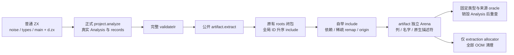
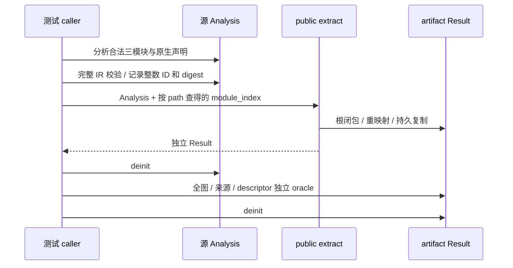

# 批量类型合并独立回归：提取边界分析

本稿使用 IDEA 框架。阅读源码固定于 **`4ef67c03394174bc045d053d21255f9efb09fcb9`**，包含 bulk merge 自举 `3df75bd4` 与 artifact type extraction 自举 `5bb73770`。全部源码通过 `git show <SHA>:<path>` 读取，不把并发 main 的后续变化混入结论。本次只创建本分析文件，未修改正式源码、执行门禁、提交或委派其他代理。

## Intent：最终目标

主代理本轮优先完成 bulk merge 的九 tag 重映射、原生名义身份、输入释放后的所有权和 OOM 清理。本稿聚焦下一部分 artifact extraction：找到真实 Analysis 的最小普通 ZX 夹具，让 task、native_ref、source enum 与聚合结构共同经过公开提取入口，能够独立核对裁剪、全局到局部引用、来源复制及输出生命周期。

不扩大到生成器专项、运行目标、缓存 codec 或新执行器。已有 bulk merge 主线工作继续由主代理完成；本稿不另建一套重复合并测试。

## Data：可用证据

### 公开入口与前置条件

公开入口是 `compiler.project.artifact.extract(allocator, &analysis, module_index)`，见 `packages/compiler/src/zx/modules/artifact.zig:12-28`：

1. analysis 不是 IR，返回 InvalidAnalysis（`:13`）。
2. 模块索引超出 analysis.modules，返回 InvalidModule（`:14`）。
3. **先完整 validateIr，再复制**；非法完整 IR 返回 InvalidIr（`:15`）。
4. 独立持久 Arena 与 temporary Arena（`:17-23`）。失败销毁持久 Arena，任何结果都销毁临时 Arena。
5. 成功返回拥有自身 Arena 的 artifact.Result；Result.deinit 负责释放它。

因此不能把手工拼装的 type_only Program 塞进 Analysis、伪造 record 来替代真实源码分析。bulk merge 可通过成熟 TypeStorage 构造合法输入图；artifact extraction 还依赖真实 ModuleRecord、函数导入、原生描述符与完整表达式图，应使用 `compiler.project.analyze` 或 `compiler.analyzeProject` 生成 Analysis。

type collector 的初始化见 `artifact/types.zig:14-25`：再次检查类型图、检查 nominal 列形状，分配稀疏 mapping，复制完整固定 scalar prefix，并将其映射置为 identity。Scalar prefix 不得重排。

`artifact/build.zig:31-34` 收集 needed 根并按全局 ID 升序 include；`:37-43` 确保被引用 Node 的原生模块进入 artifact；`:46-85` 复制类型与函数导入；`:89-109` 复制导出、函数、Store 及 source/native dependencies。模块提取不限于函数返回类型，checked imports 与模块局部声明范围也是根。

### 提取自举的具体边界

| 代码                                            | 真实职责与边界                                                                                                 |
| ----------------------------------------------- | -------------------------------------------------------------------------------------------------------------- |
| `analysis/semantic/extracting/include.zx:20-25` | 越界 InvalidModule；已有 mapping 直接返回，不重新入库                                                          |
| `include.zx:28-47`                              | pending ready 标志调度依赖；tuple/object 使用动态引用 buffer；通过已有 remap.zx 读稀疏 mapping                 |
| `include.zx:49-61`                              | 追加类型 → 写 mapping → 选择来源 → 追加来源；不是提前来源校验或原地 rollback                                   |
| `extracting/dependencies.zx:17-21`              | task 的 result/errors 两条依赖，optional/list 的一条依赖                                                       |
| `dependencies.zx:22-30`                         | tuple/object 倒序压栈，因此未映射依赖按原位置正序处理                                                          |
| `extracting/origin.zx:13-25`                    | 只检查被请求 ID 的同 ID 重复与名字匹配；缺失与冲突是不同返回码                                                 |
| `native/extract_workspace.zig:50-62`            | 必要的引用 buffer 分配；借用重映射值；持久复制并 append 到输出 TypeStorage                                     |
| `native/extract_workspace.zig:67-74`            | 独立复制 origin owner/member 和持久名义名字                                                                    |
| `extracting/copy.zig:7-28`                      | Node 标签、对象字段名、errors 名字、enum 标签/成员持久复制；tuple/reference 数值由 TypeStorage.append 复制入列 |
| `analysis/semantic/extract.zig:15-30`           | 零容量执行 Arena；释放本次 pending；OutOfMemory 原样传出；0/1 转为 InvalidModule/MissingNominalOrigin          |

名义选择器 **不增加 native origin 类别限制，不按来源身份去重**，这也是本提交实施记录明确保留的行为。不要给 extraction 新增“把 Node origin 改为 source 后必须拒绝”的测试契约；完整 native binding、上层 compiled/library 的名义规则是不同职责。本次正确正例应检查正常 Analysis 产生的 Node origin 是 native 且 key 与 NativeModule 一致。

### 已有覆盖与实际验证记录

`docs/2026-10-07/归档类型提取自举/验证结果.json` 记录 test-module-artifacts、test-typed-try-library、test-library-codec、test-semantic-cache、test-native-references-library 五专项退出 0；实施记录也有 dist、最终 CLI 生成成功。bulk merge 验证记录有十专项及 typed-try-library 退出 0。本代理没有复跑，不把这些记录等同于尚未增加的组合观察。

| 正式测试                                                    | 已覆盖                                                                                                     | 仍未独立观察                                                                                            |
| ----------------------------------------------------------- | ---------------------------------------------------------------------------------------------------------- | ------------------------------------------------------------------------------------------------------- |
| `incremental/artifact/extract_test.zig:6`                   | pure type exports、source enum origin                                                                      | native_ref 与 task/聚合的共同提取                                                                       |
| `extract_test.zig:23`                                       | scalar helper 裁掉 unrelated global enum                                                                   | 多层闭包中只裁掉无关行，不裁必需 native/type/Task 依赖                                                  |
| `extract_test.zig:40`                                       | 未使用但已检查的函数和 enum 导入保留                                                                       | 不可把“未调用”当成自动裁剪所有 checked metadata 的依据                                                  |
| `extract_test.zig:59`                                       | 原分析销毁后 path/dependency/symbol/enum/origin 可读                                                       | Node 标签与 owner、完整对象/tuple 引用列、task result/errors 的全部值 oracle                            |
| `extract_test.zig:83`                                       | 全局函数 ID 重映射到本地 import ID                                                                         | task body 中的原生 call 和表达式类型同步重映射                                                          |
| `extract_test.zig:121`                                      | 合法提前引入 Noise 后 enum global/local ID 不同                                                            | Node、Task、optional/list/tuple/object 的同步 global/local 引用                                         |
| `artifact/invalid_test.zig`                                 | diagnostic、模块边界、非法 IR、引用 enum 缺 origin/重复 origin、未引用 enum 缺 origin 不阻挡 scalar helper | NativeReference 路径的名字错误、缺失来源及组合深图的清理                                                |
| `artifact/resources_test.zig:6`、`:10`                      | entry/type 两类提取全 OOM；现有 fixture 主要 scalar + enum                                                 | source 分析与 extraction 分配混在同一 sweep；新 pending/reference/Node/task 组合的独立 extraction sweep |
| `incremental/native_link/link_test.zig:5`、`:16`            | native enum/函数跨模块合并、逆序输入释放后 ABI 可读和生成                                                  | opaque Node 与真实 task 的 artifact 本地引用图                                                          |
| `native/references/library/types.zig:6-37`                  | 真实 native-only type Analysis、Node owner、统一库边界                                                     | 可借鉴合法 `.d.zx`，不需要复制库 codec 矩阵                                                             |
| `language/expressions/tasks/analysis/shape_test.zig:86-103` | task 捕获局部绑定；原生 scalar task 的有限 errors                                                          | 可借鉴合法 async/await，不需要新 task 运行器                                                            |
| `incremental/native_runtime/mixed/main.zx`                  | 普通对象/tuple/list/optional 与 finite native errors 真正执行                                              | 没有 opaque Node 与 task 同图，本项不替代 runtime gate                                                  |

现有 module-artifacts 直属三个文件共有 6+6+2=14 个独立声明。新组合不是再做一次基础 enum ownership 或相同的 malformed Analysis 拒绝。

## Edges：边界与限制

### 最小真实源码夹具

下一部分可以新增 `tests/incremental/artifact/mixed/fixture.zig`、`extract_test.zig`、`resources_test.zig`，在现有 `test-module-artifacts` 的文件名单（`packages/test/build.zig:400`）追加 `mixed/extract`、`mixed/resources`。fixture 可按当前 module_records/fixture 的成熟组织把以下小段 ZX 放为多行常量；无须新通用 runner，也不必增加独立文件加载机制。

原生接口：

```zx
export type Node = opaque

export declare function identity(node: Node): Node

export declare function compute(input: u64): u64 throws { NativeFailure } concurrent
```

注册 `specifier="zig:host"`、`path="host.d.zx"`、`module="host"`，可以使用明确 `identity="fixture@1"`。正确 source Analysis 的 Node origin.native 与 NativeModule.key 都应为 fixture@1，而非误用 specifier 或 import_name。没有真正执行宿主调用，本次无需实现 host Zig 文件。

`types.zx` 是纯类型模块：

```zx
import type { Node } from "zig:host"

export enum Mode { First, Second }

export type Record = { count: u64, mode: Mode }

export type Request = {
  node: Node,
  record: Record,
  pair: [Mode, u64],
  values: Mode[],
  saved: Mode?
}

export type Response = {
  node: Node,
  record: Record,
  pair: [Mode, u64],
  values: Mode[],
  saved: Mode?,
  total: u64
}
```

`noise.zx` 提供合法全局编号变化：

```zx
export enum Noise { Tag }

export type Input = u64

export type Output = u64

export default function (in: Input): Output {
  return in
}
```

`main.zx`：

```zx
import noise from "./noise"
import native from "zig:host"
import type { Request, Response } from "./types"

export type Input = Request

export type Output = Response

export default function (in: Input): Output {
  const count = in.record.count
  const work = async native.compute(count)
  const total = await work

  return {
    node: native.identity(in.node),
    record: { count: total, mode: in.record.mode },
    pair: in.pair,
    values: in.values,
    saved: in.saved,
    total: total
  }
}
```

主夹具导入顺序需要确保 Noise 在所需类型之前出现；如果当前 frontend import 排序约定要求不同文本排序，可调整 names/路径和合法 source 顺序后再确认实际 global ID 变化。不能为得到预期编号手改类型行或 ModuleRecord。

`count` 是任务创建之前绑定的局部 u64；task 捕获它，而不是包含 Node 的整个 in。Node 只参与同步 identity 和正常返回。不得让 async 直接捕获带 Node 的 Input 或构造 Node 任务结果来凑九 tag，否则会触犯应用所有权契约。

SourceMode 与 Node 分别来自 source/native；task.errors 应为真实分析得到的 `{NativeFailure}`，task.result 为 u64，任务捕获符号为 count。这些是独立源码预期，不根据另一个编译器路径返回值来算 oracle。

### 模块索引与闭包必须来自真实记录

通过 analysis.modules 的 path 找 `/project/main.zx`、`/project/types.zx` 和 `/project/noise.zx`；不存在时先报告真实 diagnostic 或 MissingFixtureModule。不要依赖源码数组顺序等于完成依赖顺序。

main 的 checked noise 函数 import 应保留，但 Noise enum 没有进入其函数签名，也不是 main 的局部 type_range，因此 main artifact 可以裁掉它。types artifact 保留自身公开类型与 Node descriptor，但不应凭全局表中存在 task 就把 main 的 task 一并收入。

**原生 descriptor 的声明类型整体是根。** `artifact/roots.zig:36-44`、`:95-97` 会标记 native module 的 exported types，`build.zig:37-43` 还会为已提取 native_ref 收入完整对应描述符。因此不能断言“未直接使用的原生导出类型一定应裁掉”。使用一个只声明 Node 的小接口，避免把原生声明闭包误当普通未引用 enum 裁剪。

roots 的 type_range 在 `roots.zig:15-17`；exports/type_imports 在 `:19-20`；函数签名在 `:22-37`；表达式/符号/contracts/Store 根在 `:47-64`、`:100-106`；引用闭包在 `:69-82`。这些职责当前没有迁入提取 ZX，本项不改 roots 的策略。

### 最少的独立提取观察

1. **main 闭包与全九 tag 本地引用。** 所有 tag 都在真实 Analysis 中；main artifact 也齐全。固定 Scalar identity；Noise enum 被省略；Node/Mode 的 global ID 至少一个真正改变。按 Input/Output exports 和实际 task 表达式定位结构，不硬编码本地 ID。检查 Record 的 count=u64、mode=Mode；pair=[Mode,u64]；values=Mode[]；saved=Mode?；task.result=u64、errors 成员完整，body 的 call 输出类型与 task.result 相同。
2. **类型模块与共享依赖。** types artifact 的 public exports 和 Node native descriptor 完整，Mode origin.source 为 `/project/types.zx`，Node origin.native 为 fixture@1。不要复制已有 scalar-helper enum-drop；这里核对 main task 不进入 types 模块、共享 Mode/Record 的同一类型引用没有被分裂。
3. **analysis 销毁后的完整所有权。** 提取结果离开 analysis 的作用域后重新检查所有对象字段名、tuple IDs、error 名字、enum 标签/成员、Node 标签、origin owner/member、native descriptor specifier/identity/import_name/namespace/exports、函数 external/member/errors 与必要依赖字符串。只检查 path 或 generated.len 不足。
4. **NativeReference 来源 selector 的准确错误。** 从真实 Analysis 克隆 nominal 列，缺失 Node row 期待 MissingNominalOrigin；重复该真实 ID 或该 ID 的名字不匹配期待 InvalidModule。其他原生模块绑定仍有效，不改 Node TypeId 或源类型表。不复制已有 enum missing/duplicate 的整套基础测试。
5. **组合提取的独立 OOM 清理。** 先在 std.testing.allocator 上构建并校验 Analysis，再只对 artifact.extract 的 allocator 做 sweep。成功有完整 oracle，OOM 原样传出；返回 Result 无论怎样都 deinit。可另用缺 Node origin 的图 sweep 拒绝路径，准确处理 MissingNominalOrigin 与 OOM，不接受任意错误。

成员断言采用具名字段/导出查找的小 helper 和固定预期；不把 source.types 与 artifact.types 的所有行按位置比较，因为裁剪本来应该改变表。可以保存每个被关注 global ID 的整数值、source_digest 的数组值及静态期望，在 analysis 释放之后观察 local ID 和内容；不要保留已释放 analysis 的字符串 slice 作为 oracle。

#### 所有权骨架

```zig
var retained = block: {
    var analysis = try fixture.analyze(std.testing.allocator);

    defer analysis.deinit();

    if (analysis.value == .diagnostic) {
        std.debug.print("fixture diagnostic: {s}\n", .{analysis.value.diagnostic.message});

        return error.InvalidFixture;
    }

    try std.testing.expect(try compiler.validateIr(std.testing.allocator, analysis.value.ir) == null);

    const index = try fixture.moduleIndex(analysis.modules, "/project/main.zx");

    break :block try compiler.project.artifact.extract(std.testing.allocator, &analysis, index);
};

defer retained.deinit();

try fixture.checkMain(retained.value);
```

fixture.analyze 返回官方 AnalysisResult，可以沿用现有分析 API 的 owner 模式；不要创建自己的“同时返回 Arena 与保存其 allocator 指针”的可移动 wrapper。source constants 可以是静态；analysis 的解码/名称/路径与提取结果仍应有真实独立分配。原生 key/声明字符串的完整重查确保不是仅保留外部常量的表面可读性。

### 公共 extract 能证明的调度边界

`roots.zig:69-82` 已先标记依赖闭包，`build.zig:33-34` 又按全局 ID 升序 include。合法类型图的 child 都在 parent 之前，所以正常公开 extraction 经常在处理 parent 前已经有 child mapping。

上述新增组合能独立证明闭包、稀疏重映射、本地引用与持久数据，却**不能据此声称独立覆盖了 include 内部未映射子图的深 DFS 顺序或“task errors 比 result 先入库”**。为了这种内部调度观察伪造 roots/record 或任意重排 TypeId 不符合本次边界；本稿不新增生产导出或私有生成 runner。

同理 mapping 缓存命中的“无 pending 分配”在公开 extract 中被多处导出/导入访问间接使用，但 public allocator 还承担完整 IR 校验及持久复制，不能用整个 extract 的总分配次数等于某个常数来证明单次 include 无分配。

### 与 bulk merge 的分工

`link/types.zig:24-44` 现在 preflight 后转 generated merge；`merging/append.zx:26-47` 重映射全部 child，再 structural/nominal 查找，缺来源或冲突返回准确错误。现有 preflight 测试主要证明前缀与少量 suffix，已有普通 identity/resources 主要 scalar/enum。主代理本轮的全九 tag、原生名义身份、持久复制与 OOM 矩阵正好补这部分，不需要在 artifact 阶段再重复生成同一手工图。

artifact 的输入根和源 Analysis 是它独有的契约；以真实 Analysis 做组合提取，先检查提取结果再做可选完整 link，可避免“两个新实现一起出错但互相吻合”的镜像盲区。

如果要验证完整结果 IR，应提取全部三个真实 module records 再调用公开 artifact.linker.link；不可把单个 model.Module 当 Program 塞给 validateIr，因为其中 functions 是 import signatures。checked noise 依赖仍存在，link 时不能缺失 noise 模块。一次集成验证已经足够；本次不要求再生成/执行 Zig 或重复 cached/runtime 门禁。

## Answer：下一部分可直接实施的方案

保持三个新增 test 文件与现有 build 名单两项的最小组织，源码小常量集中在 mixed/fixture.zig。优先实现真实 Analysis 组合、main/types 独立 oracle、生命周期与仅 extraction 的 OOM sweep；来源 Node selector 的拒绝可在同一 extract_test 中少量声明。

最小门禁为现有 **test-module-artifacts**，Debug、ReleaseSafe 各一次。只有实际连带改变 nominal/native 接线时才补现有 test-native-link 或 test-native-references-library；本稿不要求缓存、runtime、生成器或全量门禁。

成功标准包括：

- fixture 本身通过完整 analyze + validateIr，不手工改 Analysis 的类型/函数/record 图。
- 三种名义/结构职责明确：Mode 是 source enum，Node 是 native opaque，task.errors 是结构 error_set。
- 源图真实出现九 tag、无关 Noise 产生编号偏移；local 所有引用指向正确 child，函数/body 的类型和导入 ID 同步重映射。
- 完整持久 oracle 在 analysis 释放后重新执行；OOM 与来源拒绝路径无泄漏、不伪称支持原地 rollback/retry。
- 先检查 artifact 独立语义，再以 link 做可选完整 IR 集成；不以长度非空或 source/result 镜像比较替代 oracle。
- 实施记录保存实际 source SHA、门禁命令、退出码与独立声明计数。当前文档只有固定阅读与已有验证记录，不是新增测试通过证据。





### 自我批判

本稿没有编译新夹具。异步标量绑定和 opaque Node 声明都有成熟正式样例，但它们组合后的首条诊断、具体 import 排序与实际编号变化仍需主代理首次实施时核对；不能在遇到源语法或任务所有权错误时手改 IR 绕过。

没有发现需要立即改生产代码的确定错误。主要缺口是独立组合观察和 extraction 单独 OOM；DFS 调度的不可直接观察限制已明确记录，避免把公开图闭包通过外推为内部所有调度分支已覆盖。
