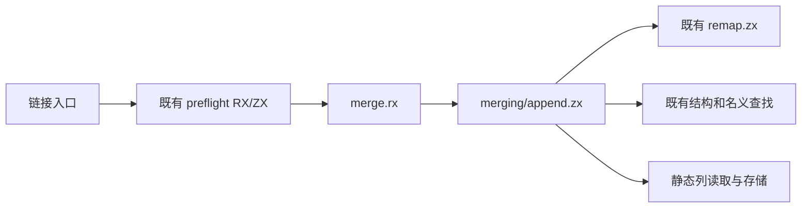
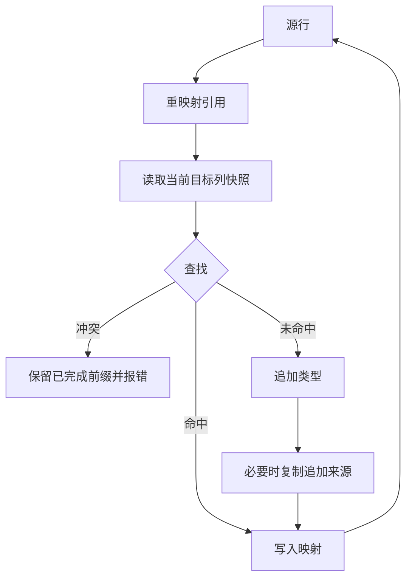

# 整批类型合并自举

## IDEA

- Intent：将整批追加、结构复用与名义冲突决策迁入 RX/ZX，复用既有前置校验、重映射和查找。
- Data：link/types.zig 仍拥有逐行循环；目标列会因 append 重新分配；已有 ZX find/nominal find 可复用。
- Edges：每行读取新目标快照，不跨 append 保留旧列；先 remap 再检查来源；名义插入先类型后来源，最后写 mapping。保留现有复制和 OOM 顺序，不新增测试或全量验证。
- Answer：正式源码、RX 入口、静态原生存储、种子分支、代码草稿、现有专项验证并提交推送。

## 架构

## 数据流

## 契约复核

- 前置校验仍先验证完整源表和来源绑定，再分配映射、检查增量前缀；沿用既有 preflight RX/ZX。
- tuple/object 的临时引用列在查找前分配，即使命中也不提前省略；先执行 remap，后判断名义来源是否缺失。
- Candidate 引用重映射、对象字段与成员名称范围通过现有源表 first/second 投影；不重写结构或名义等价规则。
- 每次 search 都通过列 getter 借用当时的目标表与来源表，search 返回整数后才 append。旧切片不会跨轮放入 loop state。
- 名义冲突不插入当前行；名义新类型先插入类型，再复制来源，最后填 mapping，保留来源 OOM 时的旧前缀行为。
- 保留原 link 的 tuple 额外 owner copy 以及成员字符串复制顺序。本轮不把它与 artifact.copy 合并，避免改变分配失败顺序；可独立评估冗余复制优化。
- 原生 getter 和存储静态链接，共享 references、reference_view 和 nominal_data 模块；没有 native→frontend 反向依赖。

## 执行问题

首次专项在根目录因未暴露全部目标而未执行，随后在 packages/test 运行。首轮编译发现原生 first 导出与局部 first 名称冲突，局部已改为 offset，不改变切片范围。

## 自我复核

源码审阅不能代替运行验证，生成器的零容量执行 arena 必须由实际相关专项验证。当前仅迁移整批追加阶段；初始化标量、源类型规则验证和类型解析不因此自动完成自举。

## 生成器边界修复

首次执行出现 OOM：原生 getter 的切片返回未被纳入值布局资格，导致整个循环回退到装箱状态。native_value 的 valueBoundary 现在允许 scalar/string/enum/error/native reference 及递归 optional/list 输出，仍拒绝 object/tuple/task 输出；输入仍拒绝 string/list/object 等可泄露 ZX 临时聚合地址的类型。expanded tuple 逐参数检查。isolated 复用同一实现，不重构两套分析链。

这里的 pure 标志用于值布局资格，并非没有副作用。原生调用顺序不变；buffer_call/analysis/flow 的独立 scalar reader 规则未扩大，仍排除可携带借用的输出。

第二次执行仍在嵌套参数处装箱。value_call 新增 borrowInvocation，把 fresh 函数返回的 state value 直接借用到 consumer 同一 body，避免先转 ABI layout 为子字段装箱。普通值调用的参数也使用递归借用，但必须检查输入与输出的 aggregate 类型交集。

未加该检查的中间实现产生了返回输入子对象的短生命周期风险，运行中体现为解析器越界。最终 sharesAggregate 递归检查双方根及 optional/list/object/tuple 后代；共享 aggregate 类型时保留旧浅层 objectValue，只有无共享或 consumer 持有全部临时存储时深度借用。修正后 type-merge、module-artifacts、value-return 三项专项退出 0。

目标 table 和 bindings helper 只返回单个快照，base/delta 包装在消费调用处构造，避免函数返回中重复 aggregate 类型引起既有保守装箱。没有移除通用的重复类型/对象身份保护。

最终两次只读复核分别检查合并契约和借用安全门，未发现新的实际问题。最终扩大专项结果仍需以运行完成输出为准。

## 最终验证

- 发行构建退出 0。
- 十项相关专项退出 0：type-merge、module-artifacts、library-link、semantic-cache、native-references-library、value-return、native-references-runtime、iterate-calls、module-generation、native-runtime。
- 补充 typed-try-library 退出 0，验证 task/result/error-set 相关库路径。
- 最终发行 CLI 编译本目录 merge.rx 草稿成功，产物在生成目录。
- 生成文件保留备用装箱函数，因此实际零容量 arena 执行通过才是本阶段的分配证据。没有宣称所有生成函数都没有 create，也没有删除保守的别名路径。
- 未新增测试、未执行全量测试或 UI 操作。草稿 manifest 仅声明源码生成接口，正式原生模块由 compiler/build 静态连接。

## 并行会话集成

提交实现后，主分支新增 7b80b14a 的前置校验边界回归。已合入该提交，并在当前整批合并实现上重新运行 test-type-merge，退出 0。相关测试由另一会话编写，本阶段未新增测试用例。主分支集成前后核对未提交文件内容，避免覆盖其他会话工作。
