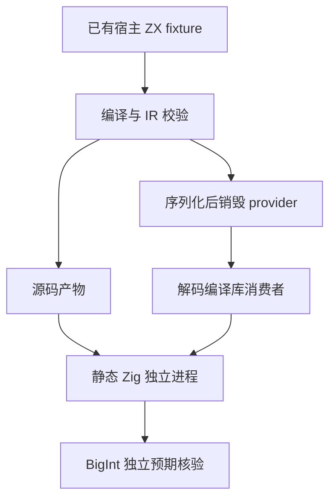
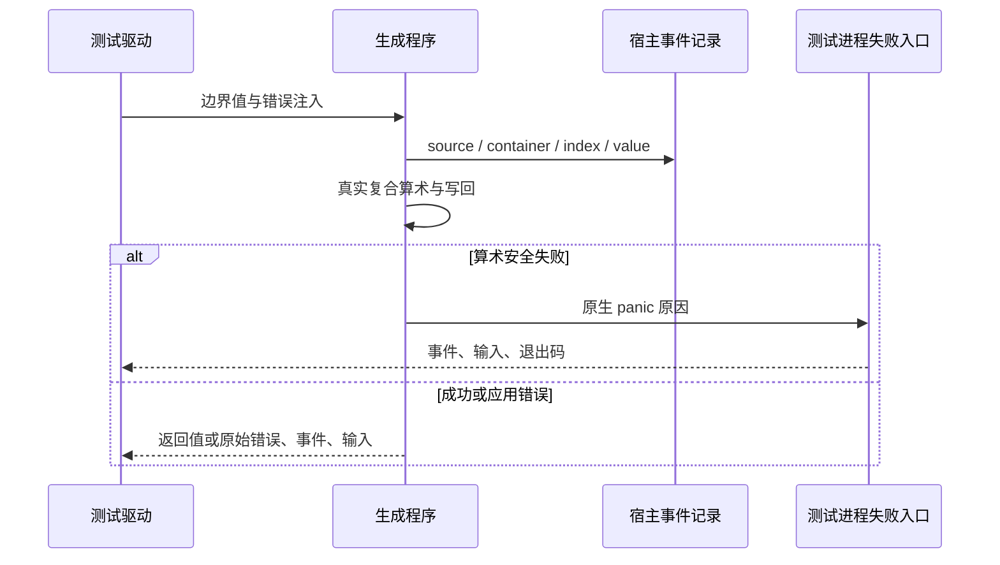

# 整数复合赋值安全边界执行计划

## Intent：最终目标

补齐 i64 列表与嵌套父容器复合赋值在安全构建中的算术边界、失败前的求值顺序和输入所有权验证。执行源码、编译库消费者两条路线，发现经验证的生产问题才通知实现会话。

## Data：可用证据

已有普通整数表达式安全测试和宿主复合赋值 fixture；前一阶段 84 个二进制、2,432 项检查通过。当前基线为 `32d54fc2687de79346cbbe8f03b6ab502bdcae5d`。沿用已有编译器与静态原生模块，不增加生产运行设施。

## Edges：边界与限制

Debug、ReleaseSafe 的整数安全失败是 panic，不是应用可捕获错误。独立进程的测试 panic handler 仅输出原始原因与宿主事件、调用方输入，再以固定状态码退出；不执行替代算术。预期以 JavaScript BigInt 精确计算，不能用 number 表示 i64 边界。

当前专项先覆盖已有 fixture 的 i64；其他整数类型的普通表达式测试不能证明其复合赋值已经覆盖。Test262 Number 的 IEEE 语义与 zxc 定宽整数不得混计为等价。

## Answer：交付格式与成功标准

新增独立进程入口、精确边界模型与驱动；接入包测试。保留所有实际运行结果、生成源码、二进制 SHA、基线和正式变更草稿。两个安全优化模式均必须验证真正的进程失败以及成功对照。按英文 Conventional Commits 提交并推送。

## 实施步骤

1. 读取成熟实现并冻结基线，保护根目录原有修改。
2. 草稿实现独立进程入口与 BigInt 预期；覆盖边界笛卡尔积、跳过路径、先发生错误和后轮次失败。
3. 接入现有构建，Debug 与 ReleaseSafe 分别执行和独立复跑。
4. 对本次 diff、证据和测试实际作用域做自我批判，发布前再次确认基线。
