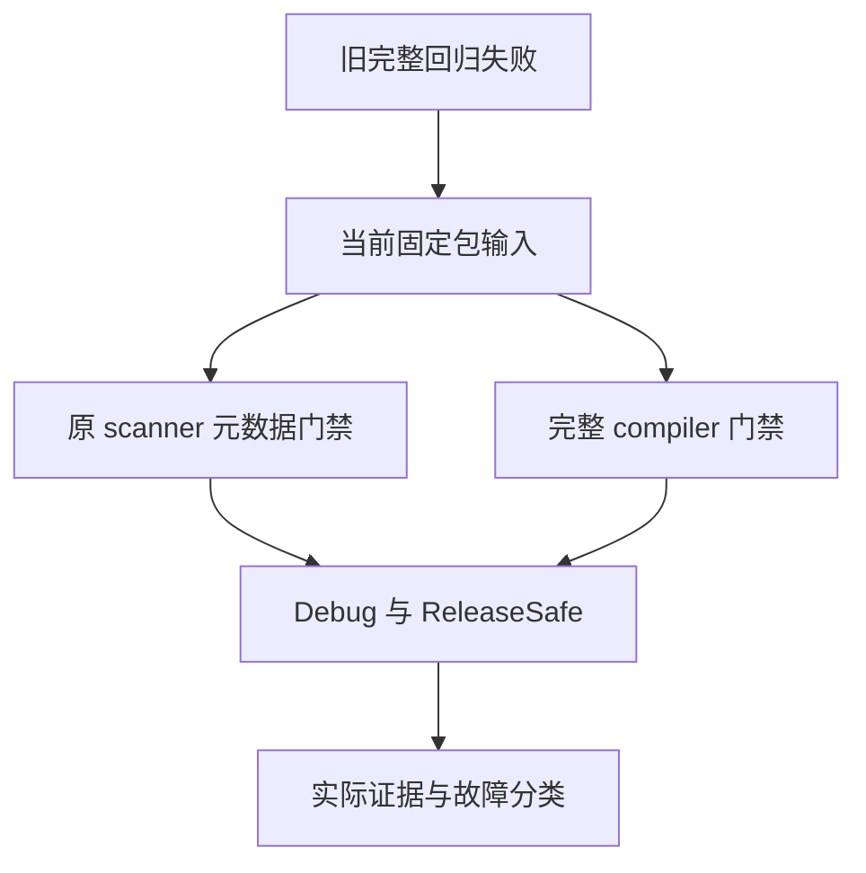
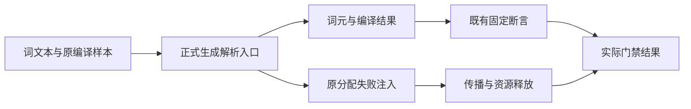

# 旧全量故障当前复验

## Intent：最终目标

在当前固定包输入上重新执行 scanner 元数据与完整 compiler 门禁，判断旧完整 ReleaseSafe 中的两项词法预期失败及一项编译分配失败清理检查是否仍然成立。仅实际当前生产问题才通知实现会话。

## Data：可用证据

历史 ReleaseSafe 固定于 37d5343：words_test 两个检查期望 O / Owned 而实际为 Dead，integration 的 compilation frees all allocations at every failure point 失败且没有附加输出。历史 Debug 固定于更晚的 9f2979b，全部 111546 个汇总原生检查通过；两个模式不是同一提交，不能直接推断为优化模式问题。

当前 words.zig 已将 owned 放入普通词，而 recognized 仅含 reserved 与 contextual。当前发布还包含原生模块检查的 RX 编排修订。依照实际包构建入口运行 test-scanner-metadata 与 packages/compiler 的完整 test，保留旧原检查，使用原有分配失败工具，不改变预期。

## Edges：边界与限制

不修改生产实现或新增镜像测试。scanner 及 compiler 门禁只能证明各自覆盖范围，不能替代未过滤根 test，也不能消除完整运行的 180 秒构建超时、Store IO 或其他历史故障。

固定当前包输入及实际源码快照，两个模式并行读同一源，运行期间不修改包源码。旧两个完整检出保持原提交，历史核验继续有效。生成入口的行为验证不等于满足全部自举架构标准；不因门禁通过宣称 RX/ZX 传递依赖已全部迁移。

## Answer：交付格式与成功标准

交付中文 IDEA 记录、四个实际门禁的原始日志与终态、源身份、实际测试二进制及相关生成模块。按真实返回码区分当前通过与当前失败；通过范围、已解决的历史观察及未验证范围分别记录。经验证的当前生产缺陷才发送给实现会话，完成本部分后使用英文 Conventional Commit 提交 push。

