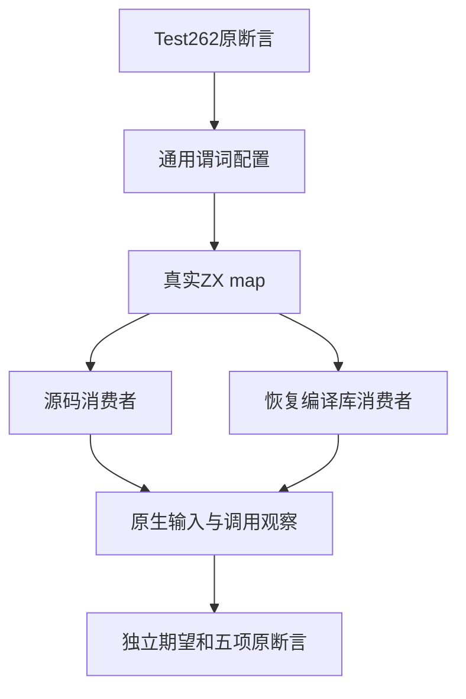
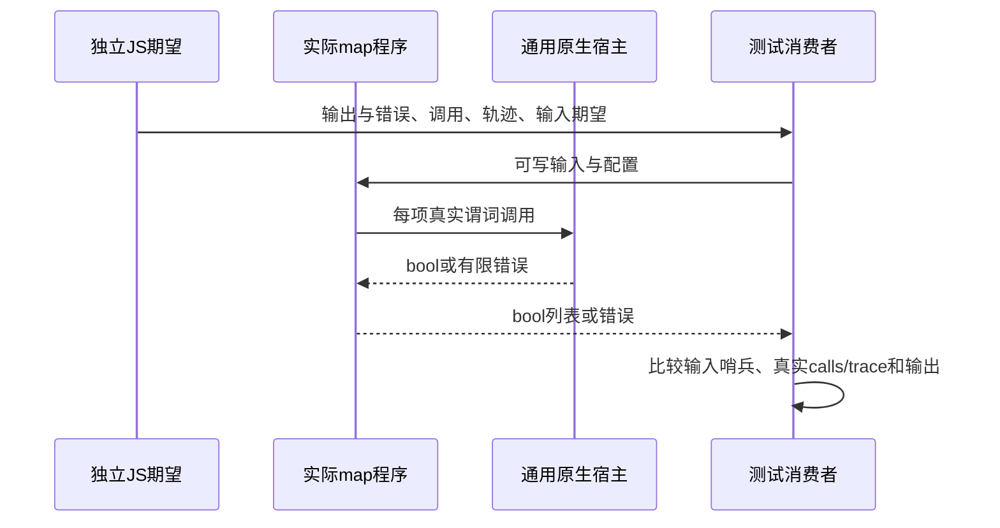

# 映射调用与输入保持执行计划

## Intent：最终目标

对齐 Test262 map/15.4.4.19-9-13.js 的全部五项原断言：四个可写输入元素保持原值、真实回调执行四次。增加通用 map 观察目录，并保持原 every/some 输出及语义不变。

## Data：可用证据

原文 revision 为 7ab7fafa0003f73fc85c1b95d88094d33f7eb8bd，SHA 为 23922dd9f5638f24fd122946a44fa67866ef0341976d34d219540880b9c09060。原输入 [1,2,3,4]，回调 val>2；idx/obj 未使用，结果未被原文断言。

现有 predicate_reviews 编译工具实际分析 ZX、校验 IR，并分别走源码与编译库消费者；库路径释放 provider 与编码 bytes 后消费恢复库。原生宿主通过可配置谓词记录 calls/trace，不需要业务硬编码。

## Edges：边界与限制

只修改测试生成、观察宿主消费者与目录注册。保留原 every/some 所有行、四份生成输出和零分配断言。map 输出需要分配，按真实 bool[] 校验，不沿用谓词的零分配要求。原动态全局计数改为测试宿主显式观察；不声称支持稀疏数组、对象身份、this/index/source 参数或任意值 throw。

仅该原文标记 adapted；控制案例不伪装为更多 Test262 原文。所有测试保持通用输入、谓词配置与独立 JS 期望计算。正式测试已由持续目标授权；代码先保存到本目录草稿再落实。

## Answer：交付格式与成功标准

生成目录案例、一个新增上游审阅、完整原文普通/严格执行证据，Debug/ReleaseSafe 下原完整 test-predicate-reviews，源码及编译库消费者均实际运行。类型检查、生成器 --check、矩阵审计、旧输出 SHA 校验通过后，英文 Conventional Commits 提交 push。失败若确认生产实现问题，再报告实现会话。

## 架构图

## 数据流图

## 自我批判

原文没有检查返回数组，新增输出检查属于增强证据；必须分别记录原五项断言与额外观察。生成器的 JS 期望不能证明 zxc 自身通过，成功还需要真实两条消费者路径和两种优化的执行结果。
