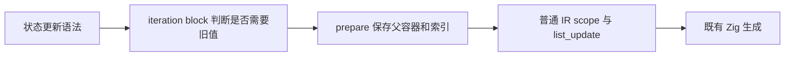
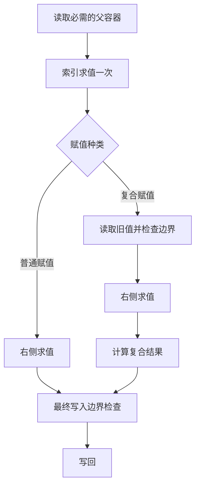

# 普通元素赋值求值顺序修复

## Intent：最终目标

普通赋值 `state.values[index()] = value()` 先定位容器并求值索引，再求值右侧，最后检查最终写入位置的边界并写回。复合赋值仍在右侧之前读取旧值。嵌套路径所需的父容器读取不能删除，索引不能重复求值。

## Data：可用证据

另一会话提供了源码与真实编译库消费者两条路径的失败记录：普通赋值越界时跳过 value，甚至把 ValueFailure 替换为 IndexOutOfBounds；复合赋值对照通过。

当前 `iteration/update.zig` 与反馈基线 `8b0a7060` 的 SHA-256 相同，均为 `e3f29d8e16d7c0fe685cfe407ed865e74095206acecde721bda6c6309ad3c244`。`prepare` 无条件把最终目标加入临时绑定，因此在 RHS 前读取旧元素。`genz` 的 list_update 已按 target/index/value/边界检查的顺序生成，不是本次修改层。

实施方案：为 prepare 显式传入是否需要读取当前目标。赋值入口仅在 operator 非空时请求读取最终值；递归定位父容器时始终请求读取。末尾仅在需要读取时创建临时绑定。

```zig
const place = try @import("update.zig").prepare(self, location, update.operator != null);

const parent = try prepare(block, item.target, true);

if (read_value) place.value = try block.temporary(place.value);
```

## Edges：边界与限制

只修改前端循环状态更新的定位过程。类型检查仍使用目标表达式的类型；写回仍使用保存的父容器和索引。普通字段赋值也不需要读取最终旧字段，但嵌套字段所依赖的父对象必须先定位。

语义缓存的编译器身份覆盖 compiler/src 的源码内容，生成缓存包含实际 IR，本次无须人工修改缓存版本。已经发布的旧编译库不会因消费端升级而重写内部旧 IR；反馈中的库路线由修复后的 provider 重新生成。

复用反馈会话已有测试及断言，临时复制到本工作树运行后恢复；不修改断言，不新增测试，不写入反馈会话的工区。先记录输入哈希，再执行 Debug 和 ReleaseSafe 的专项验证。

探针的 source 事件对应前一条显式状态赋值，不据此把任意调用表达式扩展成合法写入目标。

## Answer：交付与成功标准

交付两个前端源码文件的最小修复、现有专项的两种构建模式结果、测试输入来源及哈希。普通、复合、嵌套更新以及源码和库路线均需通过。修复完成后独立提交并推送，然后继续所有权自举成本核算。





## 自我复核

不能把所有 index 读取都删掉：对于 `state.rows[parent()][index()] = value()`，读取 rows 的父元素必须发生在最终 index 和 value 之前。此次以递归层级区分父容器和最终目标，不按函数名、索引值或测试模式选择路径。

## 实施结果

正式改动仅为 block 和 update 两个文件中的五行替换。Debug 与 ReleaseSafe 各通过 97/97 构建步骤、352/352 常规用例，以及外部 Node 驱动的 232 个副作用用例。后者由普通/复合、平面/嵌套和源码/真实编译库消费者组成：每种构建模式四个二进制各 25 项、另四个各 33 项，全部退出 0。根构建通过 35/35 步。

副作用断言核验了右侧错误优先级、最终越界前 RHS 必须执行、父容器越界时不得继续求值子索引及 RHS、索引调用次数、旧快照和输入保留。Debug 与 ReleaseSafe 的 16 个实际执行二进制 SHA-256、生成源码与 ABI 哈希、执行记录及日志保存在配套目录。

首次接收的反馈探针存在变量名遮蔽参数的编译错误；反馈会话随后提供了只重命名该变量的修正。本会话原样采用并记录了前后哈希和补丁，没有修改断言。最终核验使用修正后的统一输入快照。

临时测试覆盖已按清单逐文件核对哈希并恢复，正式测试目录没有本次修改。未新增测试用例，未运行全量测试。测试输入快照位于 `普通元素赋值求值顺序修复/验证输入/反馈用例/`，机器可读结果位于 `普通元素赋值求值顺序修复/验证结果.json`。

快照文件附加 `.txt` 后缀以保留原始字节，避免提交时格式化改变验证输入；清单同时记录原路径、归档路径和 SHA-256。

该修复改变前端产生的 IR，后续所有权自举成本核算必须以新 CLI 重新生成检查器，再建立成本基线，不能沿用修复前生成产物的字节成本。
