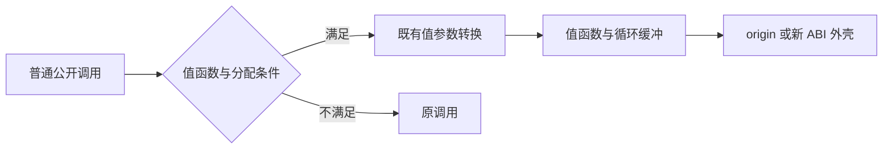
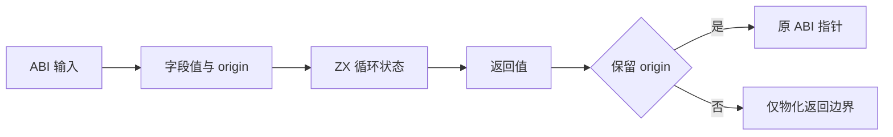

# 公共调用进入值表示路径

## Intent

让普通 RX/ZX 调用进入已经通过分析允许的值返回实现，使实际热循环使用现有缓冲优化，同时保留公开指针 ABI 和返回身份。

## Data

对真实自举模块图完成 261 次成功输入比较。最后一份 execute.zx IR 含 10048 个表达式：原生检查逻辑请求 103061382 字节，ZX 执行请求 1238819740 字节；执行结束 Arena 保留 1700825520 字节。这些数字不是复制量、时间或峰值。

实际公共入口调用 function_41，已生成的 function_41_value 及 14 条容量列未进入该调用路径。一般 call 仅在 state_active 时选值返回。已有 state_value/conversion 在 value→pointer 时会优先返回 origin，只有新值才分配 ABI 外壳；不能经 layout 中转后无条件重建外壳。

## Edges

仅对 value_functions 已许可、输出有值表示且当前调用允许分配的普通调用接通 ABI 转换。无分配错误契约继续原路径；effect、Store、并行及不满足局部边界条件的函数仍由既有分析决定。不得新增检查器专用入口或运行库，不改所有权算法。

## Answer

在 value_call 内复用既有参数准备和调用选择，新增返回 ABI 指针的入口，把末端转换模式从 layout 改为 pointer。lower 的普通 call 使用该入口。验证生成器构建、自举检查入口真实调用链和相同 IR 的阶段成本；复用既有身份与集合专项，不生成新用例、不运行全量测试。

## 自我复核

此前仅查看优化版本声明，未核验真实入口调用链，因此高估了缓冲优化覆盖。此次必须以真实入口及运行观测为验收证据。适配器仍是过渡层，调用优化不代表完整自举完成。

## 实际结果

正式代码仅修改 genz 的 lower.zig 和 value_call/root.zig。pointer 模式禁止临时栈输入，避免 origin 在公开返回后指向短命对象。

- 根构建 35/35；四个现有专项（aggregate-loop、modular-loop、iterate-calls、owned-input）229/229 步骤、441/441 用例通过，另有 1 个 Node 驱动真实库迁移用例通过。
- 重新生成的公开 execute 调用 function_21_value 准备，再调用 function_41_value 执行；执行循环实际进入既有 buffered helpers。ABI 字节未变。
- 前后各 261 条观测逐条核对 file、表达式/符号/类型/函数/块数量、输出以及原生和适配统计，全部一致。每条观测还分别比较新旧 output 与 stores_owned。
- ZX 执行累计逻辑分配请求：6641910542 → 47352155 字节（减少 99.287%）；准备阶段：34091090 → 33216946 字节。原生和适配请求分别保持 568375194、9090208 字节。
- 最大输入 execute.zx（10048 表达式）执行请求：1238819740 → 7334528 字节；结束 Arena 保留容量：1700825520 → 12573804 字节。对应原生结束容量为 11288724 字节。
- 观测 CLI 自身编译输出与普通新 CLI 输出字节一致。测量仅替换入口的 allocator 获取方式，并在准备完成后采样，未替换算法。
- 临时 compiler/test 接线已经恢复，没有新增测试、没有运行全量测试。结果不是耗时基准或峰值测量，也不意味着数据适配成本已经消失。

逐项数据见同名目录的验证结果.json；原始观测和构建日志一并保存。所有权检查草稿仍保留在本地迁移目录，完整职责自举与统一 IR 生产路径尚未完成。
