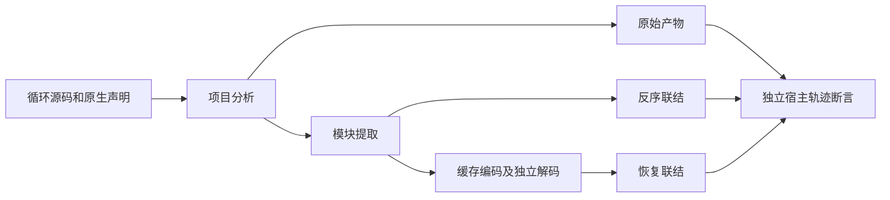

# 独立循环执行回归

## IDEA

- Intent：验证独立循环丢弃结果时仍保留执行顺序、嵌套状态隔离和错误传播，验证普通非 void 表达式语句仍拒绝。
- Data：生产提交 `4f5cb9cf77ff0886dab60eb24876a310f3b5e24e`；已有 native_runtime 编译驱动执行原始 IR、反序联结和独立编解码恢复三条路径。
- Edges：独立 Zig 声明与 JSON 用例 ID 分别统计；不将三条产物路径和两种优化模式重复计为新增用例。不改变生产代码，不承诺 Test262 全量对齐。
- Answer：草稿、正式测试、Debug/ReleaseSafe 原始日志及源码哈希；提交并 push 英文 Conventional Commit。

## 架构图

## 数据流图

## 执行步骤

1. 冻结干净生产提交；前轮草稿已正式提交，保留其二进制 diff 后复用独立工作区。历史前置校验核验脚本的实时工作区条件不再成立，历史日志与草稿仍保留。
2. 在文档目录建立草稿；复用已有三路径编译驱动与宿主，不新增运行库。
3. 格式化后同步至独立工作区，运行两种优化模式和相邻语句政策门禁。
4. 对输出和日志建立哈希记录；验证提交 hook 没有改变已测试源码。

## 自我批判预设

计数不是完整覆盖率。只以本轮实际运行与独立预期轨迹证明行为；不以生成源码包含 while 代替执行，不以退出成功代替新增声明实际运行。
