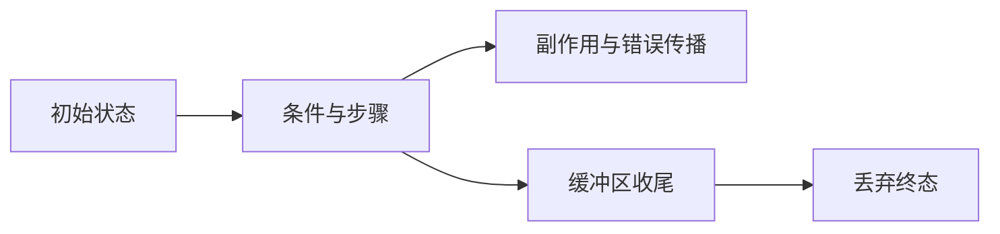

# 独立循环语句

## IDEA

- Intent：允许直接使用 `loop(initial, policy)` 执行副作用，省略最终状态绑定。
- Data：解析器已支持调用语句；普通块与循环块当前强制 void；生成器目前总是物化最终状态。
- Edges：只放行分析后确认为 iteration 的表达式；保留普通非 void 调用限制、错误传播、状态更新及缓冲区收尾。不新增运行库、不生成新测试、不运行全量测试。
- Answer：正式实现、对应源码草稿、使用参考及现有专项验证；发行构建与相关专项通过后提交推送。

## 实施

1. 统一语句分析，先推导循环，再按实际 IR 判断是否允许丢弃。
2. 增加生成器 discard 模式，支持普通语句和循环体内无绑定语句；跳过最终状态物化。
3. 迁移编译器来源生产、排序和类型重映射中的实际副作用循环。
4. 构建发行并运行现有相关专项；检查 diff 与约束。

## 架构

## 数据流

## 实现边界与自我复核

- 分析后依据 IR 的 iteration 标记放行，不按源码名字猜测；同名导入函数仍遵守普通调用契约。
- 普通函数体和循环更新块共用 evaluate 分析；IR 无绑定 scope 校验同步只允许 void 或 iteration。
- genz 使用 reference/value/discard 三种结果模式；discard 在布局允许时使用值布局，跳过最终状态转换和包装。保留既有缓冲区收尾，不把本次变更夸大为所有列表过程零分配。
- 迁移四个现有生产模块，无业务特判。需要最终状态的 heap/origins/prefix 等循环继续绑定。
- 新增语法不要求新 AST/IR 类型，也不新增运行库。嵌套无绑定分支已做代码核对；没有新增专门的嵌套用例，不能声称完整组合覆盖。
- 初次专项命令在仓库根目录执行，因根目录未暴露 test-native-references-runtime 而未运行；随后改在 packages/test 正确执行。

## 生成检查

最终发行 CLI 生成草稿 remap.rx 成功，产物见 `生成/remap.zig` 与 ABI 文件。循环生成普通 while，末尾 break 携带空值，无最终状态包装。草稿 pkg.yaml 只声明源码生成所需的原生接口；真正静态原生实现由编译器构建接线。

曾尝试用旧草稿的 manifest 直接编译正式源文件，CLI 正确拒绝包外入口。随后将当前源码及其必要依赖放在本目录草稿中生成成功，没有放宽包边界。

## 验证结果

发行构建通过；六项现有专项通过；最终 IR 修改后 loop-policy 与 type-merge 复验通过。最终发行 CLI 再次生成 remap 通过。详见 `验证结果.json`。未运行全量测试，没有新增测试或浏览器操作。
