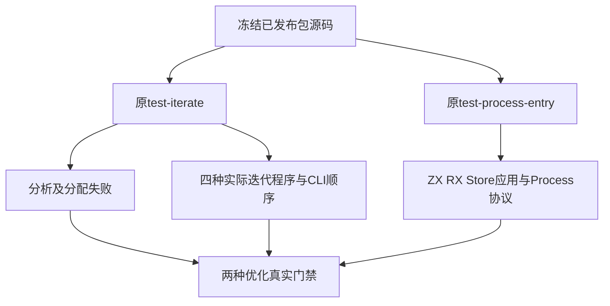
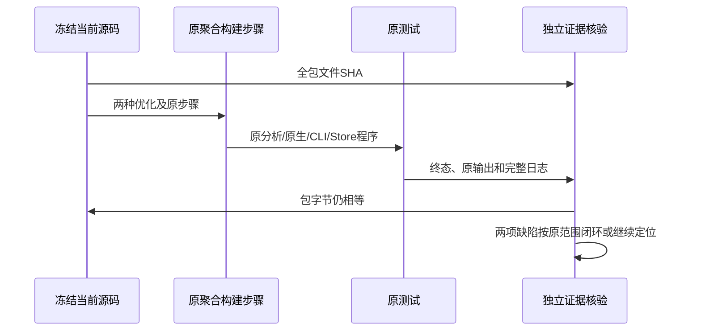

# 生产缺陷修复独立复验计划

## Intent：最终目标

按原门禁独立复验已报告的两项生产问题：Store常量初始化被InvalidInitializer拒绝、索引越界后才跳过RHS副作用。不得改夹具、断言或阈值来闭环。

## Data：可用证据

两项37d53431原始失败和已通知记录位于规范表达式列全量回归/剩余故障。当前09160135包含bf2b3592/5a768b39的Store能力槽接入与初始化记录，以及6b2ba406通用索引检查顺序修复。开始基线.json保存当前commit、packages tree和所有跟踪包文件SHA。

读取原build/iterate.zig：test-iterate包含分析/分配检查、next/do/snapshot/list四种实际程序和原五项CLI顺序/RX/遮蔽检查。test-process-entry包含原ZX、RX、Store应用的Process参数、环境、工作目录和默认/json/discard协议检查。

## Edges：边界与限制

正式源码、用例、阈值、构建注册全部不修改。完整运行上述两个聚合步骤，Debug与ReleaseSafe各-j1，保留本次独立cache和所有缓存记录。三个旧完整根继续固定检出；新专项使用当前主检出的冻结包字节，运行中不快进主检出，完成后再次逐字节核验，不混入并行版本。

构建器的Zig测试数、Node CLI测试块、Process脚本显式检查数分别记录，不能把它们混作新增目录案例。只有实际退出0、完整步骤汇总通过、原全部Node/Process输出完成且包字节仍相等，才能声明这两项原范围闭环。不能由专项通过推断完整根或全部Test262已完成。

## Answer：交付格式与成功标准

交付两种优化的原聚合门禁命令、句柄、真实终态、完整日志、编译与运行二进制指纹、实际生成程序、源字节一致性及IDEA记录。若全部通过，以英文Conventional Commits提交push证据；原生产问题闭环，不向实现会话发送无问题消息。若仍有生产失败，先确认当前真实职责再按用户授权报告。

## 架构图

## 数据流图

## 自我批判

生产会话的修复说明不能代替独立执行。只复现空列表或只编译state.rx也不能外推为全部iterate与Process协议通过，故本次恢复原完整两聚合步骤。

主检出有他人文档元数据修改，它不参与包构建且不会被暂存；包源码若在运行期间变化，必须如实记录证据受影响，不能沿用旧commit标签声称同一固定版本通过。
