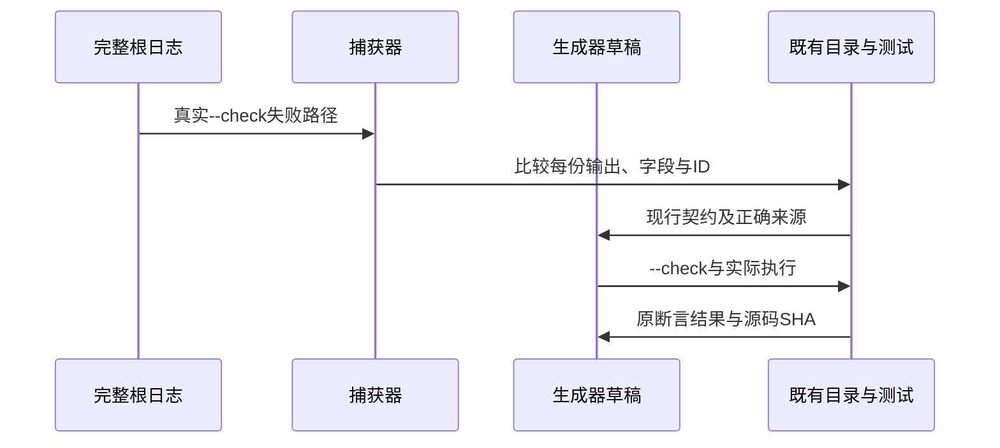

# 目录生成器契约对齐计划

## Intent：最终目标

修复完整根回归发现的ownership、switch scalars与optional enum生成器一致性失败，使生成器准确再现现行语言契约和既有目录，不回退正确来源或放宽检查。

## Data：可用证据

当前发布基线23def89a已包含规范控制流列。首轮固定dd909e00根ReleaseSafe真实发现三份生成器--check失败，完整原运行句柄55686仍需跟踪。当前最新基线reduce专项句柄54869已退出1，110/112通过，嵌套容量问题已通知实现会话；本阶段不混入该生产修复。

ownership既有propagation156项和consumption248项均为analyze成功，生成器仍含旧消费/引用传播拒绝模型。switch枚举和optional enum实际ZX已四空格格式化，需要完整对比源码及所有目录，不能先假定只有缩进。

## Edges：边界与限制

只在测试包修复实际生成器职责，正式目录和预期保持；若对比发现真正契约变化，先读取成熟实现与当前约束并执行既有前端门禁。不能按用例ID特判，不能把旧消费语义写回现有目录，不能为通过删除注册或把精确失败改任意失败。

保留正在运行的固定全量worktree源文件不变。在已固定最新提交的另一个检出准备草稿，修改前记录SHA，三个文件范围无需大规模语法重构。

## Answer：交付格式与成功标准

1. 逐项捕获三个生成器输出，比较字段、源码字节和所有case ID，保存真实差异。
2. 先修复草稿并通过既有--check；冻结全部原输出，保证未新增/删除案例或修改实际预期。
3. 使用现有前端与对应runtime案例验证语言契约，两种优化实际执行；生产reduce问题不放宽。
4. 冻结正式源码与草稿SHA，核对提交钩子，英文Conventional Commits提交push并保留根目录原有修改。
5. 继续跟踪完整根门禁并在其终态后纳入新提交，不将专项通过外推为全量通过。

## 架构图

## 数据流图

## 自我复核

生成器维护不能掩盖语言回归。所有权失败先区分旧消费预期与不可变输入契约；格式修复不得改变语义。总回归仍未完成，保留原活跃句柄与所有失败，既有目录数量不当作新增覆盖。
