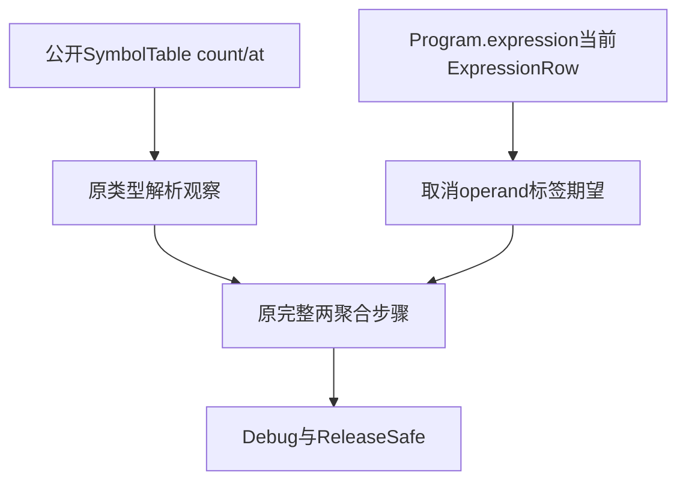
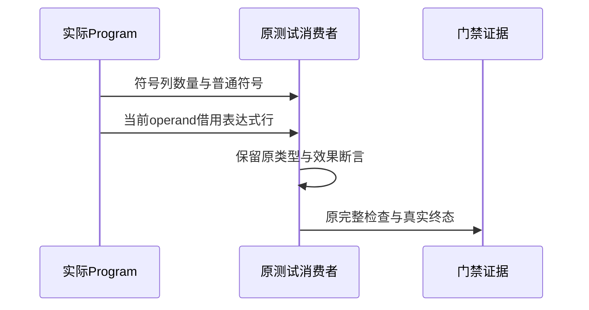

# 符号列与取消表达式契约同步计划

## Intent：最终目标

处理完整 Debug 根真实终态暴露的两个测试消费者编译失败，适配现有公开 IR 契约，保留所有用例、业务断言和分配失败检查。

## Data：可用证据

b6a81464 的无过滤完整根实际退出 1：6646/6688 步骤成功，111781/111789 测试通过，16 个失败步骤、8 个失败测试；其中 graph.zig:87 将 SymbolTable 当切片遍历，shape_test.zig:45 比较两个不同表达式联合的枚举标签。完整日志与 source/packages tree 已归档于规范表达式列全量回归。

当前 SymbolTable 是普通静态列，公开 count/at 返回 ir.Symbol。当前 Program.expression 已返回 ExpressionRow，与取消测试现有 Expected.operand 一致；旧 b6 版本返回 Expression 的失配不能延续到当前版本。取消测试应保持原样，使用完整门禁复验。

## Edges：边界与限制

仅正式修改 graph.zig，用 count/at 遍历符号。取消测试保持原样，当前公开返回契约已与它一致。不新增用例、不删除或放宽任何断言，不改源码实现或列布局。不把旧版本根结果当作当前版本生产缺陷；两项是测试与接口漂移，不向实现会话发送无问题消息。

其余旧根失败仍须分别在当前版本复验，不能由本两步骤外推完整根通过。原根测试数来自 Zig 构建器，目录案例数是另一度量。

## Answer：交付格式与成功标准

保存原文件、符号列同步草稿及取消测试未修改副本，执行原完整 test-type-resolution 与 test-zx-cancel-analysis，Debug/ReleaseSafe 各一次，收集实际终态、完整日志、编译运行二进制指纹和包文件指纹。原断言及目录计数保持不变，最小 diff 审阅通过后英文 Conventional Commits 提交 push，并发布旧完整根失败的真实终态。

## 架构图

## 数据流图

## 自我批判

编译失败不是语言语义失败；必须修正测试所读的实际公开契约，而不是把旧内部类型重新引入生产源码。当前只覆盖两处接口漂移，仍需继续逐项核对完整根剩余失败。

首次判断沿用了旧 b6 日志的表达式返回类型，尝试修改取消期望后立即读取当前 Program.expression 发现已经返回 ExpressionRow。该尝试不是生产缺陷，首轮终态必须保存；完成后撤回取消测试修改并重跑原两个完整步骤，只发布符合当前接口的最小改动。
