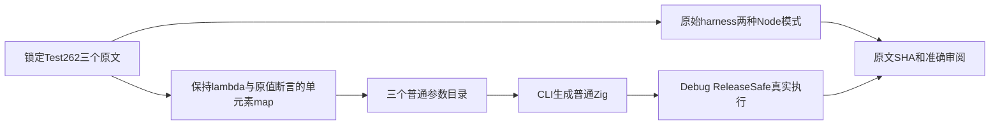

# 箭头表达式返回与上游审阅执行计划

## Intent：最终目标

保留三份尚未审阅 Test262 的完整运行时值断言，并补充普通输入矩阵；全量 Test262 与全部 zxc 特性目标仍继续。

## Data：可用证据

锁定 revision 为 7ab7fafa0003f73fc85c1b95d88094d33f7eb8bd，三份原文分别验证隐式加一返回、低优先级乘法表达式 body、带括号的对象 literal 返回后字段读取。原文 archive/extracted/index SHA 已核对，Node 普通/严格模式各执行一次共6/6。普通参数 generator 生成三组18用例，共54；原有 arrow-bodies 60例一并执行。

## Edges：边界与限制

只提交10份自有 generator/data、普通ZX/JSON目录、审阅与 suites 登记；不改生产实现。普通 var/一等函数调用迁到单元素 map callback，原始参数、body、原输入与唯一断言不变，因此分类 adapted。不声称在 zxc 中直接执行原 JavaScript、不增加excluded，也不重复审阅已完成concat。

输入清单包含同时准备的产品读取测试37份完整工作区输入，以准确记录所用冻结工作区；本部分执行目标只有 test-arrow-bodies，正式提交范围另由正式路径清单限定为10份。产品读取的nested增长问题已另报实现会话，此处不声称该部分通过。

## Answer：交付与成功标准

三份精确审阅映射，54个独立命名用例，Debug/ReleaseSafe的箭头目标独立真实终止为0；保留各运行叶子、输入/SHA、原文和生成物归属，以及自我复核。使用英文 Conventional Commit 提交并实际push。

