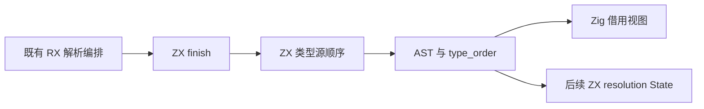
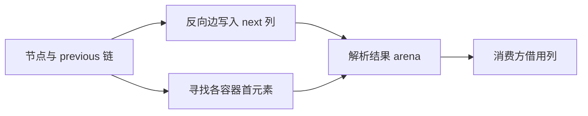

# 类型 AST 源顺序迁移

## Intent：最终目标

把类型 AST 的源顺序恢复移入现有 RX/ZX 解析链，撤除 Zig Order.create 算法，为纯 ZX resolution State 提供可直接借用的索引列。

## Data：可用证据

当前 parser 已输出索引化 Tree，但 program view、外部 signature 与 native interface 在 Zig 中重新遍历 previous 链，生成 heads/fields/items。三类解析入口都有 RX 编排的 finish ZX，生成器使用独立 seed，无需新增生成模块。

## Edges：边界与限制

保持 AST 与诊断语义。previous 保留解析期间的持久快照；新增 type_order 仅包含三个 u64 索引列，0 表示链尾，其他值为下标加一。与解析结果同 arena；下游借用，不复制 AST。普通程序的表达式与语句顺序仍是独立职责。本阶段不宣称整个 Workspace 已迁移。不新增测试用例、不执行全量测试。

## Answer：交付格式与成功标准

交付共用 ZX 索引算法、三类输出接入与 Zig 借用视图，删除原生类型顺序构造逻辑。用发行构建、已有解析和类型相关专项及生成物检查确认结果、边界和分配成本。

## 执行记录与自我复核

正式 parser 的 types/open 为每个容器建立独立 head/count；add_field/add_item 只追加边并同步推进当前 frame，previous 指向更早的同容器边；close 移除 frame 后发布 node。因此每条边最多有一个后继，已发布节点的链不再变化。嵌套容器可在物理数组中交错，不影响该不变量。

ZX order 按边数组顺序追加一个链尾槽，再将 previous 对应槽写为当前下标加一。heads 借助独立 head 函数按每个已发布节点的 count 遍历逆链。各容器边不共享，全部 head 遍历的总成本仍为 O(nodes + fields + items)。非容器和空容器 head 为 0。

三类 finish 输出同一 Order 类型；Zig 视图只读 storage.type_order，按项转换 u64 索引为 usize，未作整片指针重解释。原 types/indexed_view/order.zig 与 Order 导出已删除。表达式/语句的 frontend/syntax/program/order.zig 属于不同顺序索引，本次保留。

初版使用 map 生成零数组，首写时会复制一次。进一步核对生成代码确认该复制由循环外 started 标记保护，并非逐轮复制；此前根据局部 dupe 文本判断平方成本是错误的。终版利用 previous 总在当前边之前的不变量，从空列表逐项追加，消除了三列非空初始化副本。生成代码采用普通 Zig ArrayList，完成后 toOwnedSlice 移交输出，并保留 deinit。

输入 AST 列表保持借用；head 的 node/span/tree 参数是同步调用期间的栈值，只返回 u64，不逃逸。顺序输出与 parser 输出属于同一 arena，不新增 owner 或原生桥。仍有容量增长以及循环状态/最终输出的固定包装分配，不能称为零分配，也不能把此前 map 版的验证冒充终版验证。

## 验证与自我批判

初版发行构建 34/34 步、类型解析与状态专项 57/57 步 79/79 检查、原生声明专项 27/27 步 10/10 检查通过。终版追加实现重新完成发行构建 34/34 步、类型解析/解析状态/原生声明专项 64/64 步 89/89 检查。新发行 CLI 再次生成 order，结果与审查的追加草稿逐字节一致。源码镜像与 SHA256、生成物原始 SHA256、终态日志一并归档。没有新增测试用例或执行全量测试。

对于包含未完成容器的诊断树，新算法可能给不可达孤立边写入 next；旧算法仅遍历已发布 node，孤立槽为 0。已发布节点的可达源顺序等价，但不能宣称整个内部数组逐字节相同。没有新增静默兜底或修改诊断规则。

本次迁移撤除了完整的原生类型顺序算法，尚未迁移 resolution Workspace 的 Frame、visiting、缓存与类型表输出，也未移走表达式/语句顺序算法。
