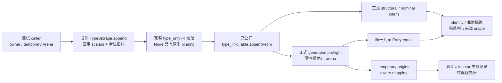
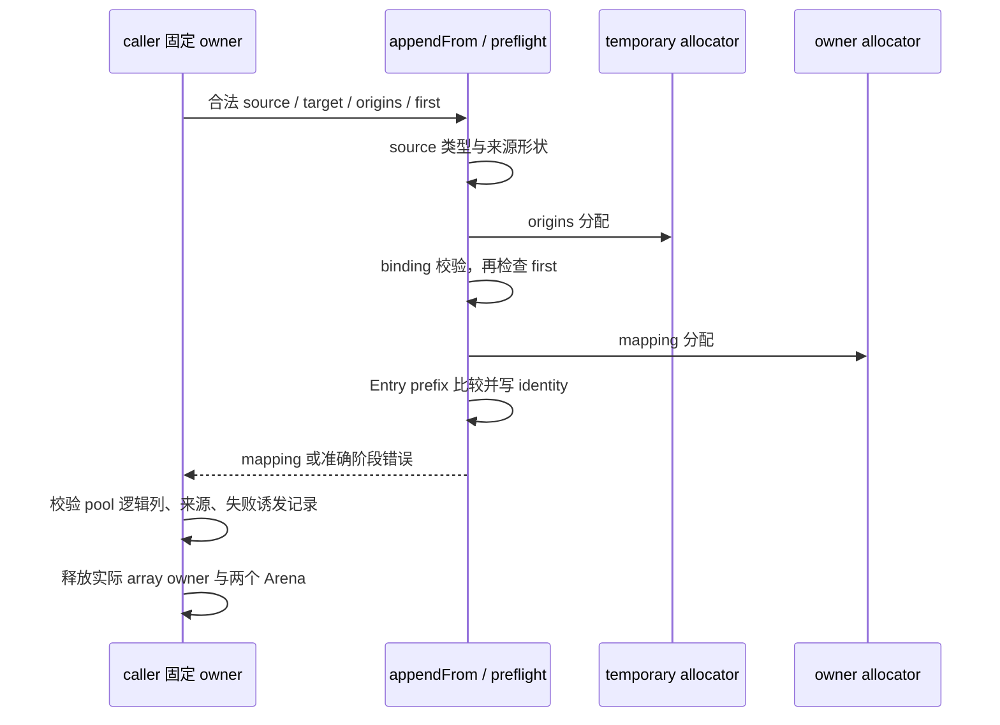

# 类型合并前置校验独立回归：分析草稿

本稿采用 IDEA 框架，源码证据固定于 `1293a95ff01ba17f3f5681f7e0a8048520184a2f`，包含 `f20fc8ba` 的 preflight 与共享 Entry 比较迁移。本次只读取文件并生成本分析文档，没有修改正式源码或执行测试。

计数先纠正：TypeValue 有 **9 个 tag**；TypeTable 有 **8 个列**。9 个 tag 为 scalar、object、optional、list、tuple、error_set、task、enumeration、native_reference，见 `packages/core/src/type_table/model.zig:4-13` 与 `value.zig:6-16`。

## Intent：最终目标

为前置校验和共享 Entry 比较补齐真正缺少的独立观察，复用已经公开的内部成熟入口：

```zig
const compiler = @import("compiler");
const ir = compiler.ir;
const Table = compiler.project.artifact.type_link.Table;
const Bindings = @FieldType(compiler.project.artifact.Module, "nominal_types");
```

`type_link.zig:4` 已公开 Table；`link/types.zig:24` 已公开 appendFrom。无需新增生产导出、导入生成文件、建立专用 runner 或复写 Entry 相等算法。

最小新增范围建议为 `preflight_fixture.zig`、`preflight_test.zig`，并在 `packages/test/build.zig:96` 的既有 type_merge 文件名单追加 `preflight`。同一 `test-type-merge` 已注入 compiler 与 allocation_testing；不需要新聚合门禁。

只建议三个实际缺口：完整非空前缀及借用 range、同一输入的来源绑定与后续驻留、双 allocator 的错误优先序。生成器临时参数专项继续沿用已有门禁，本稿不扩展它的实现或测试范围。

## Data：可用证据

### 当前实际检查与本次源码推断

`docs/2026-10-07/类型合并前置校验自举/验证结果.json` 已记录发行构建和最终十专项退出码 0；命令包含 test-type-merge、test-nominal-origins、test-native-references-library、test-module-artifacts、test-semantic-cache、test-library-link、test-library-codec、test-zx-await-runtime、test-value-return、test-native-references-runtime。实施记录说明首次两轮真实 OOM 失败后修复了嵌套参数借用路径，最终执行 arena 保持零容量。

这是已有专项的实际记录，本次没有复跑。下面的覆盖判定是逐份正式测试源码核对；新增建议尚未运行，不能记为已通过。

| 已有正式测试                              | 已覆盖                                                                 | 仍不能证明                                                                    |
| ----------------------------------------- | ---------------------------------------------------------------------- | ----------------------------------------------------------------------------- |
| `type_merge/identity_test.zig:4`          | independent structural modules 的 optional/list/tuple/object 复用      | 每类只有简单 range；没有 task/error_set/native_ref；没有完整非空 prefix       |
| `identity_test.zig:24`、`:28`             | 同来源 enum 复用、不同来源隔离及 containing structures                 | 来源与前缀内容的区别                                                          |
| `identity_test.zig:55`                    | 两个 artifacts 同来源 enum 改成员后冲突                                | 一个输入表内两个不同 ID 的同来源/name 合并或冲突                              |
| `identity_test.zig:67`                    | 合法插入 Noise enum 后，两个 artifacts 的 Mode local ID 不同仍合并     | 同一输入不同 ID 的来源绑定不会被 preflight 提前判重                           |
| `identity_test.zig:89`                    | enum 字符串、来源与对象字段在输入释放后继续可用                        | 全 9 tag 的 prefix、空 range 与多段 range                                     |
| `invalid_test.zig:4`、`:14`、`:28`、`:38` | 缺失 enum origin、同 ID 重复 metadata、名字不匹配、非法 self reference | 分配失败与这些错误的优先顺序；native_ref 的来源 kind 限制                     |
| `resources_test.zig:5`、`:9`              | 成功 merge、enum nominal conflict 的全部 OOM 清理                      | 非空 prefix 拒绝、InvalidModule 和 MissingNominalOrigin 的阶段顺序            |
| `storage_test.zig:7`、`:79`               | 9 tag 的存储列与 finish 的所有权/OOM                                   | Storage append/finish 不调用 Entry equal 或 appendFrom prefix                 |
| `storage_append_test.zig:93` 至 `:105`    | tuple/object/enum/delta 的逻辑追加原子性与重试                         | merge preflight 或整批 merge 的原子性；不能直接沿用其重试契约                 |
| `incremental/nominal/origins_test.zig:85` | context seeded enum 不归属于消费模块，实际经过非空共享前缀             | 没有逐行 identity mapping oracle；prefix 的 task/native_ref/多个 range 未覆盖 |

当前 type_merge 共 18 个独立 `test` 声明（identity 6、invalid 4、resources 2、storage 2、storage_append 4）。这些不是 18 个 prefix 用例。

### 正式 caller 与语义阶段

`packages/compiler/src/zx/modules/link/types.zig:20-21` 的 append 总是调用 first=0。`type_link.zig:33-35` 的 merge 使用此入口，因此普通 merge 测试不进入 prefix 循环。

实际非空 first 的 caller 是 `packages/compiler/src/zx/analysis/shared_types.zig:13-17`：创建 pool、复制 `types.prefix(first)`、调用 appendFrom。library/link、compiled/load 和 library/initializers 的 appendFrom 都使用 first=0。新增直接 Table 测试是在验证这个成熟内部契约，而非制造新生产行为。

生成路径的准确阶段为：

| 顺序 | 代码证据                                                          | 行为                                                                                            |
| ---- | ----------------------------------------------------------------- | ----------------------------------------------------------------------------------------------- |
| 0    | `link/types.zig:25`                                               | 完整 source TypeTable 校验，不分配 preflight 两张数组                                           |
| 1    | `merging/preflight.zx:18-20`；`types/nominal/shape.zx:10-20`      | 来源列长度与 kind/member 形状                                                                   |
| 2    | `preflight.zx:22`；`native/merge_workspace.zig:13`                | temporary allocator 分配 origins 索引                                                           |
| 3    | `preflight.zx:27-41`；`types/nominal/validation/binding.zx:16-26` | 来源 ID 范围、同 ID 重复、绑定必须指向 enum/native_ref、native_ref 必须 native origin、名字相等 |
| 4    | `preflight.zx:44-46`                                              | first ≤ source.count；非零 first 必须等于 target.count                                          |
| 5    | `preflight.zx:48`；`native/merge_workspace.zig:21`                | owner allocator 分配 mapping                                                                    |
| 6    | `preflight.zx:50-64`                                              | Entry 逐行 prefix 比较并写 identity                                                             |
| 7    | `link/types.zig:31-38`                                            | 后缀 remap/intern；到 nominal 行才检查 MissingNominalOrigin 或 ConflictingNominalType           |

preflight.zig 在 `:15-19` 直接借用列，在 `:20-26` 使用零容量 arena。necessary origins/mapping 由两类 allocator 分配；新增测试不得扩大执行 arena。

## Edges：边界与限制

### 一、合法非空前缀、payload 与借用 range

共享 Entry 比较的独立条件见 `entries/equal.zx`：

| tag              | 比较条件                                   | 最小新观察                                                                         |
| ---------------- | ------------------------------------------ | ---------------------------------------------------------------------------------- |
| scalar           | `:17-18` first                             | 合法固定 scalar 前缀的全部 identity；不制造非法 scalar 排列来进入 equal 的负例     |
| optional / list  | `:17-18` first，并先经 `:13` kind          | 相同 child 接受；换成另一已存在合法 child 拒绝；相同 child 的 optional/list 仍不同 |
| task             | `:21-22` result 与 errors 两个具体 ID      | 分别只换 result、只换 errors；两个 errors 都在 task 之前且确实是 error_set         |
| native_reference | `:25-26` label，并先比较 kind              | 相同 Node label 接受；OtherNode 拒绝；同 label 的 native_ref/enum 不得视为相等     |
| enumeration      | `:29-30` label，`:33` count，`:46` members | 独立 label、count、后部 member 差异；来源不属于 prefix 内容相等条件                |
| error_set        | `:33` count，`:46` names                   | 同成员复用；后部成员或 count 改变不相等；合法空集合支持 count=0                    |
| tuple            | `:33` count，`:45` children                | 非零 offset；后部 child、count 的合法差异                                          |
| object           | `:33` count，`:43-44` 每项 name 与 TypeId  | 非零 offset；后部字段名、TypeId、count 的合法差异；名字继续排序                    |

row 在 `entries/row.zx:18-26` 保留完整借用列，并将 first/second 投影为 offset/count；candidate 在 `entries/candidate.zx:27` 使用 offset=0。equal.zx:40-46 对左右分别采用自己的 offset。

#### padding 的协议结论

已经核对验证器，结论不是“constructor 通常不产生 padding”：

- `packages/core/src/type_table/structure.zig:27` 要求 object.first == 累积 field_end。
- `:32` 要求 tuple.first == 累积 child_end。
- `:37` 要求 error_set/enum.first == 累积 name_end。
- `:48` 要求最终累积恰好等于全部 aux 列长度。
- `packages/compiler/src/zx/ir/type_rules.zig:5` 首先执行 validStructure。

因此当前正式协议拒绝未引用的间隙和尾部 padding。完整合法 prefix 若此前各行内容相同，各类 range 的累计长度也相同，因此“同索引完整 prefix 的两个 offset 任意不同、仍合法相等”不是本入口可构造的正例。

左右 offset 独立性应通过合法追加多个 tuple/object/names range 后的 intern 观察：已有行 offset>0，candidate offset=0；追加同形值应该复用既有 ID，改后部值应得到另一 ID。不要为了覆盖 equal 私自放宽 TypeTable 协议，也不新增 padding 测试。

#### 可复制的最小 fixture 形状

采用已有 storage_test/storage_append_fixture 的成熟 TypeStorage.append 组织。fixture helper 只填 caller 提供的 Storage，并返回实际追加得到的 ID。下面片段可以作为 preflight_fixture.zig 的骨架；Variations 由主代理在相应 append 的参数处选择，不修改成品列或 TypeId。

```zig
const std = @import("std");
const compiler = @import("compiler");
const ir = compiler.ir;

pub const Ids = struct {
    pair: ir.TypeId,
    saved: ir.TypeId,
    record: ir.TypeId,
    errors: ir.TypeId,
    other_errors: ir.TypeId,
    mode: ir.TypeId,
    node: ir.TypeId,
    task: ir.TypeId,
};

fn add(storage: *ir.TypeStorage, allocator: std.mem.Allocator, value: ir.TypeValue) !ir.TypeId {
    const id: ir.TypeId = @fromBackingInt(@intCast(storage.count()));

    try storage.append(allocator, value);

    return id;
}

pub fn fill(storage: *ir.TypeStorage, allocator: std.mem.Allocator) !Ids {
    inline for (@typeInfo(ir.Scalar).@"enum".field_names) |name| {
        try storage.append(allocator, .{ .scalar = @field(ir.Scalar, name) });
    }

    const number: ir.TypeId = @fromBackingInt(@backingInt(ir.Scalar.u64));
    const boolean: ir.TypeId = @fromBackingInt(@backingInt(ir.Scalar.bool));

    _ = try add(storage, allocator, .{ .tuple = &.{boolean} });
    const pair = try add(storage, allocator, .{ .tuple = &.{ number, boolean } });
    const saved = try add(storage, allocator, .{ .optional = number });

    _ = try add(storage, allocator, .{ .object = .{ .names = &.{"flag"}, .types = &.{@backingInt(boolean)}, .len = 1 } });
    const record = try add(storage, allocator, .{ .object = .{ .names = &.{ "pair", "saved" }, .types = &.{ @backingInt(pair), @backingInt(saved) }, .len = 2 } });

    _ = try add(storage, allocator, .{ .list = record });
    const other_errors = try add(storage, allocator, .{ .error_set = &.{"Alpha"} });
    const errors = try add(storage, allocator, .{ .error_set = &.{ "First", "Second" } });
    const mode = try add(storage, allocator, .{ .enumeration = .{ .name = "Mode", .members = &.{ "First", "Second" } } });
    const node = try add(storage, allocator, .{ .native_reference = "Node" });
    const task = try add(storage, allocator, .{ .task = .{ .result = record, .errors = errors } });

    return .{ .pair = pair, .saved = saved, .record = record, .errors = errors, .other_errors = other_errors, .mode = mode, .node = node, .task = task };
}
```

这个 fixture 的 pair、record、errors、enum 全部处于非零 aux offset。error_set 与 enum 故意使用相同成员，避免测试因成员不同而掩盖 kind 区分。task 的两个可选 errors ID 都指向真正 error_set；所有复合引用都来自已经追加的行。scalar ID 仅使用正式 Scalar enum 的固定 backing 值。

对完整 fixture 先执行 validStructure，并使用 `compiler.validateIr` 检查 type_only Program：void Input/Output、空 symbols/expressions/body，给 Node 提供 `NativeModule{specifier="zig:fixture",import_name="fixture",types=&.{Export{name="Node",type_id=ids.node}}}`。native_modules.zig:44 与 native_references.zig:44-62 要求真实 Node 绑定，不可把没有原生 owner 的 Program 叫作完整合法 IR。enum/source 及 node/native 的来源表与 Program 的原生描述符是不同职责，二者都要构造清楚。

#### caller-owner 初始化：不返回内部 Arena 指针

```zig
test "complete legal prefix preserves identity for all nine type tags" {
    var owner = std.heap.ArenaAllocator.init(std.testing.allocator);

    defer owner.deinit();

    var temporary = std.heap.ArenaAllocator.init(std.testing.allocator);

    defer temporary.deinit();

    const memory = owner.allocator();
    var source: ir.TypeStorage = .{};
    const ids = try fill(&source, memory);
    const origin_ids = [_]u32{ @backingInt(ids.mode), @backingInt(ids.node) };
    const origins: Bindings = .{
        .ids = &origin_ids,
        .kinds = &.{ 0, 1 },
        .owners = &.{ "/fixture/types.zx", "zig:fixture" },
        .members = &.{ "", "" },
        .names = &.{ "Mode", "Node" },
    };

    var pool: Table = .{ .allocator = memory, .origins = .{ .allocator = memory } };

    try pool.items.appendDelta(memory, source.view());
    try pool.origins.items.appendTable(memory, origins);

    const mapping = try pool.appendFrom(temporary.allocator(), source.view(), origins, source.count());

    try std.testing.expectEqual(source.count(), mapping.len);

    for (mapping, 0..) |actual, index| {
        try std.testing.expectEqual(@as(u32, @intCast(index)), @backingInt(actual));
    }

    try @import("storage_append_fixture.zig").equal(source.view(), pool.items.view());
}
```

该 test 片段还需在 fill 后调用上述完整 fixture 验证 helper。owner/temporary 在 caller 中创建并存活到测试结束；fixture 不返回包含 ArenaAllocator 及其 allocator 指针的 movable struct。Storage、Ids、只含列切片的 Bindings 可返回，但绝不把 callee 局部 Arena 的 allocator 保存到返回的 Table 或 Origins。

negative prefix 使用同一 fill 组织的受控参数重新构造两份完整合法图。Table.items 用 baseline 初始化；incoming 使用 Variation 构造，first 均为完整 baseline.count。每个 Variation 先单独证明图合法，再 expectError(InvalidModule)。原始 source/pool 的列完整值作为独立 oracle，不能只比较两条执行路径的返回值。

最少的 payload 分支是 optional child、list child、task result、task errors、native_ref label、enum label/member/count、tuple 后部 child/count、object 后部 name/type/count、error_set 后部 name/count。scalar 的合法协议只有固定前缀，不建议非法 scalar 负例；existing 外部列拒绝门禁已有 scalar 身份边界。

### 二、同一输入的来源绑定与后续 merge/conflict

前置条件仅禁止同 TypeId 重复 metadata，见 preflight.zx:28；它不禁止同 origin/name 绑定不同 TypeId。已有 seed 校验更严格，不能调用 Origins.seed 构造这项测试：那会在进入本契约前把合法 link 输入拒绝掉。

最小 enum 正例：通过 TypeStorage.append 在同一输入表追加两份 `Mode{First,Second}`，记录两个实际 ID；nominal metadata 分别绑定这些 ID，kind=source、owner/name 相同。使用 caller 初始化的 `Table.init(owner.allocator())` 调 appendFrom(..., first=0)，断言两个输入 ID 的 mapping 相同、输出来源数量为 1、完整成员与来源字符串正确。

最小冲突：第二份通过 append 改为 `Mode{First,Third}`，仍用相同 owner/name。期待 **ConflictingNominalType**，而非 preflight InvalidModule。它与现有 identity_test.zig:55 的两个 artifacts 冲突是不同边界；这里直接证明单表 origins 索引允许不同 ID，并把决定留给后续 nominal intern。

同形 duplicate origins 的填法如下；所有 ID 都是 append 的返回值，而非随意写入成品 TypeTable：

```zig
const bound_ids = [_]u32{ @backingInt(first_mode), @backingInt(second_mode) };
const bindings: Bindings = .{
    .ids = &bound_ids,
    .kinds = &.{ 0, 0 },
    .owners = &.{ "/fixture/shared.zx", "/fixture/shared.zx" },
    .members = &.{ "", "" },
    .names = &.{ "Mode", "Mode" },
};

const mapping = try pool.appendFrom(temporary.allocator(), source.view(), bindings, 0);

try std.testing.expectEqual(mapping[@backingInt(first_mode)], mapping[@backingInt(second_mode)]);
try std.testing.expectEqual(@as(usize, 1), pool.origins.items.view().count());
```

这项小 fixture 只需固定 scalars + 两个 enum，不需要把全部 9 tag 塞进去，也不复制现有“跨 artifacts 先插 Noise 改 local ID”的测试。

还应保留两个不同阶段的独立观察：

1. 完整 prefix 仅按内容比较。incoming 的 enum owner 改为另一个合法 source，或 prefix 行没有 incoming nominal metadata，仍返回 identity；target 的既有 origin 不替换。prefix 比较不做来源身份比较，也不要求 prefix 的名义来源覆盖。来源列只要非空，每项 binding 仍必须合法。
2. 相同名义行位于后缀且没有 origin 时，才返回 MissingNominalOrigin。不要把这个检查提前到 preflight。existing missing enum 测试证明 first=0 的后缀错误，新增完整 prefix 正例证明“不提前覆盖”的另一半边界。

native_ref 必须 native origin，见 binding.zx:22；source/external origin 应拒绝。enum 可以 source/native/external origin；task、error_set 与普通结构不是 nominal binding 目标。新增绑定类别矩阵用 fixture 的真实 ids，不改 TypeId：对 Node 提供 source origin，对 task/errors 提供 metadata，都应 InvalidModule。这是对来源列的有意负例，不是制造非法类型图。

不建议复制 native references library 的 owner 隔离矩阵。该组已经覆盖不同原生实例、codec 拒绝来源/名字/绑定错误。单表同 origin/name 双 enum、native_ref binding kind、task/error_set 非 nominal 目标，才是本 preflight 尚缺的直接观察。

### 三、双 allocator 与错误优先序

使用两种独立受控 allocator，避免 `type_link.merge` 初始化 scalar storage 的分配掩盖 preflight 阶段。

caller 先在正常 setup Arena 上创建并填好 pool.items/pool.origins。另外在 caller 中创建 attempt_owner Arena，其 backing 是 owner FailingAllocator；进入 **完整 prefix** 观察时，把 pool.allocator 临时设为 attempt_owner.allocator()。preflight 之后没有后缀插入，因而这个 allocator 只承载 mapping。temporary 也用 caller 中单独的 Arena，backing 为另一个 FailingAllocator；origins 不能直接放在测试无法取回的裸 allocator 上。

两份 attempt Arena 都必须在 caller 结束时 deinit。prefix 比较失败时 appendFrom 不返回已经分配的 mapping，不能依赖成功返回后的 allocator.free 来清理；使用 attempt_owner Arena 才能同时覆盖成功与拒绝。pool 原有列及 origins 仍属于 setup Arena，不要用替换后的 allocator 清理旧列。origins 分配必定 OOM 的观察也可以使用零容量 FixedBufferAllocator，此时没有成功分配的 workspace 数据。

这里的 fail_index=0 指各个 **新建空 attempt Arena 的 backing** 第一次分配，足以观察 origins/mapping 阶段的先后；不宣称 allocator 的每一次 backing 分配都对应一个语义数组。

| 独立观察                       | 输入图                                                               | allocator 设置                     | 准确预期                                            |
| ------------------------------ | -------------------------------------------------------------------- | ---------------------------------- | --------------------------------------------------- |
| 来源形状早于 origins 分配      | 合法类型表；metadata names 长度与 ids 不同                           | temporary fail_index=0             | InvalidModule；temporary.has_induced_failure=false  |
| origins 分配早于 binding/first | 合法图；名字错误或 first 超过 source.count                           | temporary 零容量                   | OutOfMemory；不触发 owner mapping 分配              |
| binding 早于 first/mapping     | 合法图；错误名字或 Node 的 source origin；同时 first 不合法          | temporary 正常、owner fail_index=0 | InvalidModule；owner.has_induced_failure=false      |
| first 早于 mapping             | 合法 binding；first>source.count，或 first 非零但不等于 target.count | temporary 正常、owner fail_index=0 | InvalidModule；owner.has_induced_failure=false      |
| mapping 分配早于 prefix 内容   | incoming 与 target 都合法，但 optional payload 不同；first 范围合法  | temporary 正常、owner fail_index=0 | OutOfMemory，不能提前返回 InvalidModule             |
| mapping 成功后才比较 prefix    | 同上                                                                 | 两类 allocator 正常                | InvalidModule；pool 的全部逻辑列与 origins 保持原值 |

first 的负例是入口范围参数，不是 TypeId。可使用 source.count+1；target/source 图自身仍完整合法。另一条条件用已有合法 target.count 和不同 first；不得通过破坏 scalar 前缀或伪造 self reference 去“顺便”触发不同错误。

用无 nominal 的固定 scalars 小 fixture 可以进一步隔离分配顺序。形状负例给 ids 添加一个实际 scalar ID，但 names 留空，长度不匹配即停止；binding 负例则使用完整 9-tag fixture 的真实 Node/enum/task/errors ID。

建议将来源形状及两个 allocator 阶段做成各自命名声明；各声明内部只遍历真正同类边界。每一行都需检查准确 error 与 allocator 是否诱发失败，不能只接受 `InvalidModule || OutOfMemory`。

现有成功 merge 与 ConflictingNominalType 的全部分配失败已存在，不再添加镜像测试。本轮可只对新的“合法全 prefix 成功”与“合法 prefix 内容拒绝”调用 allocation_testing.checkAllAllocationFailures。前者覆盖两张必要数组，后者覆盖 mapping 分配成功后返回 InvalidModule 的清理。测试函数把 OOM 原样传出，其他错误与准确预期核对；allocator 必须进入 caller Arena，失败时整个 owner/temporary Arena 都释放。

**不新增 appendFrom 后缀失败的原子性保证。** 后缀 remap/intern 可以已经插入若干行后才发现来源缺失或冲突；本迁移没有承诺整个 merge 可原地 rollback/retry。仅 preflight 拒绝前没有写入 pool 逻辑列，不能把 storage_append 的原子性契约外推到整批类型合并。

## Answer：交付与成功标准

建议两个新增文件及一个 build 名单修改，不触碰生成器生产实现。preflight_fixture 只负责合法图构造、具体 ID、bindings 和独立断言；preflight_test 只通过 Table.appendFrom / TypeStorage.append / compiler.validateIr 验证正式边界。

可组织成下列少量声明，避免再建测试框架：

1. 完整合法 9-tag prefix 返回全部 identity，并保留 target 全列和 origins。
2. 合法不同 payload/ref/count prefix 矩阵精确拒绝。
3. 多段 tuple/object/error_set 的 row offset>0 与 candidate offset=0 驻留复用，及空 error_set 不越界。
4. 一个输入的两个 same origin/name enum ID 合并；另一个声明验证改成员冲突。
5. prefix 的来源覆盖/身份不提前比较，target origin 保留；绑定 kind 矩阵单独验证 native_ref、task、error_set。
6. 双 allocator 的形状/来源阶段与 first/mapping/prefix 阶段分别声明，检查准确 error 和失败诱发记录。
7. 新 prefix 成功和拒绝路径的全部 OOM 各一声明。

上面是职责建议，不预报新增总 test 数量；实际实现应逐声明点数。本稿没有执行新增 fixture，也没有把已有十专项通过当作上述矩阵通过。





最小门禁为 `packages/test` 现有 test-type-merge，Debug、ReleaseSafe 各一次。可按生产受影响范围邻接 test-nominal-origins、test-module-artifacts；本轮没有必要新增 runtime、UI、Node runner 或生成器专项。

### 自我批判

本稿未编译上述 Zig 骨架；主代理首次实施应先完成 fixture 的完整 IR 验证，再处理准确诊断。caller Arena 的初始化方式和 TypeStorage 追加来源均有正式成熟依据，但具体 Variation 仍需确保字段排序、错误名排序、引用拓扑及 Node binding 与生成值一致。

源码检查能证明 padding 当前被正式协议拒绝、merge 默认 first=0、错误阶段顺序及 prefix 不比来源；不能证明尚未执行的新增用例已经成功。补充矩阵应保持在这些真实契约之内，不用非法 scalar、任意编号或强加 rollback 契约制造测试通过。
