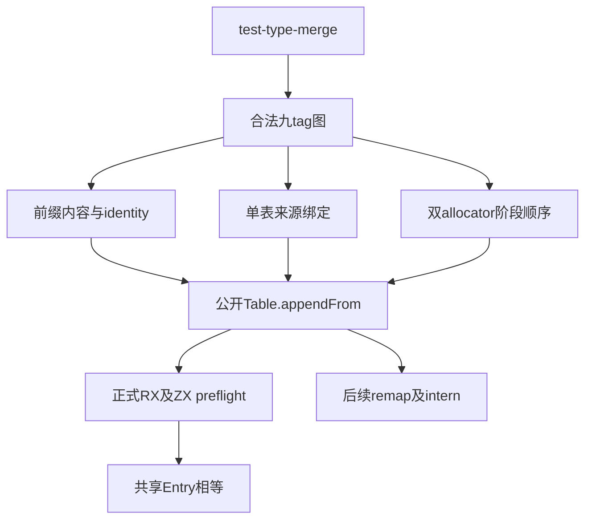
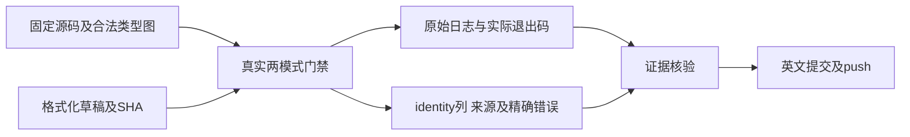

# 类型合并前置校验独立回归

## IDEA

- Intent：为新前置校验及共享Entry补齐非空前缀、单表来源绑定、双allocator错误优先序的独立观察。
- Data：主线1293a95f包含f20fc8ba；成熟type_merge、storage及nominal实现，分析草稿给出的准确协议与调用关系。
- Edges：不改生产实现；源码草稿先写本目录。沿用公开Table.appendFrom与test-type-merge，不为测试增加生产导出。合法标量前缀不改，所有复合引用来自实际已追加行。不放宽TypeTable的连续payload范围或完整消耗约束。
- Answer：按prefix、origins、resources分组补充Zig声明，真实执行Debug/ReleaseSafe及必要相邻门禁；保存固定源码、正式字节、日志与退出码，复核后英文Conventional Commit并push。

## 独立预期

九种TypeValue与八张列是不同概念。夹具通过成熟TypeStorage.append构造全部九tag，使用额外合法tuple/object/error_set使后续范围处于非零offset。为native_ref提供完整IR原生绑定；每份合法变体先执行完整type_only IR验证。

完整共享前缀必须逐项返回identity；错误前缀必须精确返回InvalidModule并保留旧类型、来源列。受控变体独立覆盖kind、child、task双引用、名义label、成员与字段内容及count，不改成品TypeId或手造任意标量排列。

同一输入内两个不同ID的相同origin/name，由后续驻留决定复用或ConflictingNominalType；前置索引不能提前拒绝。完整前缀不比较来源身份，也不提前要求名义来源覆盖。

错误顺序为：类型表有效性、来源形状、temporary origins分配、来源绑定、first范围、owner mapping分配、prefix内容。分别观察精确错误及FailingAllocator是否真正诱发失败；不接受笼统“InvalidModule或OOM”。所有attempt由caller局部arena持有，拒绝时已分配但未返回的mapping也完整释放。

## 文件边界

新增tests/incremental/type_merge/preflight目录：fixture只构造合法图及独立列预期；prefix_test、origins_test、resources_test分别承担内容、来源与分配阶段。现有build名单增加三项，不引入新测试运行器。

正式安装前核对主线对应路径无并行修改。提交前先执行仓库格式脚本，确保门禁输入与最终提交字节一致。已有缓存与旧版本窄门禁不代替新增观察。

## 架构图

## 数据流图

## 自我批判检查点

不把成功构建等同于新边界执行；不把多次模式或路由计为新增唯一声明；不把metadata故意损坏误报为正常fixture生产失败。若出现真实失败，先核验fixture协议和独立预期，再向授权实现聊天提交最小复现。
