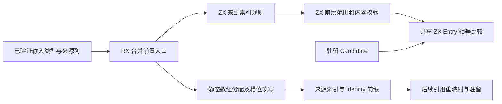

# 类型合并前置校验自举

Intent：将 link.appendFrom 的来源索引构建、共享前缀范围与内容校验迁移到 RX/ZX，并让前缀比较与现有类型驻留共用一套类型相等规则。

Data：现有 appendFrom 先验证 TypeTable，再验证来源形状、分配来源索引、逐行校验并索引、检查 first、分配 mapping、比较前缀并填 identity。sameType 与已自举的 equal.zx 重复表达结构及枚举相等规则。来源 seed 的规则更严格，不能直接套入 link：link 只拒绝同 ID 的重复来源，允许相同来源名称指向不同输入 ID，由后续驻留决定合并或冲突。

Edges：保留原有分配与错误顺序，不把检查提前到另一类错误前。前缀比较是逐行类型内容相等，不是名义查找，不增加来源身份比较。类型图的完整有效性仍由原 IR 校验入口保证。临时 origin 索引与返回 mapping 是必要结果内存，允许分配；执行 arena 保持零容量。原生端仅分配并初始化数组、读写槽位，不包含类型分类、来源规则、前缀判断或遍历。不得为了比较构造 slice 副本。

Answer：抽出带 offset/count 的借用 Entry 视图，Candidate 与 TypeTable 行投影后复用唯一 ZX equal；新增 merge 前置 RX/ZX，静态 workspace 原语仅管理原有两张数组。Zig 保留种子实现与类型表前置校验，正式 link 消费结果继续 remap/intern。执行发行与受影响现有专项、保存最终生成证据、复核并提交推送。不新建测试、不全量。



```mermaid
sequenceDiagram
    participant Link as Link
    participant RX as RX/ZX
    participant Memory as Workspace 原语
    participant Equal as 共享相等比较
    Link->>RX: 已验证类型表、来源表、first
    RX->>RX: 形状校验
    RX->>Memory: 分配来源索引
    RX->>RX: 来源逐行校验
    RX->>Memory: 索引来源
    RX->>RX: first 范围检查
    RX->>Memory: 分配映射
    RX->>Equal: 比较共享前缀
    RX->>Memory: 写 identity
    RX-->>Link: 有效或 InvalidModule
```

## 生成器嵌套临时参数问题

首次发行构建通过，但八专项因真实 lookup 的零容量 arena 报 OutOfMemory，143/155 用例失败。原因定位为普通标量调用的浅 objectValue 只把最外层参数放栈上，嵌套 row/candidate 调用仍选择 boxed ABI，并分配其临时输入。前置循环通过现有 iteration value 路径，不代表普通调用同样无分配。

修复限定在已有纯标量消费者的临时 object 参数分支：复用 value-call，将新建对象/元组及能够证明返回根为新建聚合的调用结果，在同一消费者 body 内物化；已有 reference/cache 指针原样保留。不能移除 duplicates boxing，也不能将 id(x)=x 的结果复制后取新地址；条件与短路分支继续原生成，不提前提升副作用。原有动态分配不是通过扩容 arena 兜底。

第二轮修复消除了普通 lookup 的嵌套分配，但进一步执行到 prefix 的循环状态路径时仍调用 boxed row。借用物化器现同时支持普通与 state 表示：已有 state 值先绑定，再按 origin 转为 ABI 借用；evaluation 缓存按当前模式保存；新 literal 使用 ABI 布局。fresh 子调用仅在参数已物化并缓存后临时进入 ABI 调用模式，保留原 invocation 的输出转换，之后恢复状态。不会在切换期间重新求值用户表达式。

阶段性 `test-type-merge`、`test-value-return`、`test-native-references-runtime` 已通过。最后补充的“转换前绑定”用于确保复杂表达式不被重复求值，因此继续执行最终发行与全部相关专项。自省：生成文件会保留未实例化的 boxed helper，其中可以存在 create；不能仅搜索文本就声称所有路径零分配。实际使用零容量 arena 成功的执行路径才是本阶段依据。

只读复核确认 ABI/state 缓存 roundtrip 通过原 origin 保留身份，fresh 判断排除直接返回已有对象，调用期间所有借用槽在同一 body 存活。原 value_call 的其他 legacy 分支保持不变，本修复只证明已覆盖的嵌套临时输入路径，不能泛化为任意 fresh 嵌套返回都无分配。

## 最终验证与自我复核

- 最终发行 `zig build dist` 退出码 0，包含转换前绑定修正。
- 最终十专项全部退出码 0：`test-type-merge`、`test-nominal-origins`、`test-native-references-library`、`test-module-artifacts`、`test-semantic-cache`、`test-library-link`、`test-library-codec`、`test-zx-await-runtime`、`test-value-return`、`test-native-references-runtime`。没有新增用例，没有执行全量。
- 使用最终 CLI 分别重新生成 preflight.rx 与 lookup.rx，均退出码 0，保存源码和 ABI。正式 preflight、结构 lookup、名义 lookup 的执行 arena 均保持零容量，受覆盖的实际路径执行成功。必要 origins/mapping 数组通过 owner allocator 分配，不属于临时参数对象分配。
- 前置流程与分配顺序保持原语义；same origin/name 的不同输入 ID 不被预先拒绝，前缀不比来源，不提前要求名义来源覆盖。Entry 比较复用唯一逻辑，两侧范围各用自己的 offset；引用只比较具体 ID，不递归改变名义身份。
- 生成器只对新建聚合根采用临时 value 结果，不复制既有引用身份；条件/短路继续原路径，输入求值一次，作用域覆盖实际消费者。状态缓存经 origin 转换保留旧指针。未删除 boxing 保护，也未用扩容执行 arena 掩盖问题。
- 本轮经历两次真实 OOM 失败后才通过，不能只凭发行编译成功声称自举运行正确；boxed helper 是否出现 create 也不能代替运行路径验证。现有专项不是一般规模的形式化证明，未声称所有可能 fresh 返回都无分配。
- 仍未完成整批驻留循环、模块提取调度与类型解析的自举，后续继续推进。

合入主线新补充的混合类型缓存恢复回归后，追加执行 `test-native-runtime`，退出码 0。该组验证原始、重新链接和解码后的原生 ABI，包括输入保持、有限错误、连续调用及分配失败；没有重复此前十专项。
