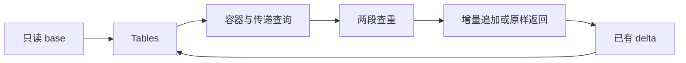
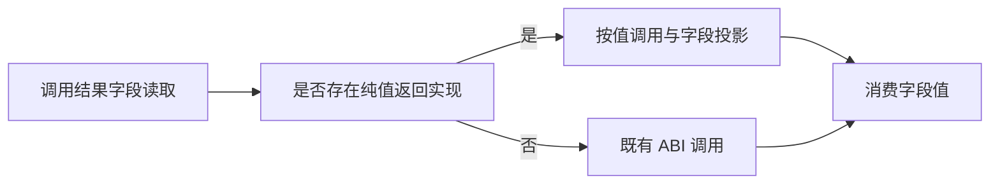

# 类型增量状态的连续构造与查询

## Intent：最终目标

让 ZX 类型构造、容器校验和传递查询直接使用 Tables 的 base/delta，支持多次构造连续更新同一增量，为移走解析 Workspace 提供真实状态接口。

## Data：可用证据

types/find、equal、row 已支持两段表；container 与 querying/contains 仍读取单 Table，构造器目前只产单行增量。继续依赖单表会迫使调用方拼接 base/delta，复制整个类型表。

## Edges：边界与限制

base 不可变并借用。delta 的子列偏移始终相对于 delta 自身，子 TypeId 是 base 与 delta 联合空间中的全局 ID。命中和诊断不得丢弃已有 delta；校验顺序保持。查询公开生成入口仍接受原 table/id/native_references，通过薄 ZX 入口接入两段模型；不改既有宿主与测试 ABI。

不拼接整表、不新增原生接口、不新增测试用例、不跑全量测试。Frame/visiting/resolved 迁移仍未完成。

## Answer：交付与成功标准

交付连续构造 update、增量 append、双段容器与查询实现、旧单表入口适配、真实连续构造草稿与现有专项记录。通过新 delta 的查重、跨 base/delta 引用和传递限制展示，确认未用 flatten 替代状态建模。

## 执行与自我复核

实施包含纯 ZX 的 update/limit/delta、双段容器与查询、旧入口适配，以及下述两处通用 genz 修复。未新增测试用例、未运行全量回归。

### 生成器字段读取缺口

首次专项暴露类型解析零额度入口 OutOfMemory。生成的 container 对 `row(...).kind` 使用普通指针返回调用，产生临时记录堆分配。修复 genz 的通用 projection：有值返回实现的纯函数调用按值生成，再投影字段；保持不具备该能力的调用路径。生成缓存版本由 v14 升至 v15。不扩大宿主分配额度。

长度预检初稿使用非 void 调用语句，不符合 ZX 语句契约；改为局部值绑定，由生成器保留 fallible 求值。

生成代码检查：limit 的四类子列检查均保留为 `_ = try narrow(...)`；行数检查发生在 delta 分配前。ZX 中未使用的局部值不消除可失败调用。

### 连续构造的实际证据

通用 batch/step 草稿已由真实发行 CLI 编译为可执行文件，输入与输出保留在草稿目录。

- 两个 Tuple 的 children 偏移分别为 0、2；两个 Object 的 field 偏移分别为 0、2；两个 ErrorSet 的 names 偏移分别为 0、2。
- Object 字段按名称排序，类型同步重排；重复 List、异序同一 Object 分别复用 ID 11、15。
- NativeReference 经 Optional 后交给 Task，被 capability 诊断拒绝；此前十行 delta 保留，ID 列不追加错误结果。
- 将非空 delta 再交给 batch，Tuple 引用已有 Object；重复两次返回 `[21,21]`，仅追加一行，children 偏移为 3，传递 List 查询为 true。

首次批量生成物仅 ids 列复用容量，delta 仍复制。缓冲调用分析仅将数值标量返回函数视为读者，find 的 Search 与 validate 的 Diagnostic 使 delta 路径被保守拒绝。已扩展不含列表与原生引用的纯结果分类，允许标量、枚举、错误集及其 optional/object/tuple 组合；追加后的旧版本读取和别名逃逸检查保留。

这里的字符串值可能仍借用输入字符串字节，但不携带可增长列表的缓冲区。纯函数边界本身禁止将列表传入原生接口；列表中的字符串元素与列表描述符存储也不是同一块内存。不得把这项分类解释为深复制或无借用。

更新后的真实 batch 生成物在 reduce 外声明九个 ArrayList：delta 八列及 ids。它们经 step、update、delta 的 buffered 调用传递；每列初次写入才拷贝输入列，之后保留容量，最终转移 owned slice。两组输入经优化后的原生可执行文件重跑，结果与优化前一致。

第三组输入将已有行作为非空 base，再加入两个 Tuple：结果 ID 为 `[21,22,21]`，delta 的 children 偏移为 `[0,1]`，不误加 base 的子列长度，跨 base/delta 的 List 查询仍为 true。

### 成本与自我批判

本阶段消除了连续追加时反复复制旧列的问题，不代表整个解析链已零分配。base/delta 同型记录仍有 ABI 包装分配；字段规范化与查询标记有各自的存储需求。查重仍使用既有线性查找，多次未命中构造的整体查重成本没有因此变为线性。

不得仅以普通构建成功判断完成：首次 34/34 构建通过仍伴随真实编译 OutOfMemory，专项才暴露字段投影分配。也不得仅以功能结果判断成本：首次 batch 结果正确仍复制整个旧 delta，必须检查实际缓冲区传递。Frame、visiting/resolved 与宿主 TypeStorage 所有权迁移继续保留为后续工作。

### 最终验证

- 发行构建：34/34 步通过。
- `test-type-query test-type-resolution test-value-return test-iterate-buffer test-iterate-calls`：242/242 步、426/426 测试通过，另有一项 CLI 库迁移与再发布验证通过。
- `test-typed-try test-object-construction`：165/165 步、153/153 测试通过。
- 三组通用 batch 原生执行结果见草稿；前两组在缓冲优化前后逐项相等。
- 本次 ZX/RX 格式检查与 diff 空白检查通过；正式源码的草稿镜像和哈希见验证结果.json。

没有新增注册测试，没有运行全量测试。最终生成文件仅依赖 Zig 标准库、普通整数原生接口与 ABI 类型定义，不引入专用运行库。
