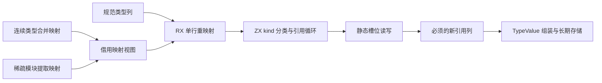
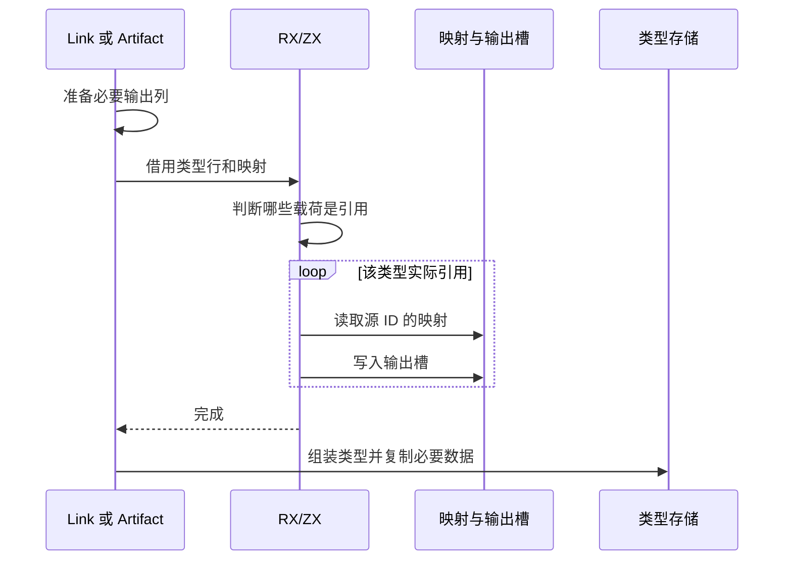

# 类型引用重映射自举

Intent：将链接合并与模块提取的单行类型引用重映射统一交给 RX/ZX，保持实际 TypeId 方向与所有权边界，为后续整批类型驻留自举提供共同步骤。

Data：link/types.remap 与 artifact/types.copy 都按类型种类分别映射 optional/list/task/tuple/object，非引用数据保持原样。前者引用映射是已初始化前缀，后者是依赖遍历后填充的稀疏映射；TypeTable 已验证引用指向先前类型。已有 tuple/object 必须生成新的引用列，TypeStorage.append 随后复制其值到长期列。

Edges：不能把 first/second 一律当 TypeId，它们也表示标量码及范围。保留 artifact 的依赖访问顺序、类型生成顺序、名义身份和跨 owner 字符串复制。共享算法只处理单行映射，暂不移动遍历调度、前缀校验与查找驻留。原生接口只读映射槽、写输出槽，不分类、不遍历类型；dense/sparse 直接借用，不复制整张映射。执行 arena 零容量，tuple/object 输出引用列仍需必要的分配。目标引用列必须活到 TypeStorage.append 完成；不把它们当作借用源对象的长期内存。

Answer：实现 remap.rx 与 ZX 类型分类/引用循环，静态 references 模块承担单个槽位读写。适配器分配所需引用列并组装原有 TypeValue，seed 保留相同行为。接入 link 与 artifact 两个入口，运行相关既有专项和发行构建，保留真实生成与自我复核。不新增用例，不执行全量。

## 正式接线与复核

link 与 artifact 已共用 semantic/remap.zig 的适配入口，RX/ZX 决定 optional/list/task 及 tuple/object 的具体映射。静态 references.get/set 只操作映射槽与结果槽，不读取类型 kind。reference_view 在 frontend 与原生模块共享同一构建实例，dense/sparse 只通过明确 union 选择原有存储，不转换整个映射表。

artifact 的依赖栈顺序未改，tuple/object 引用数组在 TypeStorage.append 后已有列副本，因此 tuple 改用 temporary；名称和枚举成员的持久复制保留。u32 输出数组转为 TypeId enum(u32) 切片沿用现有等宽借用方式，栈上两个槽只用于 optional/list/task，不作为返回切片。正式执行使用零容量 arena，必要的目标引用列由调用者 temporary 提供。

只读复核未发现引用范围、任务双引用、临时内存生命周期或模块依赖问题。已通过类型合并、模块产物、库链接、语义缓存与 typed-try-library 五专项；正在等待发行及额外的实际 await 运行专项。该额外专项用于检验 task 引用路径，不能用仅含 task 的存储测试替代重映射运行证据。

## 最终验证与自我复核

- 发行 `zig build dist` 退出码 0。
- `test-type-merge`、`test-module-artifacts`、`test-library-link`、`test-semantic-cache`、`test-typed-try-library` 五专项退出码 0；额外 `test-zx-await-runtime` 退出码 0。没有新增测试，没有执行全量。
- 最终 CLI 重新生成真实 remap.rx 成功，保存生成源码及 ABI；生成程序没有 allocator.alloc/create，正式适配调用始终使用零容量执行 arena。
- 所有引用查找与向量重映射在 ZX 中决定；原生端只有槽位读写，适配层只确定必要结果存储形状并组装原有 TypeValue。字符串及名称不在此阶段重映射或复制，仍由原 owner 转移逻辑处理。
- 已验证的专项包含源生命周期、合并、产物裁剪、分配失败及任务实际执行，但不是对所有类型图的形式化证明。类型表必须已验证，稀疏映射槽必须已由依赖调度填好，不能把内部原语暴露为对任意数据安全的公开接口。
- tuple/object 必须产生新引用列；零额外编排分配不等于整个重映射无需分配。artifact 的该类列改在临时 owner 分配，后续 TypeStorage 已复制其元素；长期字符串所有权不变。
- 本阶段没有迁移 artifact 依赖调度、link 的前缀一致性检查与整个追加流程。类型解析、整批增量驻留及这些调度决策继续推进，不据此宣称整个编译器自举完成。
