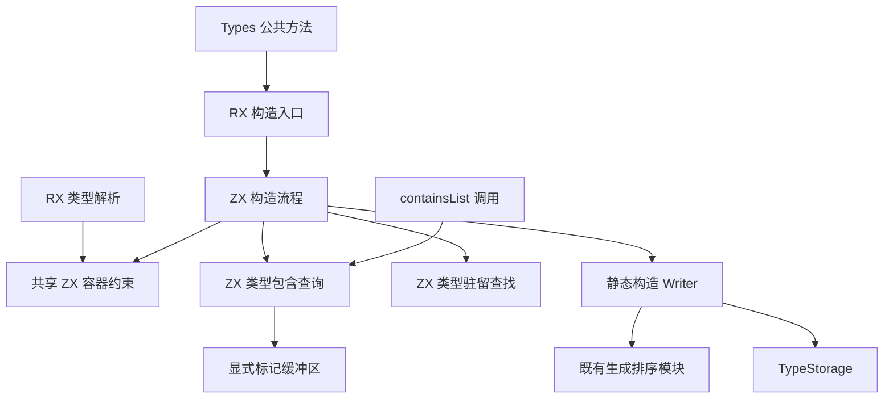
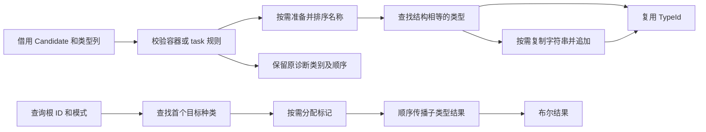

# 类型构造与查询自举

## 阶段定位修正

根据用户 2026-10-07 的明确要求，本阶段是公共类型构造控制逻辑迁移，不是完整职责自举。执行以 [自举完成标准](../../../rules/自举完成标准.md) 为最终门槛。

当前 construction Writer、type_flags State、TypeStorage、整数转换、诊断提交和生成排序回调均保留过渡依赖。零字节临时 allocator 只验证生成控制流程成本，不证明这些桥已经完成自举。后续必须将自有数据模型和状态操作用普通 ZX 表达；通用能力不足时完善语言和生成器，再移除桥。

## IDEA

- **Intent**：将 Types 的公共类型构造与列表包含查询迁入 RX/ZX，共享解析器已有容器规则，保留源解析与公共构造的边界。
- **Data**：基线 bbdfdc66；证据为 analysis/types.zig、唯一 containsList 调用 transforms.zig、semantic/resolution、core/native_references.zig 及既有类型查找和排序实现。
- **Edges**：不新增运行库、AST 镜像、全表复制或长期缓存；不让 core 反向依赖 compiler；不新增测试用例、不运行全量测试。只读视图与可变 State 分离，原生层仅执行存储、分配、排序桥接和诊断呈现。
- **Answer**：交付共享容器约束、公共构造 RX/ZX、拓扑顺序查询 RX/ZX、静态原生工作区及正式接线；完成已有专项、发行构建和源码复核后提交推送。

## 架构图

## 数据流图

## 保留的规则

- wrap 先 task，再 list<void>，然后 lookup/append；optional<void> 允许。
- tuple 只拒绝直接 task 子项，允许空 tuple 和 void 元素。
- object 先拒绝直接 task 字段，再原地成对排序 names/types，再 lookup/append；即使命中已有类型，原数组也已排序。公共构造不新增重复字段、空名或 void 校验。
- errorSet 先复制名称指针数组、排序、lookup；命中不复制字符串。未命中才按排序顺序复制字符串并追加，不去重、不新增命名校验。临时指针数组可在追加完成后释放，字符串仍由类型数据生命周期持有。
- task 先判断 result 是否包含宿主引用，再拒绝直接 task result，再 lookup/append；不新增 errors 种类检查。
- resolver 在全部子项解析完成后调用共享容器约束，字段重复、字段 void 和 enum 仍由 resolver 决定。

## 查询与接口决策

类型表满足子类型 ID 先于父类型 ID 的现有前提。查询按拓扑顺序传播 bool 标记，不建立递归调用、全表副本或缓存。

NativeReference 模式保留 core 查询顺序：根直接命中即 true；根之前不存在 native_reference 即 false；否则分配根索引加一的标记，依次传播。optional/list 和 task.result 可穿透，task.errors 不参与。

List 模式中 list 直接命中；optional、tuple、object 传播子项；task 必须返回 false。保留直接 list 命中和前缀无 list 的无分配路径。与旧递归相比，前缀扫描可能访问更多无关行，不宣称无条件更快。

containsList 在 frontend.types 中可访问，但没有找到签名的外部文档承诺，仓库内只有 transforms 一处调用。为如实传播新 scratch 分配失败，返回类型改为 Allocator.Error!bool，调用者使用 try。此内部开发接口变化需要明确记录，不以 catch false 或 panic 保持表面签名。

core.containsNativeReference 仍服务 core、napi、CLI 和其他校验调用者；本阶段只迁移 Types.task 所需查询，不制造跨包依赖环。

## 实施顺序

1. 提取纯 ZX 容器约束，接入 resolver。
2. 实现可释放的标记 State 与双模式包含查询。
3. 实现不依赖 Reader 的构造 Writer，接入 RX/ZX 构造流程。
4. 替换 Types 正式路径，原始实现仅保留 seed 使用；同步 containsList 调用。
5. 运行相关已有专项、发行构建，检查零临时分配边界、复制和清理顺序，保存源码与证据后提交推送。

## 自我批判标准

不能为了共用接口构造假 AST Reader；不能把 resolver 专属的字段规则扩散到公共构造；不能将 core 依赖 compiler 作为查询复用方式。共享的是语义约束和类型表模型，不是将所有流程强行合并。

显式标记数组增加了 List 查询的可见 OOM 点，新增成本必须记录。生成控制流程继续使用零字节临时分配器；这不等于所有原生类型数据零分配。

## 实施与自我复核

三个入口 construct_type、query_types、resolve 均使用 seed CLI 成功生成 Zig。生成调用图检查分别覆盖 42、9、107 个入口可达函数，没有直接 create/alloc 调用；未使用的堆分配函数仍可能存在于生成文件中。该检查只覆盖生成流程，不涵盖原生桥内部必要的数据分配。

首次校验把含嵌套字段的 Candidate 存为局部值，生成器为字段转换分配临时内存，导致零字节临时 arena 下已有类型及任务专项失败。调整为直接传入容器校验，任务检查单独读取种类及 result ID，重新生成后可达临时分配消失。没有通过增加 arena 容量掩盖问题，也没有放宽通用生成器的借用边界。语言生成器对这种局部嵌套值的优化仍是独立改进项。

修正后已有 types/positive 专项 20/20 通过；原生声明、宿主引用、类型合并、任务分析和 typed try 分析专项共 244/244 通过。没有新增测试用例或执行全量测试。运行的是正式 generated_parser 路径，包含查询、构造包装器的零字节临时 arena。

标记数组在 ZX 查询返回前显式释放，宿主 defer 处理失败清理；释放时清空状态避免重复释放。errorSet 临时指针数组由 Writer 释放，字符串和类型存储仍遵循现有生命周期。不得把这些仍以 Zig 实现的状态管理称作最终自举。

下一步优先消除 type_names 到 lint.checkName 的语义代理，并核实字符串逐字节访问及通用转换能力；随后以完整数据职责迁移 Frame、State 和类型表。不能仅把规则复制到 ZX 而保留同职责 Zig 规则供正式路径继续调用。

发行构建 `zig build dist -Doptimize=ReleaseFast --summary all` 通过。当前正式 CLI 与 seed CLI 对相同路径的三个入口生成的 Zig 及 ABI SHA256 完全一致，记录见种子生成哈希.json；这不是完整编译器的 stage 2/3 自举证明。
