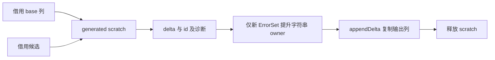

# 类型构造 Writer 的纯值迁移

## Intent：最终目标

用 RX 编排的 ZX 值函数完成类型构造校验、候选规范化、查重和增量列生成，删除 construction Writer 及其原生可变状态接口。Zig 仅负责借用输入、报告诊断与持久 owner 提交。

## Data：可用证据

现有构造通过 opaque Writer 读写 Types.items，并在原生回调中排序、分配和追加。types/find 已支持 base/delta 查重；container 与 querying/contains 已提供 ZX 语义校验。Object 调用方从返回 TypeId 重新查询字段，不依赖输入字段被原地排序。ErrorSet 目前只排序、不去重。

## Edges：边界与限制

保持先校验、后排序/查重的诊断顺序和文字；Task 先检查宿主引用再检查嵌套任务。Object 必须同步排序名字与 TypeId，使用 UTF-8 字节字典序。输入表借用，不拼接或复制全表。返回 delta 内部 first 偏移相对于自身列，子 TypeId 保持全局 ID。

appendDelta 仅复制字符串描述符；新 ErrorSet 的字符串必须复制至 Types allocator，命中已有类型则不复制。Object 名字延续既有调用者所有权。成功追加后才能销毁 generated scratch；失败时不保留 scratch 引用。既有 seed 构造暂留以服务生成器；正常 generated 构造不再调用 Writer。

不新增测试用例，不执行全量测试。完整 resolution Workspace 迁移仍为后续目标。

## Answer：交付格式与成功标准

交付纯 ZX 构造入口、字段配对排序、delta 行输出、Zig owner 提交以及 Writer 接口与构建依赖删除。发行构建和现有类型/对象/任务相关专项通过，生成物无 construction 原生导入，输入全表不复制。

## 执行与自我复核

constructing/model 定义普通 Table/Candidate 输入与 delta/id/diagnostic 输出。execute 先验证，再规范化，再复用 types/find；命中返回空 delta。delta 只构造一行的四个主列及对应子列，不复制 base。Object/Tuple/ErrorSet 的 first=0 是增量局部偏移，Optional/List/Task 保留全局 TypeId。

Object 字段采用单循环堆排序，同步交换 names/types；less 按字符串字节比较，与旧 std.mem.lessThan(u8) 一致，避免引入另一种 Unicode 排序规则。ErrorSet 复用普通字符串列表 sort，不去重。生成排序代码的两个 started 标记在循环外初始化，最多各复制一次名字描述符和 TypeId 列，交换时复用缓冲；比较 helper 不分配。

删除了构造 Writer、zig:construction 声明与全部访问/存储/诊断回调，以及生成器接口、ParserModules 字段和模块构建依赖。construction_abi 保留为普通值 ABI；resolution 仍使用 named_columns 排序，未越界删除该模块。TypeStorage 的宿主 owner 仍保留。

Zig 适配器借用输入列，调用生成构造器，先报告诊断、再 appendDelta。新 ErrorSet 字节只在查重未命中后复制，失败时清理已复制前缀；临时描述符和 generated arena 都按作用域释放。Object 名字来自既有调用者的 Types owner，不新增字符串拷贝。诊断文字均为 ZX 常量，span 仍为 0..0。

第一次构建被编译器风格规则拒绝了嵌套条件表达式；已改为 match，未绕过规则。最终发行构建已通过 34/34 步，新发行 CLI 能再次编译正式字段排序和类型源顺序模块，排序生成物与迁移前 CLI 编译同一纯 ZX 源码的结果逐字节一致。类型解析、任务分析、有限错误与对象构造专项最终 185/185 步、270/270 检查通过。生成构造模块没有 construction 导入，仅依赖 integers 原语与普通 zxc_abi；源码镜像、删除清单、生成物及 SHA256 已归档。没有新增测试用例或运行全量测试。

## 自我批判与剩余边界

迁移删除了专用可变 Writer 及其原生语义，但不是整个构造链零复制：纯 Object 排序最多复制两列，appendDelta 复制返回列，ErrorSet 字节按生命周期要求持久化。输入 base 未复制。不能以分配次数变化为理由放弃普通值语义，也不能将这些成本隐藏为“零开销”。后续完整 ZX 类型存储 owner 才能进一步消除宿主提交边界。

对象排序不再原地改写输入，这是内部行为变更；已核对 aggregates、tasks 与 seed 调用者均从返回 TypeId 查询规范化字段。ErrorSet 重复成员语义不变，Task 诊断先 native reference 后 nested task。resolution 的 Frame/visiting/resolved 仍未迁移，不能声称完整自举完成。
