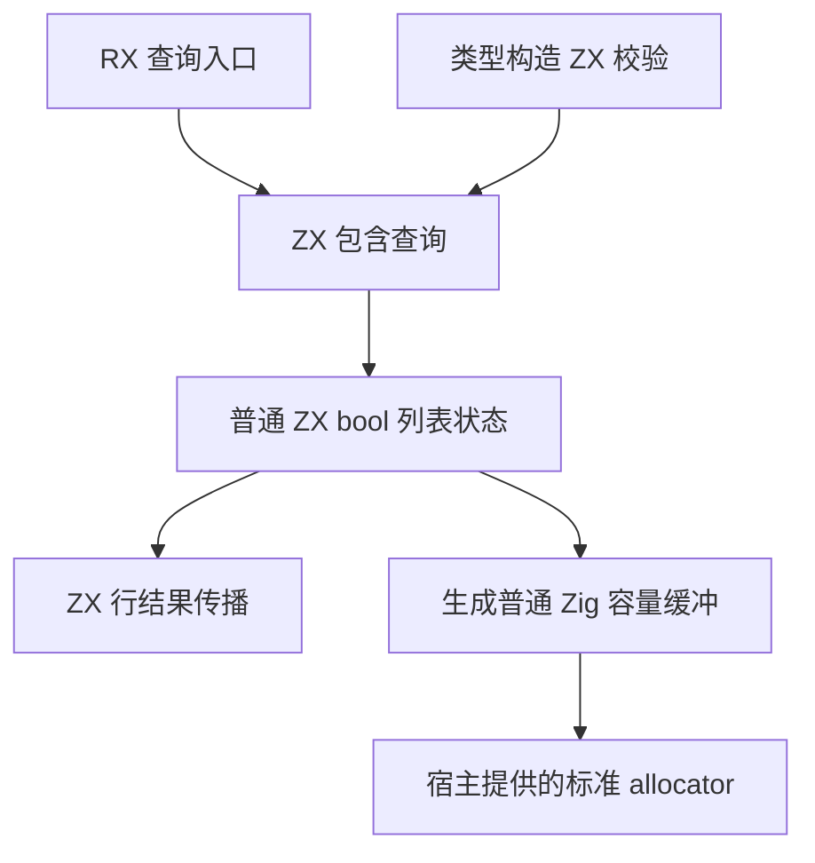
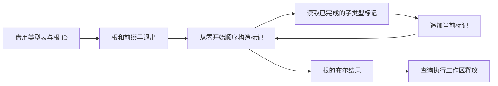

# 类型查询状态自举

## IDEA

- **Intent**：把类型包含查询的标记数组、初始化和更新迁入普通 ZX，完整移除专用 type_flags 原生模块及手写 Flags State。
- **Data**：基线 3fab3ef6；querying/contains、row 的算法已用 ZX，但通过 flags.allocate/get/set/release 操作 Zig bool 数组。普通 loop/list push 和生成器已有私有容量缓冲优化，可作为实现基础。
- **Edges**：类型表仍借用且子类型先于父类型；双查询模式语义不变。根直接命中、前缀无目标仍不分配。不新增专用原生替代桥，不复制类型表，不新增测试用例或全量测试。
- **Answer**：交付完整 ZX 标记状态、删除原生桥与构建接线、检查生成循环复杂度和内存生命周期，再用已有类型与任务专项验证并提交。

## 架构图

## 数据流图

## 语义与成本

列表标记仅保存根之前及根自身的结果。首个目标种类之前追加 false，其后按原类型表传播规则计算；NativeReference 模式穿透 optional/list/task.result，List 模式不穿透 task。tuple/object 只读较早子类型结果。

不能仅因源码没有 zig:type_flags 就宣称零成本。必须检查生成的 push 是否使用单个增长缓冲，而不是每轮复制整个前缀。增长缓冲可能有几何容量与扩容成本，与原一次定长分配不完全等价，需要记录。宿主 arena 是生成执行的通用分配边界，不得重新引入持有算法状态的专用 Zig struct。

## 自我批判

删除专用状态桥才构成此次目标；把 flags 另换一个原生名字不算迁移。生成代码的内存释放点需要检查，尤其构造路径调用查询后的查找与追加期间是否仍保留 scratch；如有延长，应如实记录并完善通用生命周期生成，不能悄悄宣称原生版成本等价。

## 实现与成本复核

已删除 type_flags.d.zx、type_flags.zig、querying/flags.zig，以及注册、导入和 opaque 输入。constructor 的校验直接调用持有普通列表状态的 ZX 查询。查询及构造宿主仅提供标准 ArenaAllocator 并在退出时释放，不再持有或操作 Flags State。

生成结果使用单个 ArrayList(bool)，首次 appendSlice 来源为空，后续 append 复用容量；没有每轮复制完整前缀。只读行函数完成后才追加标记，扩容时没有继续使用旧切片。复杂度为 O(N + E) 时间、O(N) 空间，N 是根前缀长度，E 是实际遍历边数。

与旧定长数组存在真实成本差异：逐元素追加带容量检查，几何扩容可能搬迁已有标记；toOwnedSlice 可能调整容量。不能声称标记工作区全程零复制、精确一次分配。根直接命中与前缀无目标仍在分配前返回。

独立查询的工作区在查询 wrapper 返回时释放。构造路径的查询 scratch 则在构造 wrapper 返回时释放，比旧 flags.release 延长到后续 lookup/append 结束；其大小仍为单次调用 O(N)，不会积累到编译器全局。后续应以通用局部集合生命周期和容量推导优化这一差异，不再引入专用原生 flags。

本轮编译器模型的真实前进是数组状态由 ZX 表达并由生成器管理。integer 原生转换、构造 Writer 和类型表本身仍待迁移；不将查询状态迁移称作完整编译器自举。

## 验证过程

发行构建成功。类型合并、宿主引用、任务分析和 typed try 分析组合专项初次 233/234 通过；唯一失败为上轮字符串索引能力扩展后的旧诊断文案断言，仍预期“indexing requires a list or tuple”。现将既有断言更新为准确的“indexing requires a list, tuple or string”，错误类别及源码位置不变，没有新增用例或按输入硬编码行为。

当前正式 CLI 与上一阶段 CLI 对同路径查询 RX 生成的 Zig 及 ABI 完全一致，原始哈希见生成成本检查.json。此证据限于本入口，不是完整编译器 stage 2/3 证明。

更新既有诊断断言后，宿主引用专项 14/14 通过；其余组合专项在首次运行已通过。本次复跑为原234项的子集，不能累加为248项独立测试。没有执行全量测试。
