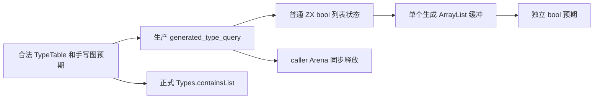
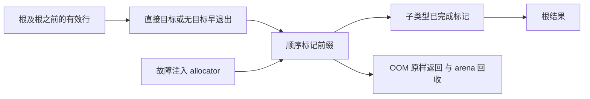

# 类型查询独立回归执行计划

## IDEA

- Intent：以独立图预期验证生成类型查询的 NativeReference/List 两模式、有效根前缀、共享 DAG、任务传播差异及 OOM 所有权；补齐新普通 ZX bool[] 状态的运行证据。
- Data：冻结 4693dd0dbb27c8f4af1c96d38dc658d741d39354；正式 querying/contains 与 row；TypeTable 公开八列模型及现有 generated_type_query 模块实例。
- Edges：查询要求类型表有效、子节点先于父节点且根 ID 有效。只造合法 TypeTable，不测试虚构循环/越界，不伪造 Analysis。直接用生产生成模块观察双模式，public Types.containsList 另外检查；core.ir.containsNativeReference 仍是手写版本，不能把它当生成查询 oracle。
- Answer：分类独立测试、中文 IDEA/架构与数据流图、原始门禁及哈希；双模式冷缓存后英文 Conventional Commit 提交 push。Test262 字符串索引原文审阅由一个只读分析代理准备，正式 review 留待完整核对。

## 架构图

## 数据流图

## 执行步骤

1. 已核对并保存前轮 owned 工作区差异，仅清理本会话十一输入，冻结当前提交。旧类型解析实时核验需恢复 b6b7adcb 与其对应输入；历史日志不修改。
2. 用完整 Scalar 前缀、合法 native/enum/error/optional/list/tuple/object/task 类型构造图，所有表先通过正式 validateTypes。任务结果可含 native 的表用于查询拒绝候选，不声称这是可执行的合法任务程序。
3. 独立核对根直接命中、首个目标前/后、非祖先噪声、列池偏移、共享子节点和 task.result 模式差异。快速路径用 fail_index=0 检查没有分配。
4. 深链与宽图跨越列表容量增长，扫描查询 owner allocator 的分配失败，检查八列及字符串字节输入不变，查询返回后 allocator 无活跃块。保持没有专用 flags 桥或新生产模块。
5. 双模式冷缓存与相关 task/transform 专项；记录实际叶节点与缓存情况，检查 diff，自我批判后提交 push。

## 自我批判

两种模式不能互相当 oracle：List 模式刻意不穿透 task，Native 模式穿透 task.result。根之后有目标不应影响结果或分配路径。需要验证真实生成代码的缓冲与退出生命周期，不能以删除旧 flags 文件替代运行证据；这些测试也不证明最终完整自举。
