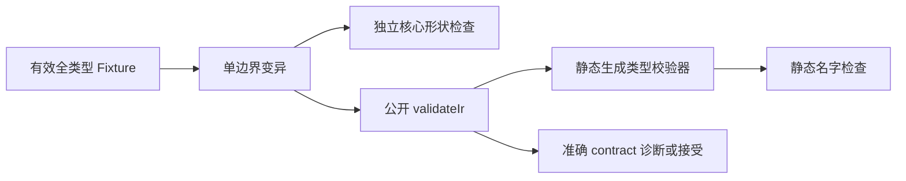
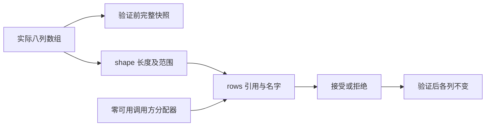

# 类型表校验自举回归执行计划

## IDEA

- Intent：验证从 Zig seed 切换至 ZX/RX 静态生成校验器后，八列形状安全、九种类型语义、允许值和拒绝值均保持契约；校验不能依赖运行时分配。
- Data：冻结提交 `35da71f5d98511e827ce92152055ee0423d92248`；公开 compiler.validateIr、TypeStorage 与 TypeTable；核心 validStructure 提供独立形状检查，期望语义来自明确契约与具体最小变异，不复制 seed 算法作为唯一 oracle。
- Edges：拒绝用虚假巨型 slice 和无效指针模拟最大长度；使用真实短数组中的最大 u32 偏移、计数和引用。type_only Program 明确隔离表达式和所有权层。新增 Zig 声明不计为 JSON catalog ID，优化模式不重复算新增。
- Answer：中文草稿、正式分类回归、Debug/ReleaseSafe 原始日志与哈希；实际终止成功后英文 Conventional Commit 提交并 push。

## 架构图

## 数据流图

## 步骤

1. 保存前轮已提交草稿的工作区差异，精确确认十个输入哈希后清理已拥有差异，复用隔离工作区。历史循环证据仍保留，其实时核验需恢复原冻结 HEAD 与补丁。
2. 草稿按形状、引用、名字和允许控制分类，以真实短数组覆盖后续项与非零偏移，所有修改采用独立合法基线。
3. 使用零可用验证分配器，并断言无诱发分配；保存输入列快照，确认接受和拒绝均不写入。
4. 正式源码格式化后同步，执行双优化模式及相邻外部解码门禁。
5. 保存原始日志、基线、输入哈希、声明数，校验 hook 后字节一致，再提交 push。

## 自我批判

合法 TypeTable 不自动等于合法用户源码。enum label/member 的非空与唯一规则不能自行扩张为 native reference/error 的 PascalCase 规则；tuple 的 void 与 optional void 也不能被错误禁止。有限输入不是全部位模式证明，不以生成阶段或基线旧测试成功替代新增测试实际执行。
