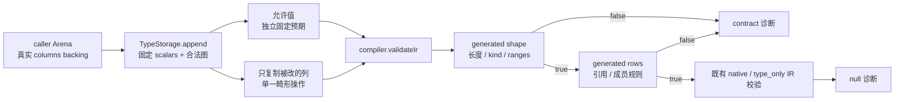
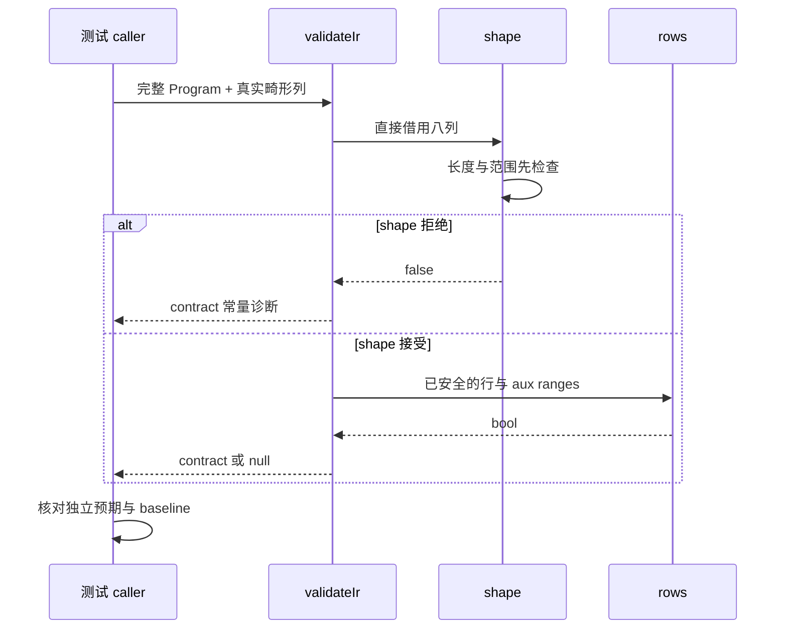

# 类型表校验自举回归：边界分析

本稿使用 IDEA 框架。阅读源码固定于 **`6575f0151ecb3054d8149034227463204befd3e0`**（`feat(compiler): bootstrap type table validation`），通过 `git show <SHA>:<path>` 核对，避免并发 main 推进混淆证据。本次仅查找、读取和生成这份分析文档，未修改正式源码、运行门禁或提交。

交付时主代理已报告冻结 `35da71f5`（包含上述阅读 SHA），实现 104 个独立声明：shape 36、references 30、names 20、allowed 18。采用公开 validateIr、type_only Program、合法 NativeModule owner、调用方 FailingAllocator fail_index=0 且不诱发失败，以及完整八列快照。首轮 shape/names 已通过；references/allowed 的 ir alias 编译错误已修正，双模式门禁正在执行。这是主代理提供的进度，本代理未运行或重新审阅该批新测试；本稿不再要求扩大新增规模。

## Intent：最终目标

补齐类型表校验自举的独立契约观察：公开 `compiler.validateIr` 能安全拒绝 malformed columns；shape 成功之后 rows 严格校验引用与成员；已有允许值仍被接受。预期来自明确的类型表协议及类型语义，不把旧 seed validator 复制为唯一 oracle。

公共入口已足够：`packages/compiler/src/root.zig:5` 导出 `compiler.ir`，`:18` 导出 validateIr。`ir.TypeStorage`、TypeTable、TypeId、Scalar、Program 都可直接使用，不需要生产导出 generated validator，不新建运行器或私有测试接线。

分析阶段的最小组织建议为 `packages/test/tests/contracts/type_table/fixture.zig`、`allowed_test.zig`、`rejection_test.zig`，以及 `packages/test/build.zig:76` 的现有 test-contracts 文件名单增加两个测试入口。下文保留这套入口分析与 fixture 骨架供审阅；交付时主代理已有上述 104 声明实现，不要求按此建议重新组织或增加文件。本次没有创建正式测试。

## Data：可用证据

### 已有验证与覆盖

本提交的 `docs/2026-10-07/类型表规则校验自举/验证结果.json` 记录发行构建与五个既有专项退出 0：test-library-codec、test-cache-codec、test-native-references-ir、test-typed-try-library、test-type-merge。该轮未增加用例。本次没有复跑，新增建议不能据此记作通过。

| 已有正式入口                                                                                | 已覆盖                                                                                        | 本轮真正缺少                                                                     |
| ------------------------------------------------------------------------------------------- | --------------------------------------------------------------------------------------------- | -------------------------------------------------------------------------------- |
| `tests/support/type_column_fixture.zig:13-38`；cache/library `type_columns_test.zig:79-171` | 24 类列变异，每组有有效 mixed 基线、24 份独立拒绝和一份拒绝 OOM；两组总计 52 个声明           | 直接公开 validateIr 的 shape 安全边界；新 task/native_ref 与成员区别；合法宽边界 |
| `incremental/type_merge/preflight/prefix_test.zig:4`                                        | 九 tag、非零 tuple/object/names range、完整合法图，实际 validateIr 校验；后续 prefix 差异矩阵 | 两个合法 payload 不同导致 prefix 不相等，并不等于 rows 会拒绝语义非法 payload    |
| `preflight/origins_test.zig`                                                                | 单表同来源/name 不同 ID、绑定 kind、多个 range 驻留                                           | 名义元数据校验不是 TypeTable rows 规则                                           |
| `type_merge/storage_test.zig:7-28`、`:79`                                                   | 存储九 tag 及 finish 的全部 OOM                                                               | 只覆盖成熟非空值，不证明空 object/tuple/error_set 或 void 的差异                 |
| `packages/compiler/tests/language/positive_semantics_test.zig:23`                           | 普通源码 typed empty tuple                                                                    | 不是外部 IR 接口的全部允许值矩阵                                                 |
| `packages/compiler/tests/ir/validate_test.zig:6`                                            | 公开 validateIr 拒绝外部 frontend 的表达式/契约/Store 等伪造行为                              | 该文件没有类型表 shape/rows 的直接畸形列矩阵                                     |
| `packages/test/tests/contracts/ir_test.zig`                                                 | contract IR 变异与生成门禁                                                                    | 可以共用 test-contracts；不应将新的类型表职责继续堆入该文件                      |

已有 codec 24 类为：first/second/labels/field_names 长度、未知 kind、scalar 身份与 second、非法 label、optional self、list void、tuple/object self、object void/空名/乱序、tuple/object/names 的 gap/overflow、enum 空标签/重复成员、error 空成员。不要另造一套同样 24 项 JSON/digest 镜像测试。

#### 不能把 codec 已有覆盖说弱

cache codec 在 `packages/compiler/src/zx/modules/semantic_cache/codec.zig:61` 直接调用 type_rules.validate。library codec 在 `library/codec.zig:79` 调 compiled 验证，`zx/modules/compiled/validate.zig:11` 调 IR 验证，再在后面校验 nominal 与导出。当前源码不能支持“所有列变异都只被旧 core 检查挡住、完全没进入生成 validator”的笼统结论。

公开 validateIr 新回归的价值，是明确绕开 JSON、digest、library shape/nominal/导出等其他协议，构造现有 fixture 没有的边界，并直接断言 `.contract` 诊断。无需否定已存在的外部 codec 检查。

### 两层正式校验链

`packages/compiler/src/zx/ir/validate.zig:6` 先检查 version 与 type_rules，随后 `:7` 才检查 native_modules。类型表不合法时，应直接返回常量 contract 诊断，不继续取行、检查绑定或遍历函数。

`zx/ir/type_rules.zig:4-19` 在正式 generated_parser 路径借用全部八列，构造 labels/fields/members 视图，固定 Scalar 数量、u32 最大列数，再用零容量 Arena 同步调用 generated validator。意外生成错误被 catch unreachable；因此某个边界触发 OOM/越界 panic 是实现违约，不能变成“接受 OOM 也是通过”。

`analysis/semantic/validate_types.rx:2-12` 保证先执行 shape，只有 true 才执行 rows。这是安全顺序，不能把所有输入交给 row 再依赖 bounds safety。

## Edges：边界与限制

### shape：列协议与索引安全

精确证据位于 `packages/compiler/src/zx/analysis/semantic/types/validation/shape.zx`：

| 规则                                                                  | 行号  | 最小独立观察                                                          |
| --------------------------------------------------------------------- | ----- | --------------------------------------------------------------------- |
| first/second/labels 与 kinds 等长；field_names/types 等长；列计数上界 | 15-18 | 每个长度短/长都在读取之前返回 false；不用伪造 slice 长度              |
| kind 编码只接受 0–8；非 enum/native_ref 不得有 label                  | 29-30 | unknown kind=255 的真实 u8 数组；让它位于非首行；合法标签例外另设正例 |
| object 的 field range 连续且在界内                                    | 31-36 | 最大 u32 first、尾部缺失、count 越界；field 配对仍完整时才隔离 range  |
| tuple 的 children range 连续且在界内                                  | 37-42 | 相同安全边界与空 range 接受                                           |
| enum/error_set 共用一个 names range 累积量                            | 43-48 | 多段交错 enum/errors、各自非零 offset；漏掉后部或尾部未消费数据拒绝   |
| scalar first 有界，second=0                                           | 49-50 | 固定前缀行的正常接受；已有 codec 已有 second 拒绝                     |
| optional/list 的 second=0                                             | 51-52 | 非零 second 拒绝，即使 child ID 合法；这里 second 不是列表长度        |
| native_ref first=second=0                                             | 53-54 | 两个字段分别非零，标签和原生绑定保持有效                              |
| 三类 aux 列最终必须恰好消费完                                         | 61    | children 尾部垃圾、paired fields 尾部垃圾、names 尾部垃圾各自拒绝     |

`first <= length && count <= length-first` 的短路保护发生在 `:32/:38/:44`。使用普通短 backing 数组和 `first=std.math.maxInt(u32)` 能观察安全拒绝，不需要真实分配巨大内存，也不能伪造 `[0..4GiB]` 的无效 slice。

当前 shape 不允许未引用 aux padding：range.first 必须等于同类累计终点，最终累计必须等于列长度。这个结论来自正式协议，不是仅 constructor 不产生 padding。

task 的 first/second 分别是 result/errors TypeId，shape 不把它们当 aux range；引用与 kind 约束全部留在 rows。optional/list 的 first 是 child TypeId、second 必须为 0。不能把同一列在不同 tag 中的含义统一成 offset/count。八列上界中，first/second/labels 继承与 kinds 等长的上界，field_names 继承与 field_types 等长的上界；不因没有逐列重复写 maximum_count 就认定遗漏。

最大列数固定为 u32.max，通过公开入口不宜为了覆盖“列长度 > u32.max”分配数 GiB 或伪造指针。本轮明确保留此物理长度极限的源码证明边界，不另造不安全测试来凑分支。

### rows：真正的语义条件

`rows.zx:11-18` 要求至少包含完整 Scalar 前缀，并按顺序调用 row；完整 shape 成功后才允许以下取值。`row.zx`、`children.zx` 和 `members.zx` 分担不同规则：

| 类型             | 必须拒绝                                                        | 明确允许、不可收紧                                                         | 源码证据                                             |
| ---------------- | --------------------------------------------------------------- | -------------------------------------------------------------------------- | ---------------------------------------------------- |
| scalar           | 前缀 kind/ordinal 错误；前缀之后追加 scalar                     | 固定 Scalar 全前缀                                                         | row.zx:21-26                                         |
| optional         | child 不在此前行、child 为 task                                 | **optional<void>**；非 task 的其他已存在 child                             | row.zx:37-38                                         |
| list             | 同上，另加 child=void                                           | enum、native_ref、object、tuple 等合法非 task child                        | row.zx:37-38                                         |
| tuple            | 任一 child 不在此前行或为 task                                  | **空 tuple、tuple 包含 void、重复 child**；不要求驻留唯一                  | children.zx:17-23                                    |
| object           | child=void/task/后向边；名字为空或非严格升序                    | **空 object**；字段只要求非空与字节升序，不额外要求 source identifier 风格 | children.zx:23-27                                    |
| error_set        | 名字不符合 type_decl；乱序、重复                                | **空 error_set**；严格 byte 升序的多个合法名字                             | members.zx:16-17；native/type_names.zig:13-14、21-22 |
| enumeration      | 空 label、零成员、空成员、重复成员                              | **标签无额外命名策略；成员无 PascalCase 或排序要求**，只需非空、唯一       | row.zx:45-49；members.zx:18-29                       |
| native_reference | 标签不符合 type_decl；列 first/second 非零                      | 合法标签的引用；其原生 owner 另由完整 IR 检查                              | row.zx:29-30；native/type_names.zig:9-10             |
| task             | result/errors 不在此前行；result 为 task；errors 不是 error_set | **task<void>**；其他非 task result；errors 可为空 error_set                | row.zx:33-34                                         |

类型表中的 task.result 可以是非 task 类型，不在此层新增应用任务的 capture、执行或原生引用限制；具体 task 表达式仍由 `zx/ir/tasks.zig`、ownership 等更高层契约检查。用 type_only、没有 task expressions 的 Program 验证表协议，不能声称它已证明某个应用可以启动该任务。

名称差异尤其重要：`packages/lint/src/root.zig:14-36` 的 type_decl 策略要求大写 ASCII 首字母及 ASCII 字母数字。它只在 native_ref label 和 error_set member 的原语中调用；不能顺手应用到 enum label/member 或 object fields。

合法正例建议用普通字节串 `enum label="foreign enum"`、成员 `{"zebra","alpha","space value"}`；object 字段 `{"0count","a-field"}` 仍严格 byte 升序且非空。它们是公开 IR 表协议值，不表示普通 ZX 声明语法必须接受这些名称，也不借此要求所有生成目标支持任意字节名称。

### 三个真正高价值的缺口

1. **shape 安全拒绝与尾部消费。** 直接公开 validateIr：短列、未知高 kind、最大 first、paired fields 与各 aux 尾部。新增是无 JSON 包装的安全顺序观察；既有相同语义的 codec 用例保留，不重复它们的实现。
2. **允许值正例。** 空 object/tuple/error_set 在非零 aux offset 上仍合法；optional/tuple/task 对 void 的差别；enum 与 object 的较宽名字规则；错误集严格命名/排序。防止自举统一 helper 之后错误套用同一种名称或 child 策略。
3. **rows 类型区分与真实拒绝。** task.result/errors 的前向性、nested task、enum 不能充当 task.errors；optional/list/tuple/object 不能直接含 task；error_set 乱序/重复/非法名字、enum 空成员或零成员、native_ref 非法标签。这些不会被现有合法 prefix mismatch 测试代替。

### 最小安全 fixture

使用 caller 创建的 Arena；fixture helper 只填 TypeStorage、返回追加时获得的真实 ID，不返回带内部 Arena allocator 指针的可移动对象。完整固定 scalars 按正式 enum 顺序追加；再构造一个有非零多段 aux ranges 的合法图，返回需变异的 row 索引。

可以借鉴 `incremental/type_merge/preflight/fixture.zig:40-80` 的九 tag 图，但不要导入该测试文件作为新 validator 的唯一期望计算器。新 fixture 只用成熟 TypeStorage.append，不调用 merge/intern，更不复制 seed validator。

```zig
const std = @import("std");
const compiler = @import("compiler");
const ir = compiler.ir;

fn add(storage: *ir.TypeStorage, memory: std.mem.Allocator, value: ir.TypeValue) !ir.TypeId {
    const id: ir.TypeId = @fromBackingInt(@intCast(storage.count()));

    try storage.append(memory, value);

    return id;
}

fn scalars(storage: *ir.TypeStorage, memory: std.mem.Allocator) !void {
    inline for (@typeInfo(ir.Scalar).@"enum".field_names) |name| {
        try storage.append(memory, .{ .scalar = @field(ir.Scalar, name) });
    }
}
```

正例的追加时序可以是：nonempty tuple → empty tuple → nonempty object → empty object → nonempty errors → empty errors → foreign enum → optional<void> → tuple<void,bool> → list<u64> → Node → task<void,empty_errors>。这样空 range 的 first 不都为 0；所有 child 和 errors 都已存在。Node 的完整 Program 必须有真正的原生导出绑定，避免接受/拒绝其实来自 native_modules，而不是目标类型规则。

Program fixture helper 可以在 caller 的 memory 上分配 native export/module 数组再返回 Program；数组 backing 属于 caller，不是 helper 的局部栈。最小 Program 为：

```zig
fn program(types: ir.TypeTable, modules: []const ir.NativeModule) ir.Program {
    return .{
        .file_name = "type_validation.zx",
        .types = types,
        .symbols = &.{},
        .expressions = &.{},
        .input_type = @fromBackingInt(@backingInt(ir.Scalar.void)),
        .output_type = @fromBackingInt(@backingInt(ir.Scalar.void)),
        .body = &.{},
        .type_only = true,
        .native_modules = modules,
    };
}

fn rejected(value: ir.Program) !void {
    var empty: [0]u8 = undefined;
    var fixed = std.heap.FixedBufferAllocator.init(&empty);
    const issue = try compiler.validateIr(fixed.allocator(), value);

    try std.testing.expect(issue != null);
    try std.testing.expectEqual(.contract, issue.?.code);
}
```

`modules` 的具体绑定为 `specifier="zig:fixture"`、`import_name="fixture"`、types 内 `{name="Node",type_id=实际 node ID}`。native_modules.zig:44 和 core/native_references.zig:44-62 要求 Node 属于原生 owner。Program 不携带函数、Store、contracts 或 executable expressions，从而使类型错误准确停在 validate.zig:6。

reject helper 用零容量 **调用方 allocator** 额外证明 malformed 表诊断不需要分配；正式 validator 内部本来也是零容量执行 Arena。合法 type_only fixture 可以同样用零容量调用方 allocator 校验，但不要把这个结论泛化为普通 executable IR 校验完全无分配。

#### clone 后变异，不读取 malformed 行

```zig
const baseline = storage.view();

try std.testing.expect(try compiler.validateIr(std.testing.allocator, program(baseline, modules)) == null);

var damaged = baseline;
const first = try memory.dupe(u32, baseline.first);

first[@backingInt(pair_id)] = std.math.maxInt(u32);
damaged.first = first;

try rejected(program(damaged, modules));
```

上段是有意制造 malformed range 的拒绝用例，pair_id 必须来自正常追加；不是将非法表冒充合法 source。其余七列仍由真实 backing 持有。短列只改变 slice view，如 `damaged.first=baseline.first[0..len-1]`；增加尾部须分配真实的新数组，复制原元素后放一个额外值。

不能对 damaged 调 TypeTable.at/get、枚举 cast 或自写遍历来计算期望：这会在进入被测 validator 前越界，也使测试变成镜像 validator。测试只按固定操作期待 `.contract`，并检查 baseline 保持原始值。

### 建议的少量独立声明

`allowed_test.zig` 可以保持 4–5 个真正不同的观察：非零 offset 的三类空 range、void 的允许差异、enum/object 的宽名字、严格合法多成员 errors、完整 native_ref/task 表。

`rejection_test.zig` 按语义分组，不复制 codec 文件：

- shape 短列矩阵（first/second/labels/field_names/field_types），每份都有真实 backing；补齐 first/second/labels 的双向长度。
- aux 尾部未消费矩阵（children、paired fields、names）。
- unknown kind=255、first=u32.max 与 count 溢出安全拒绝。
- optional/list/native_ref 非零 second，native_ref 非零 first。
- rows 缺完整 scalar prefix、后缀 extra scalar。
- task result/errors 的范围、nested task、非 error_set errors（含同成员 enum）。
- 四种容器直接引用已有 task 的矩阵；object void 与 list void 仍明确拒绝，tuple/optional void 的正例与之对应。
- 名称策略拒绝矩阵：native_ref 小写/下划线，error_set 小写/乱序/重复，enum 空成员/零成员，object 重复名字。

shape 长度失配正好验证“先 shape 再 rows”。最大 u32 是 column 整数值，不是伪造指针或 slice 长度。reference 拒绝用例可以选择实际已有 task/enum ID，或当前 count 这一确定越界边界；所有 backing 本身保持有效。不要随机选择数字、改固定 scalar 顺序来伪装合法正例，或依赖不可控 fuzz 才知道是否应拒绝。

## Answer：交付与成功标准

本稿交付固定源码的边界依据和安全 fixture 组织。主代理已有 104 声明，下一步是完成当前 Debug、ReleaseSafe 门禁及正式结果记录，不增加本稿建议的规模。分析时识别的成熟聚合入口为现有 **test-contracts**；邻接为已有 test-cache-codec、test-library-codec、test-type-merge。若实施未改变生产代码，不需要扩为 runtime/UI 或全量测试。

成功标准为：

1. 所有 accepted 值通过公开 compiler.validateIr；所有 rejected 值返回 `.contract`，不会 panic、越界或意外 OOM。
2. 有效 baseline 单独证明合法，mutation 的实际 bytes/slices 都有真实 backing，原始基线保持不变。
3. shape 的错误不会进入 rows；未知 kind helper 的 `_ => NativeReference` 安全默认不是 unknown kind 的接受规则。
4. 允许值与禁止值配对表达具体契约，不把 enum/object 的名称要求收紧成 error_set/native_ref，也不把所有 container 对 void 的要求统一。
5. 不复制旧 seed 作为唯一 oracle，不新增生产测试钩子，不把 prefix mismatch、codec digest 拒绝或旧提交通过冒充新增 validator 边界通过。
6. 实际结果记录测试 source SHA、正式用例 SHA、命令、退出码和独立声明数量；本稿只有固定源码阅读结果。





### 自我批判

本稿没有运行建议用例；零容量调用方 allocator 的合法 type_only 路径、具体 fixture 的原生 binding、以及名称较宽的 IR 正例，都需要主代理首次实现后实际确认。源码足以说明允许边界和正式校验顺序，但不能据此声称任意外部 IR 字符串都能经过普通 ZX parser 或全部 backend。

最大列物理长度 >u32.max 的检查暂保留源码证据，不使用无效 slice 或巨量分配强行测试。新增建议追求普通、安全且有明确 oracle 的契约边界，不为每条旧代码制造镜像测试。
