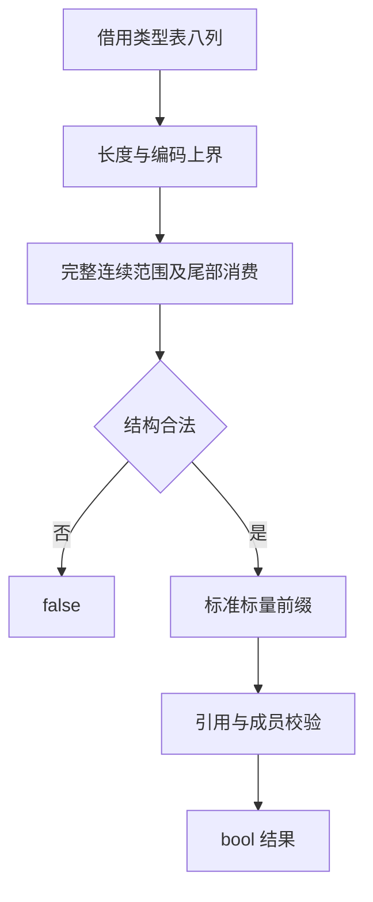

# 类型表规则校验自举

## IDEA

- Intent：将前端共用类型表校验整体迁入 RX/ZX，先完整结构校验，再执行引用和成员语义规则。
- Data：type_rules.zig 与 core/type_table/structure.zig 是现有契约；缓存和库的 type_columns 变异专项覆盖非法结构、引用与成员。
- Edges：保留 bool 入口、标量顺序、严格前向依赖、容器/task 限制、各类名称规则差异；复用 lint 命名规则；不新增测试或全量测试。
- Answer：RX 条件编排、ZX 结构及逐行规则、零容量执行适配器、种子实现、代码草稿、现有相关专项和发行构建，完成后提交推送。

## 架构

## 数据流

## 规则对照与边界

1. 八列长度均受 u32 上界保护；first/second/labels 与 kinds 等长，field_names 与 field_types 等长，因此对应上界可从等长关系继承。
2. 只接受既有 0–8 kind 编码；未知编码在 shape 分支拒绝，kind helper 的安全默认结果不进入后续规则。
3. field_end、child_end、name_end 各自连续消费；enum/error_set 共享 name_end。范围减法受 first <= length 短路保护，末尾拒绝尾部垃圾。
4. 结构完全合法后才校验固定 Scalar 前缀；数量从 Zig 元数据传入。后续不允许额外 scalar。
5. 所有引用严格向前；optional 可引用 void，list 不可；tuple 可为空并可包含 void，object 可为空但字段不可 void。上述容器均不可直接包含 task。
6. task.result 可为 void 或其他非 task，task.errors 必须是 error_set。
7. object 字段名只需非空及严格字节升序；error_set 名称经 lint 且严格升序，允许空 error_set；enum 名称与成员不增加命名策略，成员非空、不重复、至少一个且可未排序；native_reference 名称经 lint。
8. 名称原语无分配、无遍历调度，仅访问已验证下标并复用 lint 或字节比较。视图在同步执行期间稳定。

## 自我复核

保留 bool API，生成实现没有合法的分配或索引错误路径；包装器使用零容量执行 arena，并将意外生成错误视为实现缺陷。低层 core 仍保留原有结构格式检查，种子仍使用旧实现，不能据此声称全部 core 或 lint 已自举。解码专项可能先由低层格式检查拒绝某些结构变异，因此专项通过并不独自证明每个变异都触达生成 shape；本阶段同时逐项对照旧检查与短路顺序。

五项现有专项已退出 0：library-codec、cache-codec、native-references-ir、typed-try-library、type-merge。没有新增测试用例或执行全量测试。

## 最终验证

发行构建退出 0，五项现有专项退出 0；最终发行 CLI 成功编译草稿 validate_types.rx，生成 Zig 与 ABI 文件。结果见验证结果.json。包装器固定零容量执行 arena，原生名称与比较函数不分配。

草稿 pkg.yaml 仅声明源码生成接口，不是独立应用构建配置。正式原生代码由 compiler/build 静态连接。未新增运行库、测试或浏览器操作。
