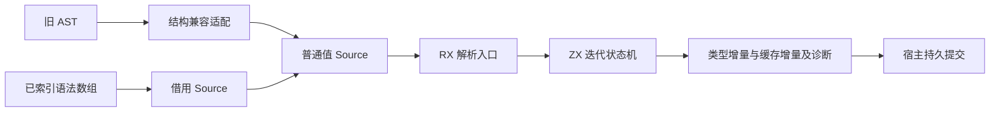
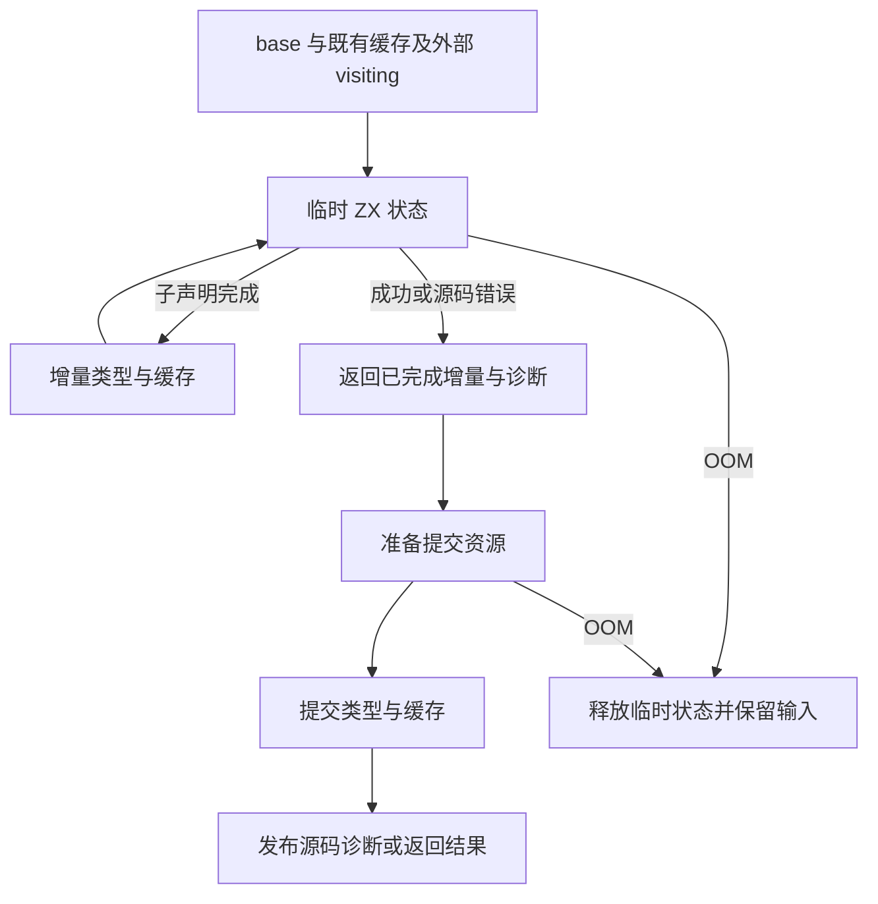
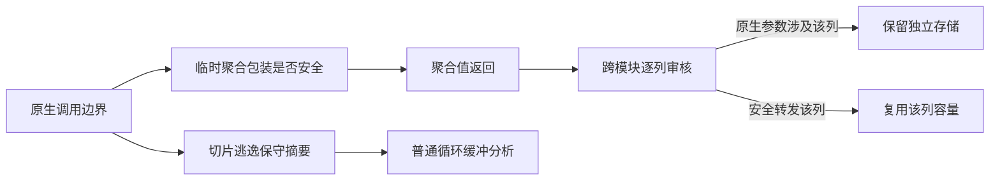

# 类型解析工作区迁移为 RX 与 ZX 普通值状态

## Intent：最终目标

移除 `zig:resolution` 的可变 Workspace、Frame 操作、名称缓存操作和类型追加方法。RX 编排解析入口，ZX 执行完整迭代状态机；宿主只负责输入布局适配、持久所有权提交与诊断发布。不能把原生工作区换名或把主循环移回宿主。

本阶段依赖已完成的 Tables、类型增量构造、容器校验与跨段查询。完整编译器自举仍要求后续处理 TypeStorage 所有权与共享类型后处理。

## Data：可用证据

- 当前 `resolution/execute.zx` 与 `step.zx` 决定控制流，但 Frame、visiting、resolved、临时成员数组全部在 Zig Workspace 内。
- `names_test.zig` 的源码错误场景明确要求保留本次已经完成的 Child 声明、类型行和原有 Cached；重试不得新增 Child。
- `resources_test.zig` 的 OOM sweep 检查既有缓存、scalar 前缀、外部 visiting、无 diagnostic 和可重试；没有要求保留 OOM 当次新完成 Child。不能将两类错误的提交要求混为一谈。
- indexed Program、Expression、native declaration 已共享 frontend 的 Tree、Order、Declaration 和 Span 模型，可以直接借用数组；Order 保存 1-based 正向链。
- NativeView 只有旧 AST，没有公共 source 字符串。名称 text 与 span 可独立存在，不能通过拼接文本或重新解析代替原 AST。

## Edges：边界与限制

名称解析优先级保持 builtin、resolved、import alias、visiting、深度、声明查找。深度限制统计名称，不统计容器 Frame。名称冲突全部校验后才能开始初始化解析。

重复对象字段先于重复字段值解析报错；task 容器校验晚于所有子项解析；void 字段立即使用该字段 span 报错。枚举保留声明名义身份与成员顺序；只有 native interface 的直接 opaque 声明生成原生引用。

源码错误作为普通输出，携带此前已经完成的类型与缓存增量。宿主完成资源准备后提交，再发布诊断。OOM 可以放弃本次临时状态，必须保留原有状态并允许重试。外部 visiting 只读，本次 active 名称独立保存，不能误删外部标记。

indexed 路径不复制节点或字符串。旧 Native AST 的结构适配是明确的兼容边界，借用原名称字节并保留原始 span；不得把指针编码成整数假装源码已经索引化。

不新增测试用例，不运行全量测试。以现有类型解析、构造、错误与视图专项验证本次变动。

## Answer：交付与成功标准

1. 普通 ZX Source、Frame/临时池、解析状态与带位置诊断模型。
2. 完整纯 ZX 名称/节点/容器/枚举迭代解析，输出类型与缓存增量。
3. RX 入口接入、宿主输入适配和提交；删除被替代的 Workspace 与原生接口。
4. 对照现有部分成功、OOM 重试、深容器、名义类型及各类 source 回归，检查实际生成物的缓冲区与生命周期。

## 执行记录与自我复核

当前完成契约审查，尚未实现新的解析器。不能将这份方案视为完成证据。审查期间已纠正一个过强推论：InvalidSource 的部分成功要求不等于 OOM 必须逐 transition 发布；现有断言支持普通值返回与宿主最终提交。

还需核实：跨独立生成模块的数组 ABI 布局、旧 AST 适配方式、frame 临时池复用、缓存输入与宿主后处理边界。`shared_types.resolve` 在 initialize 成功后重映射类型与缓存，迁移不能遗漏。

### 源码片段读取暴露的生成器边界

草稿的 collect/step 使用普通 `std:encoding.decodeUtf8`，将源码中多个 span 转为借用字符串并收集名称。修改前生成物会逐项分配输入、输出记录并复制 names 列：原生 string/list 参数令值返回分析与缓冲安全分析同时失败。

需区分两个事实：原生函数没有取得临时 object/tuple 包装的指针，不等于原生函数不会保存或返回输入切片。方案保留严格 pure 摘要，单独扩展 local ABI 摘要：

- `isolated` 接受不包含 object/tuple/task 后代的叶子参数及 list/optional，最外层展开元组按实际参数检查。输出维持现有叶子限制。
- 新 local 路径排除 IO/process 参数，当前值返回调用 ABI 不传递这些能力。
- 聚合值返回 eligibility 使用 local；严格 reader、额外临时借用、深层循环条件仍使用 pure。
- 普通循环的缓冲分析仍按 pure 开启。否则普通 ZX 包装函数返回的 string 可能借用待复用 byte buffer，单靠返回类型不含 list 无法证明安全。
- 同型 step 调用可以选择值返回实现；只有逐列 audit 通过的缓冲才跨调用传递。传入 native 的列仍被拒绝，无关列可复用。

草稿 snapshots 每次修改单字节数组并保存解码结果，用于检查字符串快照没有被后续写入污染。它是源码读取需求的可执行草稿，不新增注册测试或任何针对示例的生成器分支。

### 本阶段实际完成与验证

正式改动仅为 genz 的原生参数值表示及相应缓存版本 v16，涉及五个文件。尚未新增正式解析 Source、Frame 或替换 Workspace；上述整体迁移目标继续有效。

修改后 collect 的 step 有值返回与 buffered 版本，循环外保存一个名称 ArrayList，输入源码片段直接借用。walk 使用与解析器一致的 `loop` 状态更新块调用同型 advance，缓冲区经 advance、step 传递，生成物确认没有逐次复制旧 names。snapshots 保留逐次字节副本，避免解码字符串别名被后续写入污染。

原生执行结果：collect 和 walk 均返回 `["alpha","βeta"]`；snapshots 返回 `["A","B","C"]`。输入和结果见草稿，生成物检查说明的是这些具体路径，不是所有程序的零分配证明。

- 发行构建：34/34 步通过。
- 现有 `test-value-return test-iterate-buffer test-iterate-calls test-process-context`：265/265 步、387/387 测试通过，另有一项库迁移与再发布验证通过。
- 没有新增注册测试，没有运行全量测试。
- 两轮只读复核检查了原生 slice 返回别名、临时聚合生命周期、常规循环与逐列缓冲分析的区别。普通循环继续使用 pure 是安全所必需，不能为提高命中率改回 local。

初稿草稿的类型从函数模块导入，被纯类型模块规则拒绝，已独立到 model；walk 初稿使用表达式形式 next，被状态更新块规则拒绝，已改为显式状态赋值。没有修改语言约束来放行草稿。

推送前合入远端 `10ca9e6f` 的模块化循环回归，无源码冲突。其 `test-modular-loop` 补跑通过：87/87 步、123/123 测试，覆盖模块化调用、分配与缓存失效。此前五个正式源码文件未因此改变，未重复其他专项。

### 完整解析器接入进展

已新增普通 Source、Frame、Scratch、Cache 与 State 的 ZX 实现，RX 通过 initial、execute 编排初始化和完整迭代解析。indexed 输入只借原数组；桥在编译期递归核对产品大小、对齐、字段偏移、枚举成员与 backing 值，拒绝不兼容的独立生成 ABI。Native AST 用指针身份表和待处理栈做一次结构转换，借用名称字节，不进行递归解析或拼接源码。

宿主只快照输入缓存、适配数据表示、准备持久字符串和 map 容量，再通过 appendDelta 提交。源码诊断在提交已完成增量后发布；所有可能失败的资源准备先于可见提交。旧 zig:resolution 接口和 Workspace、Frame 操作已从源码与构建接线中撤除。此条记录是实现进展，尚待构建、现有专项和实际生成物成本验证，不能提前认为完成。

### 当前证据与未完成成本

新入口通过 35/35 发行构建步骤和 31/31 类型解析专项步骤、63/63 检查。新发行 CLI 使用 `--no-cache` 编译解析器自身完整 60 个 ZX 可达模块，成功输出普通 Zig；生成物只依赖 Zig std、通用 integers 和标准 encoding，不再引用 resolution Workspace。此处仅是组件证据，不是完整 stage 1/2/3 自举验收。

indexed 桥的初稿误用了其他 Zig 版本的 Pointer 字段，已按当前工具链 `std.lang.Type.Pointer.attrs` 修正编译期检查；没有移除大小、对齐、字段偏移或枚举值校验来绕过错误。import 路径迁移后由语言 formatter 重排，保留语言内置风格约束。

成本仍未收敛：生成的 run/step 已有值返回，但没有完整缓冲版本。跨模块分析仍会因同一函数中存在嵌套 loop 而拒绝所有 lane，scratch 的 splice 和同型 base/delta 产品也有保守限制。因此这次是解析逻辑与临时状态模型的实际迁移，不能称为零临时分配或零重复复制已经达成。

下一步的通用修复必须区分结果不携带别名和执行不读取旧别名：不能仅凭 scalar 结果或 `may.contains == false` 跳过嵌套执行。最小 scope 透传可沿 result 分析；nested loop 还要证明初值和每轮返回不携带该列，并检查捕获与版本。不得添加只针对 resolver 的生成分支。

过渡依赖仍包括 TypeStorage 持久所有权、已有缓存的 host 快照、Native AST 结构桥及 shared_types 后处理；它们应随其 owner 与状态调用链继续迁入普通 RX/ZX，不能因为旧 zig:resolution 引用已清零而提前判定完整自举完成。

关联专项 `test-type-query test-object-construction test-typed-try test-native-references` 通过 271/271 步骤、308/308 检查，另有 37 项 Node 检查通过。没有新增测试、调整期待或运行全量测试。

组件一致性补充：新 CLI 重新编译同一解析器后，生成 Zig 与 seed 构建生成物逐字节一致；ABI 的全部类型定义也一致，但整个 ABI 文件不同：CLI 包构建为原生模块增加内容身份命名空间及兼容别名，seed 生成器直接命名。不能将不同包配置下的 ABI 文件称为逐字节一致，更不能把本组件核对当作完整自举验收。

最终只读复核确认 source 外壳地址、Native 迭代转换、缓存文本借用与提交原子性；一条“已知源码诊断应优先于提交 OOM”的建议经现有资源断言核对后撤回，保持原定错误契约。
