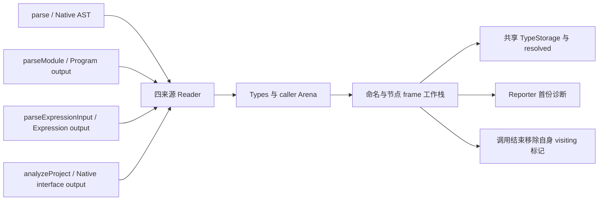
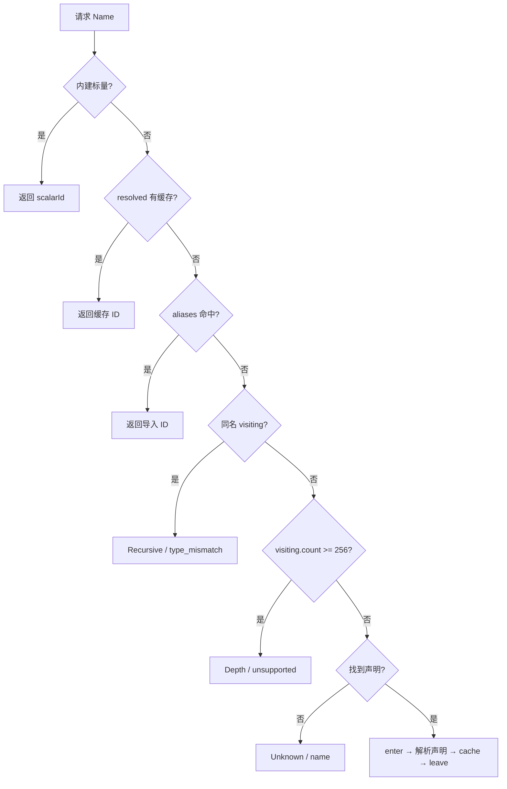

# 类型解析边界独立回归：入口与覆盖分析

## Intent：最终目标

为完整类型解析自举补充少量独立回归，验证命名解析顺序、256 个活动别名的边界、语义失败和 OOM 后的标记清理，以及四种来源的实际类型解析。预期来自明确语言契约与手写类型结构，不以旧 seed 的返回值作为唯一 oracle。

本次只分析文件与调用关系，交付这一份文档；没有修改正式源码、生成正式测试、执行测试、构建或提交。

## Data：固定阅读证据

解析器源码固定在 `bbdfdc6630974a0b2ec1bab547890369dc53eb3e`（`feat(compiler): bootstrap complete type resolution`）。既有正式测试与构建组织固定在 `b6b7adcb0908e5b30e5f787e391862b0fa89cfcf`。主代理测试工作树固定 `9a479db244e938469a939e6b2ddd4a0a6ed6680b`；本文没有在该工作树执行任何命令或修改文件。对照 `bbdfdc66..b6b7adcb`，本文所读 resolution 子目录、`analysis/types.zig` 和 `frontend.zig` 没有后续差异。

以下路径和行号以相应固定 SHA 为准；文件链接指向共享仓库，后续主线推进可能改变当前工作区行号。源码推断不等于门禁成功。

### 导出与调用入口

| 入口                                          | 固定源码证据                                                                                                                                                                                                                                                                                                                                                                                                                           | 能独立控制的内容                                                                                                                      |
| --------------------------------------------- | -------------------------------------------------------------------------------------------------------------------------------------------------------------------------------------------------------------------------------------------------------------------------------------------------------------------------------------------------------------------------------------------------------------------------------------- | ------------------------------------------------------------------------------------------------------------------------------------- |
| `frontend.types`                              | [frontend.zig:23](/Users/xiewendao/Documents/MatrixAges/zxc/packages/compiler/src/zx/frontend.zig:23)                                                                                                                                                                                                                                                                                                                                  | 实际名称是小写 `types`，不是 `frontend.Types`；测试可用 `const Types = frontend.types`                                                |
| `Types.initialize/named/resolve`              | [types.zig:11](/Users/xiewendao/Documents/MatrixAges/zxc/packages/compiler/src/zx/analysis/types.zig:11)、[types.zig:20](/Users/xiewendao/Documents/MatrixAges/zxc/packages/compiler/src/zx/analysis/types.zig:20)、[types.zig:28](/Users/xiewendao/Documents/MatrixAges/zxc/packages/compiler/src/zx/analysis/types.zig:28)、[types.zig:32](/Users/xiewendao/Documents/MatrixAges/zxc/packages/compiler/src/zx/analysis/types.zig:32) | allocator、Reporter、Native AST declarations、resolved、visiting、aliases、native_interface、shared；三个公开方法使用 Native AST view |
| `zx.Reporter`                                 | [diagnostic.zig:40](/Users/xiewendao/Documents/MatrixAges/zxc/packages/core/src/diagnostic.zig:40)                                                                                                                                                                                                                                                                                                                                     | 第一份诊断保留；`fail` 返回 `error.InvalidSource`，不分配诊断字符串                                                                   |
| `frontend.parseModule/analyzeModule`          | [frontend.zig:5](/Users/xiewendao/Documents/MatrixAges/zxc/packages/compiler/src/zx/frontend.zig:5)、[analyze.zig:33](/Users/xiewendao/Documents/MatrixAges/zxc/packages/compiler/src/zx/analysis/analyze.zig:33)                                                                                                                                                                                                                      | 默认自举路径保留 Program indexed view；关闭自举时走 Native AST                                                                        |
| `frontend.parseExpressionInput`               | [frontend.zig:9](/Users/xiewendao/Documents/MatrixAges/zxc/packages/compiler/src/zx/frontend.zig:9)、[parse_expression.zig:31](/Users/xiewendao/Documents/MatrixAges/zxc/packages/compiler/src/zx/frontend/parse_expression.zig:31)                                                                                                                                                                                                    | 自举路径保留 generated expression output；`parseExpression` 则返回 Native AST adapter                                                 |
| `frontend.expressions.compileInput`           | [expression_program.zig:18](/Users/xiewendao/Documents/MatrixAges/zxc/packages/compiler/src/zx/analysis/expression_program.zig:18)                                                                                                                                                                                                                                                                                                     | 接受 ExpressionInput，生成普通 IR；其第三个 options 后还有 comptime linking 参数                                                      |
| `compiler.analyzeProject` + native_interfaces | [native.zig:27](/Users/xiewendao/Documents/MatrixAges/zxc/packages/compiler/src/zx/modules/native.zig:27)、[native.zig:60](/Users/xiewendao/Documents/MatrixAges/zxc/packages/compiler/src/zx/modules/native.zig:60)                                                                                                                                                                                                                   | 真正的 Native interface indexed view、opaque 名义类型与原生 owner                                                                     |

四个 Reader tag 在 [resolution/source.zig:1](/Users/xiewendao/Documents/MatrixAges/zxc/packages/compiler/src/zx/analysis/semantic/resolution/source.zig:1) 精确绑定四个 concrete view 类型：Native AST、generated_parser.Output、generated_expression.Output、generated_native.Output。不能临时造一个具有同名方法的 mock view 代替，因为 `from` 会检查实际类型，不匹配会 compileError。

Reader 的程序与原生声明访问见 [reader.zig:20](/Users/xiewendao/Documents/MatrixAges/zxc/packages/compiler/src/zx/analysis/semantic/resolution/reader.zig:20)；Expression 没有声明表，`declarationAt` 的 expression 分支不可达。tuple/object 的位置遍历分别通过 `firstPosition/nextPosition/childAt/fieldAt`，见同文件 59、70、79、91 行；indexed view 的 edges 按 order 链访问，见 [indexed_view.zig:108](/Users/xiewendao/Documents/MatrixAges/zxc/packages/compiler/src/zx/analysis/types/indexed_view.zig:108)。类型元素与字段可能被其他嵌套节点的 edges 穿插，完整结构 oracle 有必要。



### 已有覆盖与实际观察的限制

1. [compiler/tests/language/declarations_test.zig:3](/Users/xiewendao/Documents/MatrixAges/zxc/packages/compiler/tests/language/declarations_test.zig:3) 已有空 enum、重复 enum 成员、重复对象字段、void 字段、void list、unknown、重复声明和不同 enum 身份八个声明。它们经 helpers.analyzeCase 验证诊断 code，成功时才 validateIr；不会验证失败后内部 maps，也没有完整 message/span 独立 oracle。
2. [compiler/tests/language/types_test.zig:53](/Users/xiewendao/Documents/MatrixAges/zxc/packages/compiler/tests/language/types_test.zig:53) 已有 optional/list 次序差别与递归别名拒绝。检查主要是成功或失败分类；没有 255/256/257 活动别名边界。
3. [type_parser/check.zig:29](/Users/xiewendao/Documents/MatrixAges/zxc/packages/test/tests/bootstrap/type_parser/check.zig:29) 直接构造 Parser 并比较旧语法树；[type_parser/resources_test.zig:47](/Users/xiewendao/Documents/MatrixAges/zxc/packages/test/tests/bootstrap/type_parser/resources_test.zig:47) 的 `256` 是 **syntax nesting**。这些覆盖解析语法，不是本轮 named resolution 的活动别名深度，不能抵扣本轮缺口。
4. [native/references/analysis/fixture.zig:40](/Users/xiewendao/Documents/MatrixAges/zxc/packages/test/tests/native/references/analysis/fixture.zig:40) 已用真实项目与 native interface；48–63 行检查 Node 的 native_reference 类型和 owner，66–92 行检查精确诊断、source_index 和导入位置。[allocation_test.zig:13](/Users/xiewendao/Documents/MatrixAges/zxc/packages/test/tests/native/references/analysis/allocation_test.zig:13) 的两个声明已经覆盖成功嵌套类型及原生语义失败的全部实际分配失败清理。不能再另造同样 Node?[] 成功用例来声称新覆盖。
5. [compiler/tests/frontend/lifetime/expression_test.zig:72](/Users/xiewendao/Documents/MatrixAges/zxc/packages/compiler/tests/frontend/lifetime/expression_test.zig:72) 覆盖 Native expression AST 对调用方源文本与路径的所有权及 OOM。它使用 parseExpression，不经过 indexed Expression reader 的类型注解解析。
6. 本次未找到正式测试直接设置 `Types.visiting`、`Types.resolved`，或调用 `parseExpressionInput` 的匹配。此结论限定于两个测试树中实际文本检索与上述入口阅读，不表示其他大规模生成夹具完全没有间接覆盖。

### 解析顺序与边界的独立契约

[name.zx:13](/Users/xiewendao/Documents/MatrixAges/zxc/packages/compiler/src/zx/analysis/semantic/resolution/name.zx:13) 的顺序是：



具体顺序分别在 name.zx 15–21、24–31、33–49、51–57、59–78 行。相同含义的 seed 在 [resolve_seed.zig:48](/Users/xiewendao/Documents/MatrixAges/zxc/packages/compiler/src/zx/analysis/types/resolve_seed.zig:48)；它仅作为历史契约交叉证据，测试不应运行 seed 再镜像它的返回结果。

- 深度不是 frame 个数、类型语法嵌套层数，也不是累计曾经解析过的别名数。它是当前 `visiting.count()`。256 个连续别名，末端 u64 可以成功：u64 在深度检查前返回。第 257 个尚未解析别名会在查找声明前失败。
- 同名递归在深度限制之前。因此表已满且请求名字已 visiting，应给 Recursive 而不是 Depth。
- 表已满且请求名字不存在，应给 Depth 而不是 Unknown。
- resolved/alias/builtin 仍能在表已满时返回。已缓存 void 的 backing ID 是 0，同样是有效命中；桥接以 ID+1 编码，见 [names.zig:5](/Users/xiewendao/Documents/MatrixAges/zxc/packages/compiler/src/zx/analysis/semantic/native/resolution/names.zig:5)。应保留这一普通有效值观察。
- initialize 会先保证 scalar 前缀，再检查 aliases 与声明，之后才依声明顺序解析，见 [initialize.zx:13](/Users/xiewendao/Documents/MatrixAges/zxc/packages/compiler/src/zx/analysis/semantic/resolution/initialize.zx:13)、[execute.zx:13](/Users/xiewendao/Documents/MatrixAges/zxc/packages/compiler/src/zx/analysis/semantic/resolution/execute.zx:13)。初始化禁止导入名字覆盖 builtin/Array、导入重复/本地冲突，以及本地 builtin/重复；这些拒绝发生在正常命名解析之前。

## Edges：契约边界与限制

### 清理与所有权

[types/resolve.zig:20](/Users/xiewendao/Documents/MatrixAges/zxc/packages/compiler/src/zx/analysis/types/resolve.zig:20) 与 34 行会创建局部 State，工作栈通过 `defer workspace.deinit()` 在成功、InvalidSource 和 OutOfMemory 时清理。initialize 同样在 10–17 行 defer。

[workspace.zig:38](/Users/xiewendao/Documents/MatrixAges/zxc/packages/compiler/src/zx/analysis/semantic/resolution/workspace.zig:38) 只移除 frame 上 `visiting=true` 的自身标记，随后释放 frame 数组。enter 的 put 成功后才置标记（60–68 行）；cacheResult 可能 OOM，cache 成功后才 leave/pop，见 [step.zx:20](/Users/xiewendao/Documents/MatrixAges/zxc/packages/compiler/src/zx/analysis/semantic/resolution/step.zx:20)、[names.zig:29](/Users/xiewendao/Documents/MatrixAges/zxc/packages/compiler/src/zx/analysis/semantic/native/resolution/names.zig:29)。因此最有价值的观察是失败后调用前既有标记仍存在、本次进入的名字全部退出，尤其 cacheResult 分配失败后的退出。

不能要求本次失败让 TypeStorage/resolved 完全回滚：解析成功的内层类型和缓存可以保留，源码没有整次事务原子性承诺。应检查调用前已有 entry/合法类型内容不变，而不是检查类型数量必须恢复。

临时 tuple children、object columns、复制字段名/enum 成员和 native 名称分配使用 Types.allocator，见 [workspace.zig:79](/Users/xiewendao/Documents/MatrixAges/zxc/packages/compiler/src/zx/analysis/semantic/resolution/workspace.zig:79)、[buffers.zig:25](/Users/xiewendao/Documents/MatrixAges/zxc/packages/compiler/src/zx/analysis/semantic/native/resolution/buffers.zig:25)、[append.zig:48](/Users/xiewendao/Documents/MatrixAges/zxc/packages/compiler/src/zx/analysis/semantic/native/resolution/append.zig:48)。workspace.deinit 不逐一 free 这些临时 buffers，普通调用由分析 owner Arena 统一释放。低层 fixture 必须使用 caller 拥有的 Arena；不能直接把 std.testing.allocator 当完整 Types owner 然后只释放 items/maps，也不能凭这一内部 API 要求它具备任意独立 allocator 的全释放契约。

Types 持有 allocator 内部指针，因此不能返回一个包含 Arena 和已经引用自身 Arena 的 Types 的可移动 struct。Arena 必须在调用方稳定地址初始化；helper 可返回指向该 Arena 中的数据，不应返回带自指针的 owner。原始 Native AST declaration/name 可以借用，必须活到调用完成；结果对象字段名、枚举成员及 opaque 标签已有复制实现，但低层 resolved map 的键仍借用 declaration.text，不能宣称整个 Types 能在释放 AST owner 后继续 named。

Reporter.fail 保留第一份诊断，不意味着预存 diagnostic 会阻止成功解析或让解析提前停止。可以独立验证已有 diagnostic 不被新的失败覆盖；不应新增“diagnostic 已有值必须零执行”的错误约束。

### 公开 analyze 不能覆盖的部分

- analyze/analyzeModule 在 [analyze.zig:49](/Users/xiewendao/Documents/MatrixAges/zxc/packages/compiler/src/zx/analysis/analyze.zig:49) 自建 Reporter、在 72–78 行自建 Types。Context 只有 types、nominal_types、native_modules、stores，不能注入 visiting/resolved/aliases。
- 正常 initialize 会拒绝 builtin 导入名与本地/导入同名，所以 builtin/resolved/alias 多重命中只能低层设置 maps 后调用 named 验证。不要为了到达这一顺序制造不合法共享 TypeId 或修改 scalar 前缀。
- public 失败只交付 Diagnostic，无法观察同一次 Types 调用前后的 visiting。必须低层直接调用。
- generic resolution 和 Workspace 不是 frontend 的公开导出。四来源源码存在不等于四来源都能通过 Types.resolve 直接调用；该方法只接受 Native AST。没有必要为测试增加生产导出或从独立 module 重复加载同一 frontend 源文件。
- Expression reader 要由表达式中的类型注解触发。仅编译 `1 + 2` 或普通对象/list 字面量只观察推断，不会证明该 reader 的 node/tuple/object 分支。

## Answer：最小可实施建议与调用骨架

### 文件组织

最小低层方案可放在 `packages/compiler/tests/analysis/type_resolution/`：`fixture.zig`、`depth_test.zig`、`state_test.zig`、`resources_test.zig`，在既有 tests/root.zig 加入测试导入。compiler 的 `test-frontend` 已注入 frontend 为模块名 `compiler` 和 zx，见 [compiler/build.zig:99](/Users/xiewendao/Documents/MatrixAges/zxc/packages/compiler/build.zig:99)。不必增加通用执行器或生成 CLI。

需要公开 native 项目与四来源邻接时，可以在 packages/test 现有 bootstrap 组织中放受控专项，复用 build/type_parser.zig 40–52 行的 frontend/zx 依赖注入模式，并使用 compiler 模块的真实项目入口。以下骨架使用模块名 `frontend`；若放 compiler/tests 中，改为 `const frontend = @import("compiler");`，它在该门禁本来就是 frontend 模块。

这些是按已读签名写出的可编译调用形状，尚未编译验证；主代理负责实现、格式化和门禁，不把本文骨架当成功证据。

### 1. 低层优先级与调用方 owner

```zig
const std = @import("std");
const zx = @import("zx");
const frontend = @import("frontend");
const Types = frontend.types;

fn observePreexistingState(allocator: std.mem.Allocator) !void {
    var arena = std.heap.ArenaAllocator.init(allocator);

    defer arena.deinit();

    const owned = arena.allocator();
    var reporter: zx.Reporter = .{};
    var types: Types = .{
        .allocator = owned,
        .reporter = &reporter,
        .declarations = &.{},
    };

    try types.initialize();

    const u64_id = Types.scalarId(.u64);
    const bool_id = Types.scalarId(.bool);
    const aliases = [_]zx.ir.Export{
        .{ .name = "Ready", .type_id = bool_id },
    };

    types.aliases = &aliases;

    try types.resolved.put(owned, "Ready", u64_id);
    try types.visiting.put(owned, "Ready", {});
    try types.visiting.put(owned, "Sentinel", {});

    const actual = try types.named(.{
        .text = "Ready",
        .span = .{ .start = 7, .end = 12 },
    });

    try std.testing.expectEqual(u64_id, actual);
    try std.testing.expect(types.visiting.contains("Ready"));
    try std.testing.expect(types.visiting.contains("Sentinel"));
    try std.testing.expectEqual(@as(usize, 2), types.visiting.count());
    try std.testing.expect(reporter.diagnostic == null);
}
```

同一 fixture 派生少量真正独立观察：resolved 删除后 alias 胜过 visiting；alias 删除后 Recursive 的精确 code/message/span；builtin 同时存在缓存/alias/visiting 时 builtin 胜出（不调用 initialize 再验证非法 aliases）；resolved 中合法 `.void` ID 不被误认为 cache miss。所有 ID 用 initialize 后的 scalarId 或成熟 `types.task/errorSet` 构造，不手写任意 ID。

### 2. 活动别名深度与失败清理

合法普通源码建议用程序化文本生成 `export type T000 = T001` 到末端 `export type T255 = u64`，单个声明的语法深度很浅；顺序必须让第一条声明进入尚未缓存的完整链。分别观察 255、256、257 个名字，正例每个 resolved 指向 scalarId(.u64)，负例精确检查请求 T256 的 token span、`.unsupported` 与 `type alias nesting exceeds 256 levels`。

低层 Native AST 可以由 `frontend.parse` 获取后借用 declarations，或用 `zx.ast.Type/.Declaration` 按上述普通类型构造；成熟公开 AST shape 见 [core/ast.zig:3](/Users/xiewendao/Documents/MatrixAges/zxc/packages/core/src/ast.zig:3)。若需要只初始化 scalar 前缀再手动调用 named，先让 Types.declarations 为空完成 initialize，之后赋值解析所得 declarations。不能在设置链后 initialize，再拿已有 resolved 链去声称测试到了 named 深度。

一个独立低层失败 fixture 建议 `A = { child: B, later: Missing }`、`B = u64[]`，外加预存 Sentinel 标记。named(A) 在 B 成功后 Missing 失败：检查 A 标记已清理、B 缓存合法、Sentinel 保留、精确 Missing span；第二次请求仍发生相同 unknown，而不是误报 Recursive。这与已有只检查递归失败的测试不同，能观察部分进展后的清理。

另一个静态满表 fixture 用 256 个不同预存标记，观察：未知名给 Depth；同名标记给 Recursive；scalar/resolved/alias 命中仍成功；所有标记集合保持不变。这里只在 Native 低层可观测，不需要四来源各重复一套同样 maps 测试。

### 3. 四来源结构 oracle 与 OOM

Program 公共调用骨架：

```zig
fn observeProgram(allocator: std.mem.Allocator, source: []const u8) !void {
    var parsed = try frontend.parseModule(allocator, source, "types.zx");

    defer parsed.deinit();

    try std.testing.expect(parsed.diagnostic() == null);

    var result = try frontend.analyzeModule(allocator, &parsed, .{});

    defer result.deinit();

    try std.testing.expect(result.value == .ir);
    try std.testing.expect(try frontend.validateIr(allocator, result.value.ir) == null);

    // 调用 hand-written check：按 export 名字定位 ID，逐字段、元素与名义标签检查。
}
```

建议普通 type-only 源码：

```zx
export enum Mode { Second, First }

export type Leaf = { z: string, a: u64 }

export type Row = [Leaf?, bool, u64[]]

export type Input = { rows: Row[], optional: Leaf?, direct: Leaf }

export type Output = Input
```

独立预期：Mode 保持源码成员次序 Second/First；Leaf 字段按 a/z 排序，分别 u64/string；Row 三元素的顺序和 optional/list 包裹正确；Input 字段按 direct/optional/rows 排序；Input 与 Output 相同 ID；重复相同结构 intern 复用。ID 由 export 或结构关系定位，不假定全表固定非 scalar 顺序。额外加入同形但不同名字 enum 时必须不同 ID；这已有普通语义拒绝覆盖，本轮只在整体 mixed oracle 中观察，不再拆一个重复单例。

Native AST 来源使用 `frontend.parse` + `frontend.analyze` 调用同一普通源，并用同一手写结构预期；不把 Native 输出当 Program oracle。

Expression 公共调用骨架：

```zig
fn observeExpression(allocator: std.mem.Allocator) !void {
    const source =
        "loop(5, { while: current => current > 0, next: current => {\n" ++
        "  const row: [u64?, bool, u64[]] = [null, true, [3, 5]]\n" ++
        "  const entry: { z: string, a: u64 } = { z: \"kept\", a: 7 }\n" ++
        "  current -= entry.a - row[2].length\n" ++
        "} })";

    var parsed = try frontend.parseExpressionInput(allocator, source, "expression.zx");

    defer parsed.deinit();

    try std.testing.expect(parsed.diagnostic() == null);

    var result = try frontend.expressions.compileInput(allocator, &parsed, .{}, false);

    defer result.deinit();

    try std.testing.expect(result.value == .ir);
    try std.testing.expect(try frontend.validateIr(allocator, result.value.ir) == null);

    // 确认 scope 内 row/entry 的 annotation 类型、完整 tuple/object/list，及 scope result。
}
```

这里 next 的语句块是 loop 的正式状态更新语义；合法形式与现有 [loops/helper.zx:8](/Users/xiewendao/Documents/MatrixAges/zxc/packages/test/tests/incremental/native_runtime/loops/helper.zx:8) 一致。不是任意普通 lambda 都允许语句块。注解实际经过 [iteration/block.zig:42](/Users/xiewendao/Documents/MatrixAges/zxc/packages/compiler/src/zx/analysis/iteration/block.zig:42) 的 Analyzer.resolveType；后者在 [analyzer.zig:127](/Users/xiewendao/Documents/MatrixAges/zxc/packages/compiler/src/zx/analysis/analyzer.zig:127) 选择 expression view 的 generic node。更新使用 row 和 entry 中的值，保留注解解析与合法状态更新；不要改成只推断 literal 的测试。

Native interface 邻接复用现有 references fixture 的 native_interfaces 注册形状，声明 Node=opaque、Mode enum 与嵌套 Record；原生 identity 输入与返回同一个 Record，Record 包含 Node，避免违反 host reference 返回必须带 reference 输入的既有约束。主源码 import host 和 Record，普通 identity 调用。除完整结构外检查 Node owner、Mode 枚举标签/成员次序、导出类型名字和原生函数 input/output 类型关系。此例比已有 Node?[] 更能观察 Native reader 的 tuple/object edges，不必新建原生 host 执行器。

OOM 复用 [allocation_testing.zig:3](/Users/xiewendao/Documents/MatrixAges/zxc/packages/compiler/tests/support/allocation_testing.zig:3) 的 noResize/noRemap 全部实际分配失败 sweep；成功路径与会先构造一个内层类型再失败的语义路径都纳入。低层 run 中必须 catch named/resolve 错误，**在 Arena 释放前**检查 Sentinel 与自身 visiting，然后把 OutOfMemory 原样返回给 sweep。外部 Arena.deinit 的无泄漏不能替代内部 maps 清理断言。

如果要精确观察 resolved.put 的 OOM，而 Arena backing 的分配合并使 sweep 无法到达这个逻辑点，允许将 FailingAllocator 包在 caller Arena.allocator 外层，Types.allocator 指向稳定位置的 failing allocator；每轮重建 caller owner，从 fail_index=0 遍历到无 induced failure。它只使已有真实分配点失败，不修改生产类型/标量/帧状态。应记录这与普通 backing allocator sweep 的区别，不声称每个 Arena 逻辑 alloc 都由普通 sweep 触达。

### 成功标准与自我复核

最终建议聚焦三项：优先级与 256 边界；语义失败/OOM 后的 visiting 所有权；四来源 mixed 类型结构与 indexed Expression 注解。复用正式 compiler/frontend、analyzeProject 和 allocation_testing 入口，保持零专用运行库、普通 Zig 静态实现原则。

成功报告必须区分实际门禁结果、精确独立断言与源码推断。本文没有执行验证，尤其表达式草稿还需主代理按当前语义检查使用情况。本文未把类型语法的 256、seed parity、validateIr 单独成功或 generated output 非空，误写成上述新边界已经覆盖；也没有强加失败整表回滚、预存 visiting 自动清除、低层 Types 可脱离借用 AST owner 存活等源码未承诺的契约。
