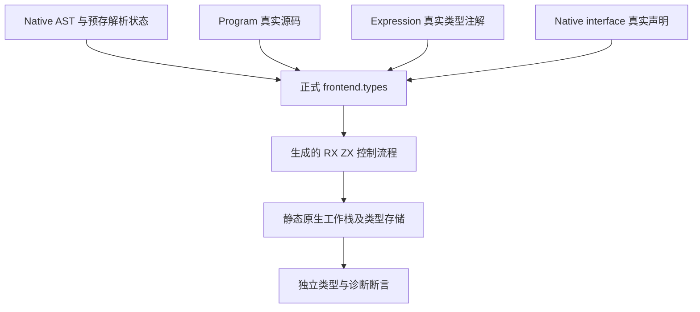
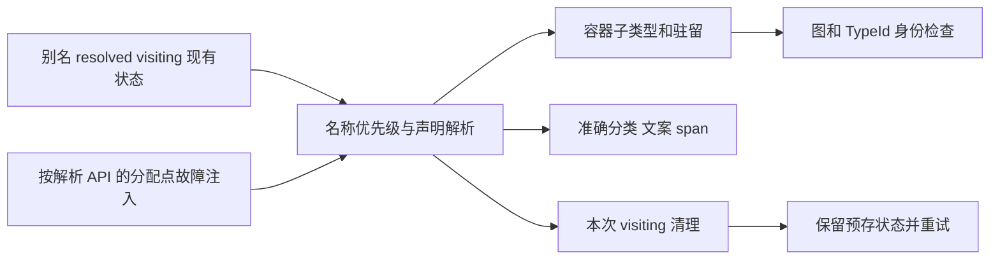

# 类型解析边界独立回归执行计划

## IDEA

- Intent：补齐完整类型解析自举的名称优先级、精确 256 层限制、预存 visiting 保留、失败后重试与四种读取来源运行证据。
- Data：冻结 b6b7adcb0908e5b30e5f787e391862b0fa89cfcf；完整类型解析实施文档明确保留的验证边界；正式 frontend.types、生成控制器与真实解析器输出。前轮已完成九 tag artifact 的双模式和合并复验。
- Edges：Native AST 是正式支持入口，可显式构造类型节点和已存在的解析状态；不伪造 Analysis 或非法 ID。使用明确预期，不以 seed 结果作为 oracle。OOM 不要求类型表或 resolved 全事务回滚，只要求撤销本次 visiting、保留调用前状态并可合法重试。正式源码只增加已授权测试与注册。
- Answer：分类独立测试、真实四来源执行、中文记录和双模式冷缓存门禁；保存输入、原始日志与产物证据，英文 Conventional Commit 提交 push。

## 架构图

## 数据流图

## 执行步骤

1. 已核对前轮冻结工作区十个输入，保存跟踪差异，清理仅本会话拥有的文件并冻结当前 b6b7adcb。前轮 artifact 实时核验需恢复旧 HEAD 和对应输入，原日志不修改。
2. 定位成熟的 frontend/core 模块实例导入与 allocator 测试，使用同一模块身份；一个只读分析代理辅助核对入口和覆盖。
3. 构造合法 Native AST、标量前缀、预存 maps 和已合法共享 task 类型；独立检查名字顺序、深度与诊断先后。
4. 用解析 API 每次分配可失败的包装器核对 visiting 清理；Arena 负责持久分配生命周期，不承诺单个失败调用释放所有持久字段。
5. 使用真实 Program、Expression 和 Native interface 源码，覆盖各自读取器运行路径；最终按实际声明数与冷缓存叶节点计数，完成 scoped diff 自我复核、提交 push。

## 自我批判

达到 256 的同时命名层数与容器工作帧层数是不同约束，不能把超过 256 的容器深度误报为名称超限。单次 public analyze 成功也不能观察预存 visiting 和 late resolved.put 的 OOM 清理；这些必须在正式 Types 入口直接检查。旧 seed 与生成器结果相同不能代替独立预期。
