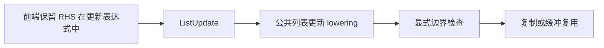
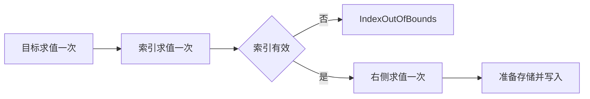

# 索引赋值求值顺序

## Intent：最终目标

列表更新按目标、索引、边界检查、右侧表达式、更新存储的顺序执行；越界不能执行右侧副作用，目标与索引分别只求值一次。

## Data：可用证据

既有 iterate CLI 回归要求空列表输出 P| 后返回 IndexOutOfBounds，原 genz/list_update.lower 却在生成检查之前绑定 update.value，导致 P|V|。设计契约见《顺序遍历与状态迭代设计》第 281 行。所有普通复制及条件缓冲复用均共用此入口。

## Edges：边界与限制

同时取消前端将右侧表达式提升为外层 ScopeBinding 的处理，并调整通用 lowering 的语句顺序；不按夹具内容特判，反馈用例的 stdout 断言保持不变。仍先绑定 target 和 index，检查成功才绑定 value；write 中的复制、容量准备与缓冲启用判定保留原行为。生成指纹域提升至 v32，避免重用错误顺序的旧生成缓存。

## Answer：交付格式与成功标准

正式源码最小修改、代码草稿、既有 CLI 用例的修复前后日志及构建结果。使用既有 iterate CLI 回归验证前置/后置条件、索引失败、RX 引用保留和名称遮蔽，不新增测试，不执行全量测试。

## 根因复核

首次只移动 genz 的 value 绑定后，Debug 与 ReleaseSafe 应用回归仍输出 P|V|。生成代码显示 value_7 的副作用调用已在 ListUpdate 外层执行，局部检查只能看到缓存值。进一步定位 iteration/block.state_update 的 self.temporary(right)：它无条件把 RHS 追加到外层 ScopeBinding，从而预先决定了错误顺序。

最终移除此提升，将 RHS 留在更新表达式内部。Place.prepare 仍捕获父容器和各层索引各一次；中间索引及复合赋值需要的旧值仍提前读取。replace 在每一级只把 replacement 放到选中位置一次，因此不增加 RHS 求值次数，也不强迫普通赋值读取被覆盖元素。两层修复共同建立所需顺序，不能把第一次局部修正写成成功。

扩大的 function-updates effects 专项揭示一处既有期望冲突：check.plannedFailure 只让复合赋值的边界错误先于 RHS，普通赋值则预期执行 value，且 RHS 错误优先；expectTrace 同样要求普通赋值越界事件终止于 value。这与上述设计契约及未修改的 iterate stdout 回归矛盾。现仅移除该 set/compound 区分，统一要求 IndexOutOfBounds 先于 RHS，并把越界末事件严格设为 index（坏的父索引仍为 container）。仍断言完整事件计数、顺序、载荷和结果，没有新增用例或接受两种行为。

语义缓存另由 CLI 的 cache_identity 对 compiler/genz 等源码内容生成身份，前端改动会使旧语义缓存失效；v32 负责生成缓存域，不需要为未改变的 IR 数据结构额外增加版本。生成代码证据中，索引函数仍位于一次捕获绑定，RHS 调用只出现于成功越过边界检查的分支内。

## 验证与自我复核

最终根构建 35/35 步骤通过。既有 iterate、function-updates、loop-columns 专项最终 237/237 步骤通过，汇总 352/352 实际执行用例，其余命中缓存；初轮 502/502 Zig 用例通过，但四个普通赋值 effects Node 执行器因上文旧期望冲突失败，完整日志保留，不作去重总数加算。更新统一期望后这些执行器全部通过，严格覆盖普通/嵌套更新、源码/库消费以及异常事件顺序。原始 iterate CLI 的五项回归在 Debug 应用与 ReleaseSafe 应用下均通过，stdout 断言未修改；编译这些应用的 CLI 自身为 Debug。

自我复核：最初仅修正生成器并不充分，真实产物暴露了前端提前绑定，最终修复同时覆盖 IR 构造与目标代码顺序。三个正式源码文件分别承担前端求值表达、通用列表更新和缓存失效，不引入新运行库，不改变缓冲复制策略，不按具体输入特判。另一套事件期望的调整是消除与既有语言契约的矛盾，仍要求唯一、严格的错误及事件顺序；不能将原始失败日志隐去或把测试修改称为纯源码修复。没有新增测试用例，也没有执行全量测试。
