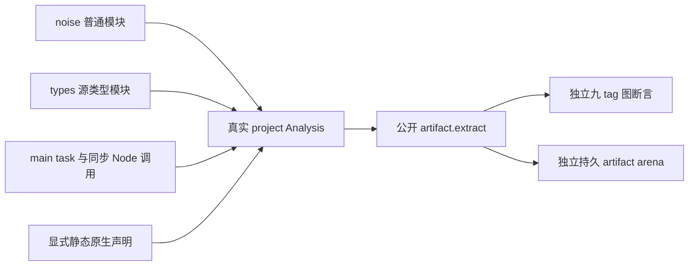
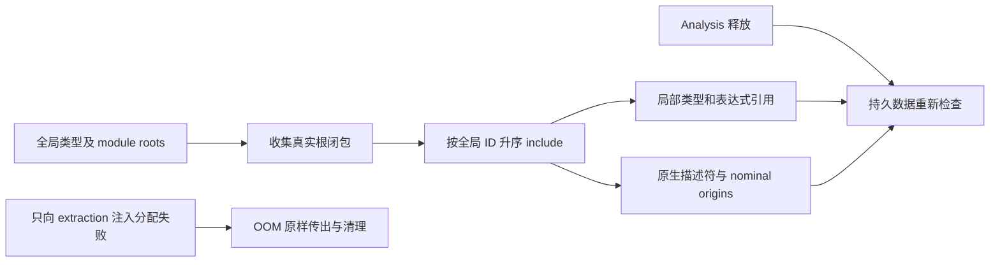

# 组合类型模块提取回归执行计划

## IDEA

- Intent：真实三模块 Analysis 的九 tag 闭包、裁剪、全局到局部 ID、native/source 来源与持久所有权正确提取；只对 extraction allocator 验证分配失败清理。
- Data：冻结 `24921a0b095bab91b9c772d25d8698b16d4e0dff`；前轮提取边界分析；公开 project.analyze、artifact.extract 与真实 ModuleRecord。类型预期来自明确源码，不伪造分析结果或调换类型行。
- Edges：Node 仅同步调用并返回，task 只捕获提前绑定的局部 u64。完整 native descriptor 的声明类型是根，不错误裁剪。公开成功不证明内部 DFS/pending 调度每个分支。无运行宿主、新运行器或生产源码改动。
- Answer：中文计划/实施记录与 Mermaid、分类正式测试、双模式实际门禁与哈希；英文 Conventional Commit 提交并 push。

## 架构图

## 数据流图

## 步骤

1. 前轮八个工作区输入哈希与正式提交一致；保存差异后仅清理已拥有差异，复用独立工作区冻结当前提交。历史 bulk 实时核验需恢复旧 HEAD/补丁。
2. 普通源码加入 source enum、native Node、嵌套对象/tuple/list/optional 与真实 async/await；噪声 enum 合法移动全局编号。使用 compiler.format 规范夹具文本，再分析并完整 validateIr。
3. 独立检查两个模块 artifact 的图、来源、函数和原生描述符；输入 Analysis 释放后检查全部有意义的持久字段。
4. 精确操纵真实 nominal 元数据，检查 Node 缺失/重复/名字错误和成功/OOM 清理。保持原生模块 owner 及类型表不变。
5. 格式化、同步，双模式执行；记录原始日志和输入哈希，验证提交 hook 后一致，再提交 push。

## 自我批判

用输出中同一类型的共享引用检查 graph 身份，不能按全局表相同位置比较裁剪结果。Analysis allocator 不放进 extraction 的 OOM 扫掠；构建源码成功也不能代替提取 oracle。只生成 Zig 文本不等于执行，所以本轮不把 emit 或 relink 验证说成原生任务运行。
