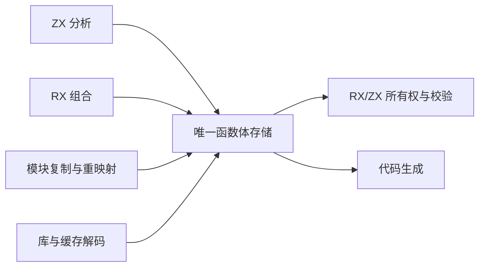
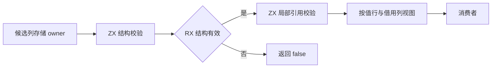
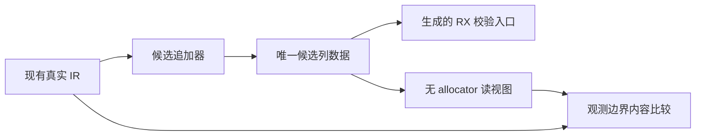
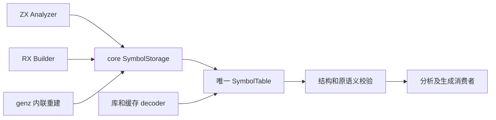
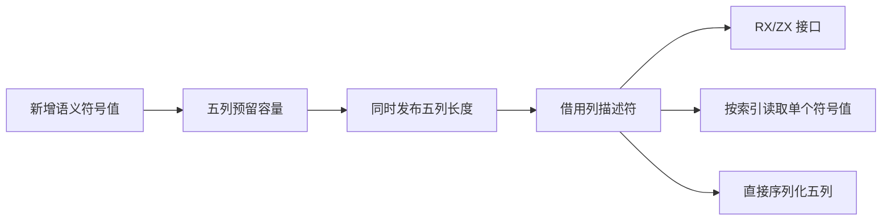

# 统一 IR 函数体存储

## Intent

让 ZX 分析、RX 组合、模块复制和 codec 共同生产及消费唯一函数体模型。最终 RX/ZX 算法直接读取该模型，删除所有权检查的转换适配层，不新增专用 Reader、Writer 或状态镜像作为最终架构。

## Data

当前 Program、Function、Contract 用 union Expression 数组；Statement 持递归 slice。Analyzer.append/finish、expression_program.build、contracts.analyze、RX Builder/program.lower/capture.argument、artifact.Nodes、project/link/semantic_cache.restore，以及库和增量缓存 JSON 解码都是实际生产或发布入口。只改 ownership 输入不能完成迁移。

类型表已有按列存储和无分配读取的本地范式。本阶段先实现控制流存储，再覆盖表达式与符号。完整函数体才是最终验收边界；分步实现不得保留两份正式状态。

## Edges

- ExprId、SymbolId、FunctionId 和 BlockId 保持 u32 的编号宽度；源位置仍能表达 u64 偏移。
- 控制块按后序写入，branch/switch 只引用已有块。每块语句直接连续存储，无须额外 block_statements 索引数组。
- 所有可变长载荷以 first/count 和原始标量列表示，避免 ZX 对象数组的指针外壳及逐记录分配。表达式模型必须覆盖全部 36 种 kind。
- 分配失败不发布半条 statement 或半个 block；容量预留可改变，但已有逻辑内容不变。计数和容量溢出须在写入前拒绝。
- 草稿 native storage 仅用于现有 Zig producer 的迁移期；整个 producer 的语义与状态生命周期仍要迁入 RX/ZX。观测时允许从旧 IR 构造候选存储，不把观测转换器接入正式编译器。
- 模型迁移必须同步 codec 和 IR version；不永久维护旧新两种内部模型。

## Answer

先交付真实可构建的 canonical Control schema、后序块 storage、RX/ZX 结构校验与终结路径计算；借用输入仅复制 slice descriptor，不复制数组，不用 allocator。利用已有真实 IR 对照旧 terminates，验证列式结构与结果，随后替换所有正式 producer，再删除观测转换。

后续表达式表、符号表和 Body 发布迁移完成前，不宣称统一 IR 或完整自举已完成。




## 具体控制模型

```zx
export type Control = {
    statement_kinds: StatementKind[]
    statement_payloads: u32[]
    block_first: u32[]
    block_count: u32[]
    branch_conditions: u32[]
    branch_yes: u32[]
    branch_no: u32[]
}
```

此处仅展示头部和分支列；草稿 control/model.zx 包含全部八种语句及所有载荷。最终不是上述局部示例，而是完整模型。

## 自我复核

不能因候选表能从旧 IR 转换而宣称 producer 已迁移。此阶段验证 schema 和存储不变量，随后必须改变实际 owner 及 codec，才会移除旧存储。避免为迁移便利保留递归语句镜像或每次检查都重新 flatten。

## 候选表达式存储

完整 Expressions schema 包含 88 个标量或字符串 slice，覆盖 36 种表达式。List/Tuple/Template 共用 sequence 池；Field/TupleField 共用 projection 池，语义仍由 kind 区分。可变长 captures、arguments、bindings、arms、fields、evaluation 均通过明确命名的 first/count 及对应载荷列表示；没有对象指针数组。

native/expressions 中的迁移期 append 对当前 ir.Expression 逐项写列，先统一预留，再发布 kind/type/span/payload。它尚未替换 Analyzer 的 owner；observed_decode 仅用于真实输入的无损对照，不是正式读取层。正式读视图必须直接读取列，不得照搬这个会分配临时 record 数组的观测解码器。

容量扩展前先记录来自自身载荷池的切片偏移，扩展后重新定位；控制流 destructure 的可选符号列同理。外部输入仍借用其原始切片。此约束独立于 Arena 是否保留旧分配，不能利用当前分配器行为隐藏悬空引用。

函数体 Body 统一引用 symbols、expressions、control 和 root；契约 Predicate 复用同样的 symbols/expressions，并保留 predicate 及 span。函数、Store、native module 和 global type metadata 仍按既有模块边界处理，不把局部 ExprId 改为全局空间。

## 控制流阶段观测

- 观测构建 31/31；现有 RX 并行推断、Store 所有权证明和 typed try 分析专项 36/36 步骤、228/228 用例通过。
- 所有权模块图：261 次观测、541 个块；控制模块图：46 次观测、222 个块。生成输出与未观测 CLI 字节一致。
- 现有专项产生 241069 次观测、241361 个块，包括故障注入重跑，不能将其称为独立程序数量。覆盖全部八种语句 kind。
- 每次逐列验证 27 个数组地址和长度不变，再逐块对照原 terminates。原始大日志压缩保存，统计明确区分观测次数和输入形状。
- 这轮只使用从既有 IR 构造的结构合法表；尚未独立验证伪造 canonical 列的拒绝行为。后续正式 codec 迁移必须补上这一边界的现有回归证据。

## 失败与借用边界复核

静态审查发现逐列 toOwnedSlice 在中途失败时会清空已转移的列，导致保留的 Storage 各列长度错位。候选 finish 明确定义为消费操作：成功交付全部列；失败释放已转移与尚未转移的全部列，Storage 回到 empty。append 仍保持失败时逻辑长度不变。不能把两者混称为同一种失败原子性。

表达式 reserve 只检查和扩展当前 kind 实际使用的列，避免每个表达式都扫描并调用全部 88 列的容量接口。容量变化可能使先前读视图失效；调用者在 append（包括失败返回）后重新取得读视图，不能保存跨变更的临时 slice。当前表达式自借用载荷在本次成功追加内部已按偏移重定位。

## 生成入口复现

在仓库根目录使用当前 CLI：

```sh
zig-out/bin/zxc docs/2026-10-07/统一IR存储/草稿/check.rx --no-cache --out docs/2026-10-07/统一IR存储/生成/控制入口.zig

zig-out/bin/zxc docs/2026-10-07/统一IR存储/草稿/body_identity.zx --no-cache --out docs/2026-10-07/统一IR存储/生成/函数体接口探针.zig
```

第一个命令生成的 `控制入口.zig.abi.zig` 对应观测构建使用的 `控制接口.zig`；生成后复制或重命名该 ABI 文件。第二个入口只验证完整 Body ABI 与身份传递，不是业务算法实现。两个生成文件可由已保存的 RX/ZX 源重建，不作为第二套手写源码维护。

临时接线补丁仅用于本工作树的观测构建。引用的整数 widen/narrow 是现有静态转换模块；它不包含 IR 规则，后续应归入统一的普通数值转换能力，避免保留编译器专用路径。

## 函数体阶段结果与下一步

最终候选完成构建（31/31）。最终所有权模块图对照包含 261 次观测、107522 个表达式；自身控制模块图包含 46 次观测、6671 个表达式。每个表达式的 type、span、kind、完整 payload 经观测解码后与原值逐项序列化结果一致；88 个表达式列地址和长度保持不变，Body 接口探针返回原输入身份。两份编译输出均与未观测 CLI 字节一致。

五项专项 75/75 步骤、142/142 用例；补充四项专项 83/83 步骤、417/417 用例。各批存在重复输入，不相加为唯一程序数。合计观察到 34/36 种表达式，尚缺 NegativeInteger、Unit。专项运行后收紧了 finish 消费失败契约并精简 reserve；随后重建并重跑两个模块图，没有重复整批专项。没有新增测试，没有执行全量测试。

正式 compiler/test 接线已恢复。候选仅存在 docs，正式 IR version 仍为 25。下一步必须完成无分配的 native 记录读视图和 canonical 表校验，再把 Analyzer、RX Builder、节点复制及两种 codec 原子地切换为唯一存储；之后删除 observation 转换器。任何时点都不能将 observed_decode 放入正式读取路径来掩盖迁移缺口。

## 无分配读取阶段

Intent：把候选表达式列直接提供给消费者，不通过重建旧 record 数组读取。

Data：原观测解码器只有 ParallelBranch、ScopeBinding、MatchArm、ObjectField 四类记录序列需要分配；其他载荷可按值读取，原始 ID 列可按固定 u32 表示借用。沿用已有 TypeFields 的 len/at 视图风格。

Edges：read 接口要求表已通过结构与引用校验，不在每个字段读取时增加兜底或重新校验。view 只持列切片，生命周期依附 owner；append 后须重新取得 view。观测用 materialize 仍只在比较边界存在。

Answer：read.zig 不接受 allocator，四类记录以列视图按索引返回单个普通值；随后逐真实表达式通过该读路径对照全部内容，并接入表校验与正式 owner 迁移。

结构校验检查列宽、连续完整的分段、kind 对应 payload 的顺序与数量、宿主偏移的可表示范围，以及控制块后序约束。RX 的 Switch 只在结构合法后调用局部引用校验；引用校验覆盖表达式与符号 ID，包括可空 ID。外部类型、函数、Store 槽位、字段编号及表达式依赖环属于程序级语义，当前函数体入口没有这些元数据，不宣称已经校验。span 的这里检查只保证可转换为宿主 usize，不代替源码范围或位置语义检查。





无分配是读取 API 和实现的性质；整个观测器仍分配候选表、JSON 对照数据及校验执行所需的临时内存，不能将其描述为整条编译流程零分配。原始 IR 到候选表的复制只存在于迁移观测中，尚未实现正式 owner 替换。

### 读取与校验验证结果

- 观测构建 31/31 步骤成功。
- 所有权模块图：261 次观测、107522 个表达式、541 个控制块；校验器自身模块图：98 次观测、29712 个表达式、1204 个控制块。
- 两张模块图中，新表达式读视图经观测边界物化后的完整内容与原 IR 一致；控制读视图逐语句、逐分支内容一致；所有候选表通过结构与局部引用检查。两份最终生成输出分别与普通 CLI 输出字节一致。
- 现有 RX 推断、字段所有权专项：27/27 步骤、173/173 用例通过；13467 次观测、59396 个表达式、13813 个控制块。观测次数包括故障注入重跑，不是独立程序数量。
- 临时 compiler/test 接线已完整恢复。没有新增测试用例，没有执行全量测试。详细计数、源码哈希及压缩原始日志见 `读视图观测.json` 和 `验证/读视图*`。

复现新增校验生成入口：

```sh
zig-out/bin/zxc docs/2026-10-07/统一IR存储/草稿/body_check.rx --no-cache --out /tmp/zxc_canonical_body_check.zig
```

观测接线补丁引用该生成文件及自动生成的 `.abi.zig`，还依赖前文控制入口与 Body 接口探针。生成文件不是正式源码。旧阶段的哈希与观测日志描述各自阶段快照，不代表当前草稿的哈希。

### 本阶段自我复核

读取层已消除四类记录序列重建及控制流树重建，完整结构验证由 RX/ZX 实现；但正式 Analyzer、RX Builder、节点复制、库 codec、语义缓存 codec 仍持有旧表示。这是迁移先决条件的完成，不能称为正式统一 IR 或编译器自举完成。当前证据来自真实合法 IR，未新增伪造表拒绝用例，也没有覆盖所有表达式 kind，因此不是验证器正确性的形式化证明。下一步应推进唯一 owner 的原子迁移，并复用现有 codec 非法输入回归验证发布边界，不继续以观测器替代生产进展。

## 正式存储迁移

Intent：依次把符号、表达式、控制流改为唯一列存储，每种表示切换时同时迁移全部生产者与 codec，不保留旧表示作为正式旁路。

Data：符号是独立的五列值表；表达式额外涉及 genz 内联泛型 ID 重映射、同表增长后的借用有效期；控制流涉及后序块发布。原先把三者一次切换的计划会把这三类不同风险混在一次验证中，因此先完成符号表的完整生产迁移。

Edges：每个阶段都同步提升 IR version 并拒绝旧格式；Program、Function、Contract 仍共享所属 arena 的生命周期。类型、表达式、控制流尚未切换的部分不能宣称已统一。

Answer：正式 core SymbolTable / SymbolStorage 与全部 ZX、RX、artifact、genz 构造路径；验证器在任何列读取前检查结构；复用现有专项验证，不新增测试。

正式符号表的 names、types、span_start、span_end、ownership 与 RX/ZX Symbols schema 对齐。Ownership 列明确采用 u32 的 Copy/Borrowed/Owned 枚举，语义行读取转换为既有 ir.Ownership；列本身可直接借给生成的 ZX 接口。SymbolStorage.append 先预留全部五列，再同时增加逻辑长度；finish 成功和失败都消费 owner。字符串按既有 arena 边界持有，artifact 深复制仍复制名称内容，普通 Program↔Function 只复制表描述符。

库 codec 随 Program 的声明直接读写唯一列存储；语义缓存 decoder 在发布前检查函数及契约的符号列结构。共享 artifact copier 也在读取前检查结构，因为直接 link 的调用路径不必经过缓存 decoder。IR version 从 25 升到 26，旧库与旧语义缓存沿既有版本门禁拒绝，不增加隐式转换。

RX span 映射只分配 start/end 两列，其他三列借用同一 Result.arena。genz 内联重建的新 SymbolStorage 与原函数符号表独立，不保存跨自身增长的列 view。初始输入符号从Values 仅是短构造入口，没有为消费者维护第二份 Symbol 数组。





尝试 grit Zig 模式被当前工具拒绝（迁移.grit 保存尝试），且未找到可用 Zig ast-grep 配置；这次采用限定接收者的文本改写后逐项编译修正。已排除 SymbolId 映射数组、destructure 符号列表及借用分析状态，保留它们原有表示。现有测试中的直接 IR 构造和畸形输入变异随表示迁移，未增加用例或削弱断言。

### 正式符号存储验证与自我复核

最终根构建 35/35 步骤成功。契约、独立表达式、库 codec、缓存 codec、模块 artifact、原生引用、RX 推断和模块调用执行八项专项 136/136 步骤、433/433 用例通过；受接口变化影响的类型验证、类型合并和任务分析三项专项 63/63 步骤、252/252 用例通过。两组按各自运行统计，未执行全量测试。只迁移现有测试表达方式，没有新增用例。

现有畸形 IR、版本不匹配、序列化生命周期与分配失败检查仍通过；新的五列长度不一致拒绝路径经过静态调用链复核，尚未增加专门伪造列测试。因此不能把现有回归说成新存储所有非法组合的完整验证。形式上的同构与读视图并不代表整个编译器自举：本阶段正式替换了 symbols；expressions/control 的唯一 owner 与自举生产者仍待迁移。

首次编译中已修正所有权字段写入、独立 RX 参数读取及误匹配的 SymbolId 临时数组接口。一次旧失败构建尚未退出便发起修正构建，导致早期临时日志混写；最终证据使用两者退出后、源码稳定时的独立构建日志，不使用混写日志。后续构建必须先确认既有 handle 终态，再启动同一目标的修正构建。

最终 CLI 重新编译所有权 RX/ZX 模块图，输出与迁移前基线逐字节一致；输出哈希与正式源码哈希见 `正式符号存储结果.json`。
